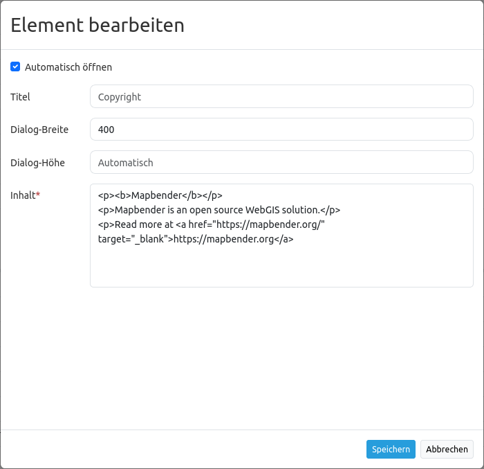

.. _copyright_de:

Copyright
************

Dieses Element zeigt die Nutzungsbedingungen ("Terms of use") in einem Dialog an.

.. image:: ../../../figures/de/copyright.png
     :scale: 80

Konfiguration
=============

* **Automatisches Öffnen (Autoopen):** Schaltet ein/aus, ob das Copyright Fenster beim Start der Anwendung automatisch geöffnet werden soll (Standard: Ausgeschaltet).
* **Title:** Titel des Elements. Der Titel wird neben dem Button angezeigt.
* **Popup width:** Breite des Popup Fensters (Default: 300).
* **Popup height:** Höhe des Popup Fensters (Default: 170).
* **Tooltip:** Text, der als Tooltip angezeigt wird. Dieser wird angezeigt, wenn der Mauszeiger längere Zeit über dem Button verweilt. Er wird außerdem als Kopfzeile im Copyright Fenster verwendet.
* **Content:** Inhalt des Copyright Fensters. Dieser wird angezeigt, wenn das Element per Click aktiviert wird (oder bei Start der Anwendung wenn die "automatisches Öffnen" Option aktiviert wurde).