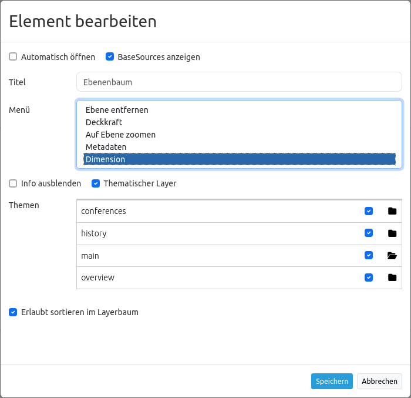
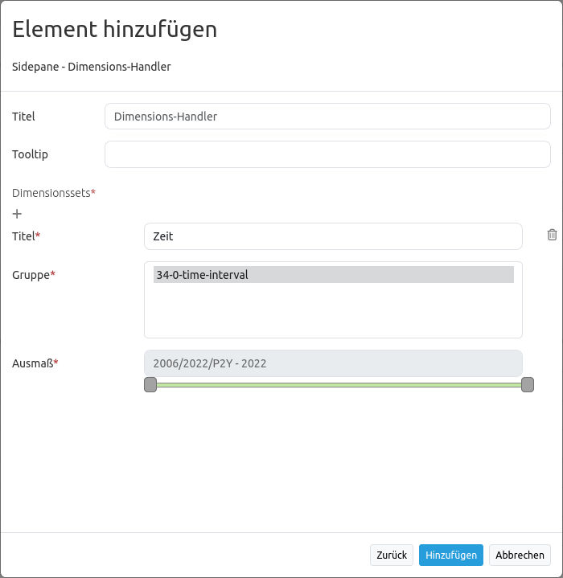

.. _dimensions_handler_de:

Dimensions-Handler
******************

Für die Einbindung von WMS-Diensten mit einer zeitlichen Dimension kann der Dimensions-Handler genutzt werden. WMS-Time Dienste müssen dafür zunächst als WMS-Datenquelle registriert werden. Falls die WMS-Dienste über die Angabe einer zeitlichen Dimension verfügen, wird diese in den Layer-Metadaten angezeigt. 

.. code-block:: resource

    Dimension:
    name:'time', units:'ISO8601', unitSymbol:'', default:'2018-01', multipleValues:'', nearestValue:'1', current:'', extent:'2014-01/2018-01/P1M'

.. image:: ../../../figures/wmst_source.png
     :scale: 80

WMS-T werden wie herkömmliche WMS in die Layersets eingefügt, zusätzlich muss jedoch der Time-Parameter aktiviert werden. Wird dieser nicht aktiviert, dann werden die Dimensionen des Dienstes außer Acht gelassen und beim Aufruf der Kartenebene der Standardwert genutzt.

Bei Diensten mit einer zeitlichen Dimension erscheint bei der Instanz die Schaltfläche "Dimensionen". Durch einen Klick auf diese Schaltfläche werden die unterstützten Zeit-Parameter angezeigt. Die zeitliche Dimension kann dort per Checkbox-Klick aktiviert werden. 
Nach einem weiteren Klick in die Schaltfläche öffnet sich das Detailformular, in dem die Nutzung weiter definiert werden kann. Die Werte aus dem WMS-Dienst werden hier übernommen und können weiter eingeschränkt werden. Für die Einrichtung des Dienstes sind die folgenden Definitionen von Zeitparametern nötig: 

* **Abfrageart**: multiple, nearest, current
* **Name**: Wert TIME (name=time)
* **Units**: Abbildungsformat für zeitliche Dimensionsangaben (ISO 8601:2000)
* **Unit symbol**:
* **Default**: Standardzeitpunkt
* **Extent (extent slider)**: Unterstützter Zeitbereich  

Das Element unterstützt die folgenden Zeitvariablen: 

* einzelner Zeitpunkt
* Liste von Zeitpunkten
* Zeitintervall 

Steuerung von Zeitvariablen
===========================

Es bestehen zwei Möglichkeiten, die Zeitangabe in der Anwendung zu steuern. Zum einen kann jeder Dienst, für den der Time-Parameter aktiviert ist, über das Kontextmenü des Layers im Layertree gesteuert werden. Zum anderen kann ein zentraler Schieberegler eingebunden werden, der in einem beliebigen Bereich der Anwendung angezeigt werden kann. Über den Schieberegler können mehrere Kartenebenen mit demselben Kartenbereich zusammengefasst und zentral gesteuert werden.

Zeitslider im Kontextmenü
-------------------------

Die Zeitachse kann über den Ebenenbaum als Option in das Kontextmenü des Layers im integriert werden. Dazu muss die "Dimension" Option in dem `Ebenenbaum <../basic/layertree.html>`_, aktiviert werden. 

Nach der Aktivierung in dem Ebenenbaum erscheint ein Zeitslider in dem Kontextmenü. Für die Nutzung der zeitlichen Anzeige muss das Element zuvor über die Checkbox aktviert werden. Danach kann die Zeitachse mithilfe des Cursors verschoben werden. 

.. image:: ../../../figures/wmst_context_menu.png
     :scale: 80

Zeitslider als Element
----------------------

Die Kartenebenen können mithilfe des Dimensions-Handlers über einen zentralen Schieberegler gesteuert werden. Dieses Element kann direkt (ohne Button-Verknüpfung) in die Sidepane, die obere Werkzeugleiste und in die Fußzeile integriert werden. 
Die Konfiguration des Dimensions-Handlers erfolgt in drei Schritten:

* **Anlegen des Elements**: Zuerst muss das Element im Backend (Layout-Bereich) als neues Element in einen der Bereiche Sidepane, obere Werkzeugleiste oder Fußleiste hinzugefügt werden.
* **Definition eines Dimensionsets**: Anschließend erfolgt die Erstellung eines Dimensionsets über den „+“-Button. Hiernach muss ein Titel angegeben und eine Layerset-Instanz als Gruppe gewählt werden.
* **Definition des Schiebereglers**: Zuletzt muss der Bereich, der über den Schieberegler gesteuert werden sollen, festgelegt werden. Eine Mehrfachauswahl ist möglich, aber es können nur Instanzen kombiniert werden, die den gleichen zeitlichen Extent besitzen.

Wenn eine Instanz ausgewählt wurde, sind alle Instanzen, die nicht dieser Vorgabe entsprechen, nicht mehr auswählbar. Nach der Konfiguration kann das Dimensions-Handler Element gespeichert werden, um in der Anwendung zu erscheinen.

.. image:: ../../../figures/wmst_element.png
     :scale: 80

Konfiguration
=============

* **Title**: Titel des Elements
* **Tooltip**: Beschriftung des Elements bei Mouseover
* **Dimensionsset**: Gruppe für die zeitliche Dimensionsanzeige mit Titel (**Title**), Layergruppe (**Group**) und zeitlicher Dimensionsspanne (**Extent**)

Im folgenden Abschnitt sind die YAML-Definitionen für das Element und die Einbindung in dem Dienst und Ebenenbaum aufgeführt. 

Elementkonfiguration
--------------------

.. code-block:: yaml

    target: ~                            # ID des Kartenelements
    dimensionsets:
        title: Zeit
        group:
            dimension:      # Dimensionsangabe wie in der Layerkonfiguration
                origextent: 2014-01/2018-01/P1M
                active: null
                type: interval
                name: time
                units: ISO8601
                unitSymbol: null
                default: 2017-11
                multipleValues: true
                nearestValue: true
                current: true
                extent: 2014-01/2017-11/P1M

Layerkonfiguration 
------------------

.. code-block:: yaml

        dimension:                      # Dimensionsangabe in der Layerinstance
            -   name: time
                units: ISO8601
                unitSymbol: null
                default: 2018-01
                multipleValues: false
                nearestValue: true
                current: false
                extent: 2014-01/2018-01/P1M

Ebenenbaum 
----------

.. code-block:: yaml

        title: Layertree
        class: Mapbender\CoreBundle\Element\Layertree
        configuration:
            [...]
            menu:
                - [...]
                - dimension

