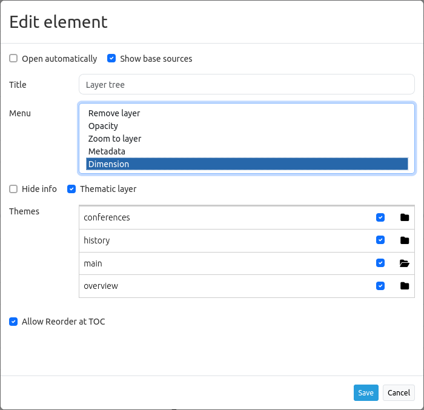
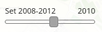

.. _dimensions_handler_de:

Dimensions Handler
******************

Für die Einbindung von WMS-Diensten mit einer zeitlichen Dimension kann der Dimensions Handler genutzt werden. 
WMS-Time Dienste werden wie ganz normale WMS als Datenquelle registriert. 
Wenn die Dienste über die Angabe einer zeitlichen Dimension verfügen, werden diese in den Layer-Metadaten angezeigt. 

.. code-block:: resource

    Dimension:
    name:'time', units:'ISO8601', unitSymbol:'', default:'2018-01', multipleValues:'', nearestValue:'1', current:'', extent:'2014-01/2018-01/P1M'

.. image:: ../../../figures/wmst_source.png
     :scale: 80

WMS-T werden fast genau wie herkömmliche WMS in die Layersets eingefügt, dabei muss jedoch der Time-Parameter noch aktiviert werden. Wird dieser nicht aktiviert, dann werden die Dimensionen des Dienstes außer Acht gelassen und bei dem Aufruf der Kartenebene der Standardwert genutzt.

Bei Diensten mit einer zeitlichen Dimension erscheint bei der Instanz die Schaltfläche "Dimensionen". Durch einen Klick auf diese Schaltfläche, werden die unterstützten Zeit-Parameter angezeigt und die Zeit kann über das Anklicken der Checkbox aktiviert werden. 
Nach einem weiteren Klick in die Schaltfläche öffnet sich dann das Detailformular, in dem die Nutzung weiter definiert werden kann. Die Werte aus dem WMS-Dienst werden hier übernommen und können weiter eingeschränkt werden. Für die Einrichtung des Dienstes sind die folgenden Definitionen von Zeitparametern nötig: 

* **Abfrageart**: multiple, nearest oder current
* **Name**: Wert TIME (name=time)
* **Units**: Abbildungsformat für zeitliche Dimensionsangaben (ISO 8601:2000)
* **Unit symbol**:
* **Default**: Standardzeitpunkt
* **Extent (extent slider)**: Unterstützter Zeitbereich  

.. image:: ../../../figures/wmst_layer.png
     :scale: 80

Das Element unterstützt die folgenden Zeitvariablen: 

* einzelner Zeitpunkt
* Liste von Zeitpunkten
* Zeitintervall 

Steuerung der Zeit
==================

Es bestehen zwei Möglichkeiten, die Zeitangabe in der Karte zu steuern. Zum einen kann jeder Dienst, für den der Time-Parameter aktiviert ist, über das Kontextmenü des Layers im Layertree gesteuert werden. Zudem kann ein zentraler Schieberegler eingebunden werden, der in einem beliebigen Bereich der Anwendung angezeigt werden kann. Über den Schieberegler könnne mehrere Kartenebenen mit dem selben Extent zusammengefasst und zentral gesteuert werden.

Zeitslider im Kontextmenü
-------------------------

Die Zeitachse kann über den Ebenenbaum als Option in das Kontextmenü des Layers im integriert werden. Dazu muss die "Dimension" Option in dem `Ebenenbaum <../basic/layertree.html>`_, aktiviert werden. 

Nach der Aktivierung in dem Ebenenbaum erscheint ein Zeitslider in dem Kontextmenü. Für die Nutzung der zeitlichen Anzeige muss das Element über die Checkbox aktviert werden. Danch kann über die Maus die Zeitachse verschoben werden. 

Zeitslider als Element
----------------------

Die Kartenebenen können durch das Dimensions Handler Element über einen zentralen Slider gesteuert werden. Dieses Element kann in die Sidepane, Toolbar und in den Footer integriert werden. 
Die Konfiguration des „Dimensionhandler erfolgt in drei Schritten:

* **Anlegen des Elements**: Zuerst wird das Element definiert und gespeichert. Danach schließt sich das Element (siehe Konfiguration).
* **Anlegen eines Dimensionsets**: Für die Erstellung eines Dimensionsets kann in dem Element über den „+“-Button ein neues Set angelegt werden. Nach der Eingabe eines Titels muss das Element gespeichert werden. Danach schließt sich das Element.
* **Definition des Schiebereglers**: Danach kann in dem Element in dem Feld „Group“ die Instanzen aus dem Layerset ausgesucht werden, die über den Slider gesteuert werden sollen. Eine Mehrfachauswahl ist möglich, aber es können nur Instanzen mit einander kombiniert werden, die den gleichen zeitlichen Extent besitzen.

Wenn eine Instanz ausgewählt wurde, sind alle Instanzen, die nicht dieser Vorgabe entsprechen, nicht mehr auswählbar. Zudem erscheint nach der ersten Auswahl einer Instanz ein Schieberegler, mit dem der Extent eingeschränkt werden kann.

Konfiguration
=============

.. image:: ../../../figures/wmst_configuration.png
     :scale: 80

* **Title**: Titel des Elements
* **Tooltip**: Beschriftung des Elements bei Mouseover
* **Target**: Kartenelement für die Verknüpfung
* **Dimensionsset**: Gruppe für die zeitliche Dimensionsanzeige mit Titel (**Title**), Layergruppe (**Group**) und zeitlicher Dimensionsspanne (**Extent**)

Im folgenden Abschnitt sind die YAML-Definitionen für das Element und die Einbindung in dem Dienst und Ebenenbaum aufgeführt. 

Elementkonfiguration
--------------------

.. code-block:: yaml

    target: ~                            # ID des Kartenelements
    dimensionsets:
        title: Zeit
        group:
            dimension:      # Dimensionsangabe wie in der Layerkonfiguration
                origextent: 2014-01/2018-01/P1M
                active: null
                type: interval
                name: time
                units: ISO8601
                unitSymbol: null
                default: 2017-11
                multipleValues: true
                nearestValue: true
                current: true
                extent: 2014-01/2017-11/P1M

Layerkonfiguration 
------------------

.. code-block:: yaml

        dimension:                      # Dimensionsangabe in der Layerinstance
            -   name: time
                units: ISO8601
                unitSymbol: null
                default: 2018-01
                multipleValues: false
                nearestValue: true
                current: false
                extent: 2014-01/2018-01/P1M

Ebenenbaum 
----------

.. code-block:: yaml

        title: Layertree
        class: Mapbender\CoreBundle\Element\Layertree
        configuration:
            [...]
            menu:
                - [...]
                - dimension

