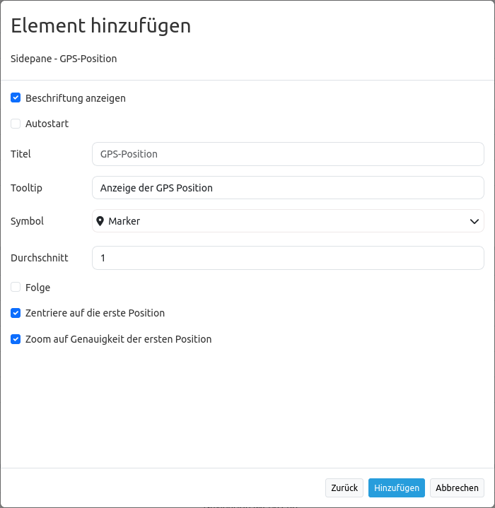

.. _gpspostion_de:

GPS-Position
************

Dieses Elememt stellt einen Button bereit, der zu Ihrer aktuellen Position navigiert und zeigt ein Symbol an dieser Position an. Der Maßstab wird dabei nicht verändert, außer durch Aktivierung der Einstellung ``zoom to accuracy (zoom to accuracy on first position)``.

Die Funktion baut auf der `Geolocation-API <https://www.w3.org/TR/geolocation-API/>`_  des W3C auf. Ob Ihr Browser diese Funktionalität unterstützt, erfahren Sie auf der `Can I Use <http://caniuse.com/#feat=geolocation>`_ Seite. Die Funktion nutzt den ``High Accurcacy Parameter``, der die Standortbestimmung über GPS forciert. Falls das Gerät einen GPS-Empfänger hat und dieser aktiviert ist, ist die Positionsbestimmung also genauer. Ansonsten werden die WLAN Access-Points zur Positionsbestimmung herangezogen.

Der Mittelpunkt zeigt die wahrscheinliche Position des Gerätes an, der äußere Kreis die Genauigkeit der Positionsbestimmung, d.h. in welchem Bereich sich die ermittelte Position sich wahrscheinlich befindet.

Kompatibilität: Internet Explorer und MS Edge geben ohne GPS-Gerät am Rechner teilweise sehr ungenaue Informationen heraus. Das Verhalten ist auch mit anderen Anwendungen zu beobachten.

.. image:: ../../../figures/gps_position.png
     :scale: 80

Konfiguration
=============

* **Beschriftung anzeigen (Show label):** Schaltet die Beschriftung des Buttons an/aus.
* **Title:** Titel des Elements. Dieser wird in der Layouts Liste angezeigt und ermöglicht, mehrere Button-Elemente voneinander zu unterscheiden. Der Titel wird außerdem neben dem Button angezeigt, wenn "Beschriftung anzeigen" aktiviert ist.
* **Tooltip:** Text, der angezeigt wird, wenn der Mauszeiger eine längere Zeit über dem Element verweilt.
* **Icon:** Symbol des Buttons, basierend auf einer CSS Klasse.
* **Target:** ID des Kartenelements, auf das sich das Element bezieht.
* **Average:** berechnet den Mittelwert der unter Average angegebenen letzten empfangenen GPS Koordinaten, Standard ist 1.
* **Refreshinterval:**  Aktualisierungsintervall in ms. Der Standardwert ist 5000 ms.
* **Follow:** Standard ist false, true positioniert die Karte bei jeder empfangenen GPS Koordinate neu.
* **Center on first position:** true zentriert die Karte auf die erstermittelte Position.
* **Zoom to accuracy:** Zoomt auf die ermittelte Koordinate nach Messgenauigkeit.
* **Zoom to accuracy on first position:** Zoomt auf die ermittelte Koordinate nach Messgenauigkeit bei erster ermittelten Position.

YAML-Definition:
----------------

Das Element wird als Button in die Toolbar eingefügt.

.. code-block:: yaml

                class: Mapbender\CoreBundle\Element\GpsPosition
                label: true                         # false/true, um den Button zu beschriften. Der Standardwert ist true.
                autoStart: false                    # true, wenn diese Funktion beim Start der Anwendung geöffnet werden soll, der Standardwert ist false.
                title: GPS-Position                 # Titel des Buttons
                tooltip: GPS-Position               # Text des Tooltips
                icon: iconGpsTarget                 # Symbol für den Button
                target: map                         # ID des Kartenelements
                average: 1                          # berechnet den Mittelwert der unter average angegebenen letzten empfangenen GPS Koordinaten, Standard ist 1            
                refreshinterval: 5000               # Aktualisierungsintervall in ms. Der Standardwert ist 5000 ms.
                follow: true                        # Standard ist false, true positioniert die Karte bei jeder empfangenen GPS Koordinate neu. Sollte nur mit WMS Diensten im gekachelten Modus verwendet werden, da sonst bei jeder Neupositionierung ein neuer Kartenrequest geschickt wird
                centerOnFirstPosition: true         # Zentriert die Karte auf die erstermittelte Position
                zoomToAccuracy: false               # Zoomt auf die ermittelte Koordinate nach Messgenauigkeit
                zoomToAccuracyOnFirstPosition: true # Zoomt auf die ermittelte Koordinate nach Messgenauigkeit bei erster ermittelten Position

Class, Widget & Style
======================

* **Class:** Mapbender\\CoreBundle\\Element\\GpsPosition
* **Widget:** mapbender.element.gpsPostion.js
* **Style:** mapbender.element.gpsPosition.css

