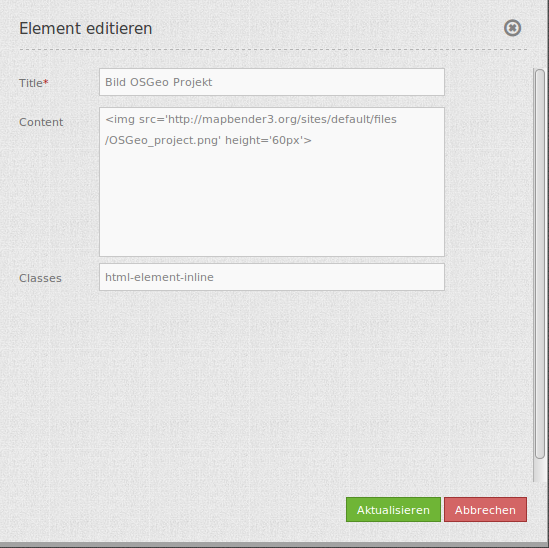
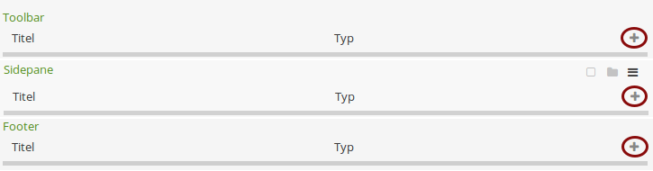
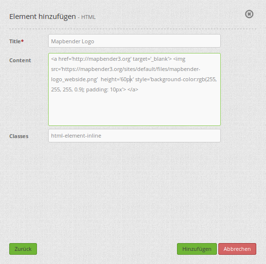
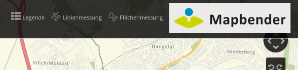
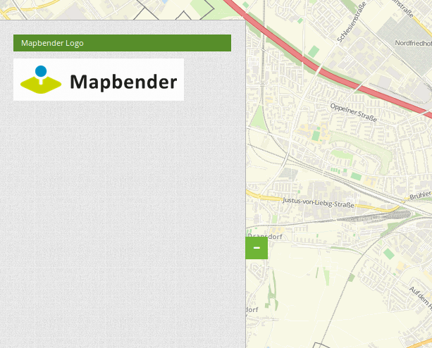
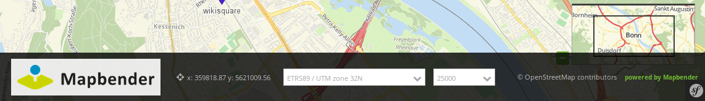
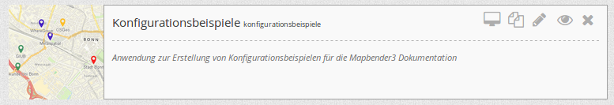
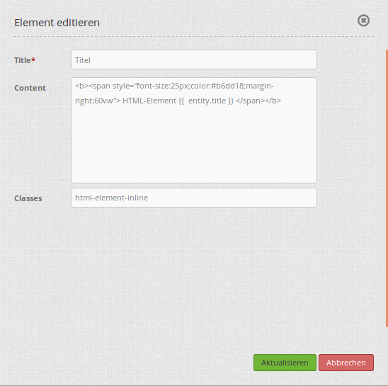

.. _html:

HTML-Element
************

Über das HTML-Element kann ein generisches HTML an einer beliebigen Stelle in der Anwendung definiert werden.
Im generischen HTML stehen folgende Variablen zur Verfügung : "application" (Entity Application), "entity" (Entity HTMLElement) und "configuration". Damit kann beispielsweise ein Bild in die Anwendung eingefügt werden. 

.. image:: ../../../figures/html_result_application.png
     :scale: 80

Configuration
=============

Einfügen eines Bildes in Ihre Anwendung:

.. code-block:: yaml

    

* **Title:** Titel des HTML-Elements. Dieser wird in der Layouts Liste angezeigt und ermöglicht, mehrere HTML-Elemente voneinander zu unterscheiden. 
* **Content:** Inhalt des HTML-Elements, z.B. Bild oder Link. Content kann Variablen: "application", "entity" und "configuration" beinhalten.
* **Classes:** html-element-inline, CSS-Klasse

Konfigurationsbeispiele
============================
Logo mit hinterlegtem Link einbinden:
--------------------------------------
Über ein HTML-Element können verschiedene zusätzliche Elemente eingebunden werden. Beispielsweise kann ein Bild oder Logo integriert werden. Aber auch ein einfaches Textelement, oder ein Text- bzw. Bildelement, welches mit einem Link zu einer Webseite hinterlegt ist. Das HTML-Element kann an unterschiedlichen Stellen in der Anwendung eingebunden werden.

In der Anwendung wird das HTML-Element unter dem Reiter Layouts durch das ``+`` -Zeichen entweder in der Toolbar, in der Sidepane oder im Footer eingefügt.

Es erscheint der Dialog "Element hinzufügen – HTML". Für dieses Konfigurationsbeispiel sieht der Dialog wie folgt aus:

     
Das HTML-Element, welches hier eingebunden wird hat die Bezeichnung (Title) Mapbender Logo. Im Content wird das gewünschte Element als HTML-Code angegeben und bei Classes wurde die Default-Einstellung html-element-inline übernommen. Der Code für das Anwendungsbeispiel lautet:

.. code-block:: yaml

     

Das Mapbender Logo wird als Bild eingebunden (img src='https://mapbender.org/sites/default/files/mapbender-logo_webside.png'). Zusätzlich wird für das Bild die Höhe (height=‘60px‘) und das Styling definiert. Das Styling (style=) beinhaltet die Hintergrundfarbe und Transparenz (background-color:rgb(255, 255, 255, 0.9)) sowie den Abstand des Bildes zu den Seitenrändern (padding:10px). Außerdem wurde ein Link zur Mapbender Webseite hinterlegt (href='http://mapbender.org'), welche sich beim klicken auf das Bild in einem neuen Tab öffnet (target='_blank').

Das Element kann an unterschiedlichen Positionen eingebunden werden. Beispielsweise in der Toolbar:

In der Sidepane:

     
Und im Footer:

     
     
Logo mit hinterlegtem Link einbinden:
--------------------------------------
Im Mapbender besteht die Möglichkeit Variablen in Anwendungen zu verwenden. Als Beispiel wird gezeigt, wie der Titel der Anwendung und des Elements mithilfe eines HTML-Elements eingebunden werden kann.

**Die Variable "application.title"**

Die Anwendung, für die dieses Element konfiguriert wird, sieht im Anwendungsmanager des 
Mapbender wie folgt aus:

Zuerst muss ein HTML-Element, wie vorher beschrieben über das ``+`` -Zeichen, hinzugefügt werden. Um den Titel der Anwendung einzubinden, wird die Variable "application.title" benötigt.

.. image:: ../../../figures/de/html_example_application.title_dialog.png
     :scale: 80

In diesem Beispiel ist die Bezeichnung (Title) des HTML-Elements "Titel". Im Content wurde folgender Code verwendet:

.. code-block:: yaml

     <b> Anwendung {{  application.title }} </b>

Der Titel der Anwendung wurde mit dem Textzusatz "Anwendung" eingebunden. Dieser Zusatz ist unabhängig vom Titel der Anwendung und wird vor diesen gesetzt (D.h.: Anwendung + Titel der Anwendung). Durch den Style-Block (style=) wurden die Schriftgröße (font-size:25px), die Schriftfarbe (color:#b6dd18) und die Position (margin-right:50vw) des Titels angepasst. Außerdem wird der Titel fett (<b></b>) angezeigt. Die Variable für den Anwendungstitel wird durch diesen Ausdruck eingebunden: *{{ application.title }}*

Für das Anwendungsbeispiel sieht das Ergebnis des HTML-Elements wie folgt aus:

.. image:: ../../../figures/de/html_example_application.title.png
     :scale: 80

**Variable "entity"**

Die Variable "entity" bindet Parameter des HTML-Elements ein. Wurde beispielsweise die Variable *{{ entity }}* eingebunden, wird die ID des HTML-Elements angezeigt. Wurde die Variable *{{ entity.title }}* eingebunden, wird in der Anwendung die Bezeichnung (Title) des Elements ausgegeben.

Die Konfiguration für das HTML-Element "Titel" und die Variable *{{ entity.title }}* mit dem Textzusatz "HTML-Element" sieht zum Beispiel wie folgt aus:

Die Parameter für das Styling entsprechen der Konfiguration für das vorherige Beispiel des HTML-Elements mit der Variable application.title. Für entity.title wurden lediglich Textzusatz, Variable und Position (margin-right) angepasst.

Dieses Element sieht in der Anwendung wie folgt aus:

.. image:: ../../../figures/de/html_example_entity.title.png
     :scale: 80

YAML-Definition:
----------------

.. code-block:: yaml

    content: 
Hello, World!

Application: {{ application.title |trans }}
 # content kann Variablen: "application", "entity" und "configuration" beinhalten.
    classes: my-special-css-class
   

Class, Widget & Style
============================

* **Class:** Mapbender\\CoreBundle\\Element\\HTMLElement
* **Widget:** mapbender.mbHTMLElement

HTTP Callbacks
==============

None.

JavaScript API
==============

None.

Beispiele
==================

Einfügen eines Bildes

.. code-block:: yaml

   

Einfügen eines Links

.. code-block:: yaml

  <a href='http://mapbender.org' target='_blank'>Go to the Mapbender Website</a>

