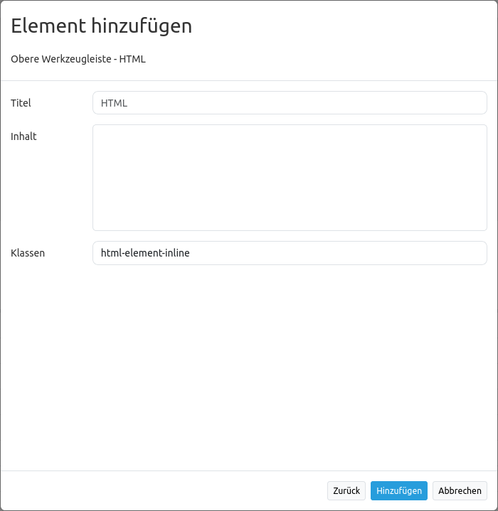

.. _html_de:

HTML (Element)
**************

Dieses Element ermöglicht die Definition von HTML an beliebigen Stellen in der Anwendung. Dadurch können zum Beispiel Bilder, Links oder Texte eingebunden werden. Die folgende Abbildung zeigt die Integrierung des Mapbender-Logos in Footer, Toolbar und Seitenleiste.


Es stehen grundsätzlich die folgenden Variablen im HTML-Element zur Verfügung:

- "application" (Entity Application)
- "entity" (Entity HTML-Element)


Konfiguration
=============

Das Element wird im Backend in die Anwendung eingebunden.



* **Title:** Titel des HTML-Elements. Dieser wird in der Layouts-Liste angezeigt und ermöglicht, mehrere HTML-Elemente voneinander zu unterscheiden.
* **Content:** Inhalt des HTML-Elements, z.B. Bild oder Link. Der Content kann die Variablen "application" und "entity" beinhalten.
* **Classes:** Alternativ kann auch auf eine CSS-Klasse für das HTML-Element verwiesen werden. Die im CSS-Editor definiert werden kann.


Konfigurationsbeispiele
=======================

Bild einbinden:
---------------

Das Mapbender Logo wurde als Bild in die Seitenleiste eingebunden (````). Es kann eine definierte Höhe (``height='60px'``) angegeben werden. Es kann eine Hintergrundfarbe soowie Transparenz (``background-color:rgb(240, 240, 240, 0.9)``) gesetzt werden und beispielsweise ein bestimmter Seitenrandabstand (``padding:10px``). Diese Eigenschaften werden im Styling-Bereich (``style=``) definiert.

.. code-block:: yaml

     


Bild mit hinterlegtem Link einbinden:
-------------------------------------

Das zuvor eingebundene Logo kann um eine Linkverknüpfung erweitert werden. Der Link verweist auf die Mapbender-Webseite (``href='https://mapbender.org'``). Die Information ``target='_blank'`` sorgt dafür, dass sich der Link beim Klicken in einem neuen Tab öffnet.

.. code-block:: yaml

     <a href='https://mapbender.org' target='_blank'>
      </a>

Variablen & HTML-Element
------------------------

Es besteht die Möglichkeit, Variablen in Anwendungen zu verwenden.

* Variable: **"application.title"**

Mit dieser Variable kann der Titel einer Anwendung eingebunden werden. Im folgenden Beispiel lautet dieser: "Konfigurationsbeispiele".

Der HTML-Code kann wie folgt aussehen:

.. code-block:: yaml

     <b><span style="font-size:25px;color:#b6dd18;margin-right:50vw"> Anwendung {{ application.title }} </span></b>

Die Variable für den Anwendungstitel wird durch ``{{ application.title }}`` eingebunden. Der Begriff "Anwendung" ist ein Textzusatz und erscheint unabhängig vom Titel. Durch den Style-Block (``style=``) wurden Schriftgröße (``font-size:25px``), Schriftbreite (``<b></b>``), Schriftfarbe (``color:#b6dd18``) sowie Position (``margin-right:50vw``) des Titels angepasst.

Für das Anwendungsbeispiel sieht das Ergebnis des HTML-Elements wie folgt aus:

.. image:: ../../../figures/de/html_example_application_title.png
     :scale: 80

* Variable: **app.user.username**

Diese Variable gibt den Namen des aktiven Nutzers im HTML-Element aus:

.. code-block:: yaml

	<p>Username: {{ app.user.username }}</p>

Im Anwendungsbeispiel wird der Nutzername in der Toolbar angezeigt:
	

    
* Variable: **group.title**

Die Gruppe des Benutzers kann nicht in einem einzelnen Ausdruck wiedergegeben werden, da Twig den Map-Filter erst in höheren Versionen unterstützt.
Um Gruppentitel dennoch ausgeben zu können, wird eine Schleife im HTML-Element eingebunden:

.. code-block:: yaml

  
      <p>Gruppe #{{ index }}: {{ group.title }}</p>
  

Im Anwendungsbeispiel werden Index und Name der Gruppe in der Toolbar ausgegeben:


* Variable: **"entity"**

Die Variable ``{ entity }`` gibt die ID und ``{ entity.title }`` den Namen des HTML-Elements wieder. 

Im Folgenden wurde die Variable ``{ entity.title }`` mit dem Textzusatz "HTML-Element" eingebunden. Die Styling-Parameter entsprechen der Konfiguration aus dem Beispiel *application.title*. Für *entity.title* wurden lediglich Textzusatz, Variable und Position (margin-right) angepasst.

.. code-block:: yaml

	<b><span style=“font-size:25px;color:#b6dd18;margin-right:60vw“> HTML-Element {{ entity.title }} </span></b>

Diese Variablen sehen in der Anwendung wie folgt aus:


Verweis auf eine Twig-Datei
---------------------------

Im Content-Bereich kann auch auf eine Twig-Datei verwiesen werden. Bitte beachten Sie, dass die Twig-Datei valides HTML enthalten muss.


YAML-Definition:
----------------

Diese Vorlage kann genutzt werden, um das Element in einer YAML-Anwendung einzubinden.

.. code-block:: yaml

    title: 'HTML-Element'
    class: Mapbender\CoreBundle\Element\HTMLElement
    content: <p>Hello, World!</p><p>Application: {{ application.title |trans }}</p> #content kann die Variablen "application" und "entity" beinhalten.
    classes: my-special-css-class

