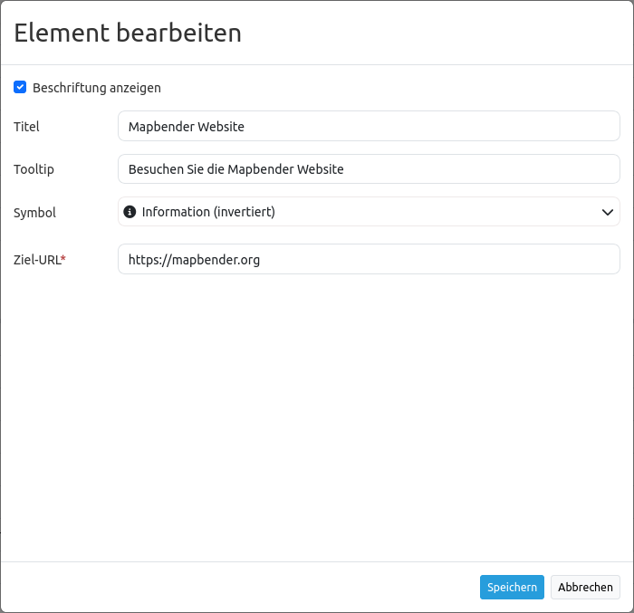

.. _link_de:

Link
****

Dieses Element stellt ein Button-Modul bereit, über das eine Webseite oder ein Skript verlinkt werden kann. 

Konfiguration
=============

* **Beschriftung anzeigen:** Schaltet die Beschriftung des Buttons an/aus (Standard: an).
* **Title:** Titel des Elements. Dieser wird in der Layouts Liste angezeigt und ermöglicht, mehrere Button-Elemente voneinander zu unterscheiden. Der Titel wird außerdem neben dem Button angezeigt, falls die Checkbox "Beschriftung anzeigen" aktiviert ist.
* **Tooltip:** Text, der angezeigt wird, wenn der Mauszeiger eine längere Zeit über dem Element verweilt.
* **Icon:** Symbol des Buttons, basierend auf einer CSS-Klasse.
* **Ziel-URL:** Angabe der Ziel-URL, auf die der Button verweist.

Icons
-----

Für einige Symbole können zwei verschiedene Icon-Typen ausgewählt werden.

* Ein Symbol basierend auf einer Grafik (z.B. "About"),
* Ein Symbol basierend auf einer Schrift (z.B. "About (Font Awesome)").

Letztere basieren auf einem `IconSet <https://github.com/mapbender/icons>`_, das mit dem Mapbender als Modul ausgeliefert wird. Wir empfehlen die Verwendung der Symbole aus dieser Bibliothek.

Mehr Informationen dazu unter:

* https://github.com/mapbender/icons
* http://rawgit.com/mapbender/icons/master/demo.html

Konfigurationsbeispiele:
=========================
Je nach Ziel der Anwendung werden unterschiedliche Buttons benötigt, die verschiedene Funktionen bieten. Diese können nach Bedarf und Wunsch integriert werden. 
Buttons können für Features eingebunden werden, die vorher im Content-Bereich konfiguriert wurden. Beispielsweise können die Legende oder die Linien- und/oder Flächenmessung über Buttons angesprochen werden:

Link zur Mapbender-Webseite
---------------------------

Zuerst muss über das ``+`` - Zeichen in der Anwendung unter dem Reiter Layouts im Toolbar Bereich das Element Button ausgewählt werden.

.. image:: ../../../figures/de/add_toolbar.png
     :scale: 80
     
Nach Auswahl des Elementes "Link" öffnet sich der Dialog "Element hinzufügen – Link". Hier werden die Einstellungen zur Konfiguration des Elementes vorgenommen.

Im Feld *Title* definieren Sie den Text, der rechts neben dem Button angezeigt werden soll. 
Hierzu muss *Beschriftung anzeigen* aktiviert sein. Sie können im Feld "Tooltip" einen Text definieren, der erscheinen soll, wenn die Maus über den Button fährt. 
Unter *Icon* können Sie über die Auswahl einen der möglichen Button-Symbole ausgewählen.

YAML-Definition:
----------------

.. code-block:: yaml

    title: Link                                # Titel
    class: Mapbender\CoreBundle\Element\Button
    tooltip: Besuchen Sie diese Webseite       # Text des Tooltips
    icon: iconInfoActive                       # Symbol verwendete CSS Klasse
    label: true                                # false/true, um den Button zu beschriften. Der Standardwert ist true.
    click: https://mapbender.org               # bezieht sich auf eine Webseite oder ein Skript
