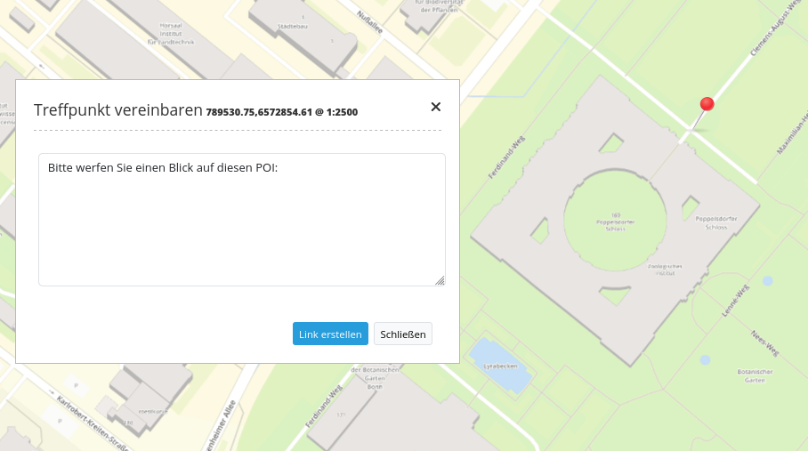

.. _poi_de:

POI (Treffpunkt)
**************************

Generiert POI-URLs (Treffpunkt-URLS), verwendbar für das Verschicken eines Koordinatenpunkts per E-Mail. Dabei wird der übermittelte Punkt in das Koordinatensystem der Karte projeziert und angezeigt.

     

Konfiguration
=============

.. image:: ../../../figures/de/poi_configuration.png
     :scale: 80
     
* **Versenden per Mail:** Der POI wird per Mail verschickt. 
* **Title:** Titel des Elements. Dieser wird in der Layouts Liste angezeigt und ermöglicht, mehrere Button-Elemente voneinander zu unterscheiden. Der Titel wird außerdem neben dem Button angezeigt, wenn "Beschriftung anzeigen" aktiviert ist.
* **Body:** Dialogtext der nach dem Setzen eines POI angezeigt wird. 
* **GPS:** Erlaubt eine GPS Positionierung.

YAML-Definition:
----------------

.. code-block:: yaml

    target: map                             # only mapp-element is possible
    body: 'Setzen Sie per Klick einen Treffpunkt'  # definieren Sie einen Text für den Dialog

