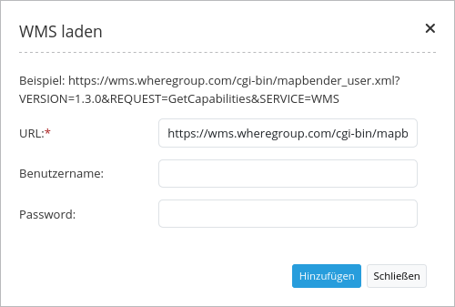
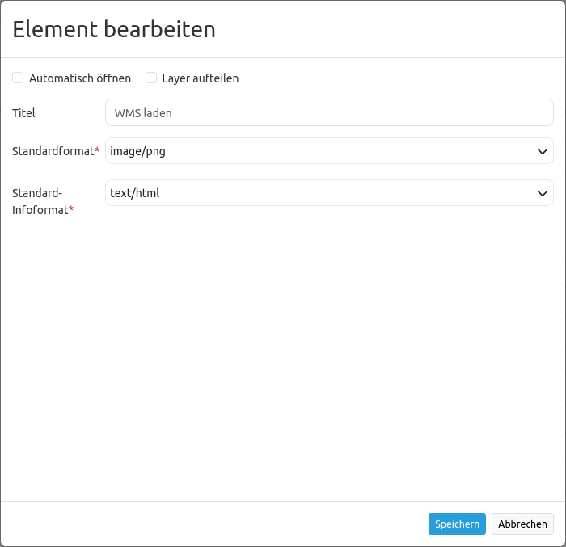

.. _wms_loader_de:

WMS laden (WMS Loader)
**********************

Mit diesem Element können WMS per getCapabilities-Request in Mapbender geladen werden. Es kann WMS 1.1.1 und WMS 1.3.0 geladen werden.

Konfiguration
=============

* **Automatisches Öffnen:** Öffnet Element beim Start der Anwendung (Standard: false).
* **Layer aufteilen:** Teilt Ebenen beim Laden des Dienstes auf (Standard: false).
* **Title:** Titel des Elements. Dieser wird in der Layouts Liste angezeigt und ermöglicht, mehrere Button-Elemente voneinander zu unterscheiden. Der Titel wird außerdem neben dem Button angezeigt, wenn “Beschriftung anzeigen” aktiviert ist.
* **Default format:** image/png, image/gif, image/jpeg (Standard: image/png).
* **Default info format:** text/html, text/xml, text/plain (Standard: text/html).

Für das Element wird ein Button verwendet. Siehe unter :ref:`button_de` für weitere Informationen zu dessen Konfiguration.

YAML-Definition:
----------------

Diese Vorlage kann genutzt werden, um das Element in einer YAML-Anwendung einzubinden.

.. code-block:: yaml

   target: ~                            # ID des Kartenelements
   tooltip: 'WMS Loader'                # Text des Tooltips
   autoOpen: false                      # true, wenn das Element beim Start der Anwendung geöffnet werden soll (Standard: false).
   defaultFormat: 'image/png'           # image/png, image/gif, image/jpeg (Standard: image/png)
   defaultInfoFormat: 'text/html'       # text/html, text/xml, text/plain (Standard: text/html)
   splitLayers: false                   # Nutzt geteilte Ebenen beim Laden des Dienstes (Standard: false)

Hinzufügen eines WMS über einen definierten Link
================================================

Mapbender kann einen WMS über einen definierten Link hinzufügen, z. B. über :ref:`die Informationsabfrage<feature_info_de>` oder über Suchergebnisse.

Dazu muss in "WMS laden" die Option **use Declarative** aktiviert werden. In einer YAML-Anwendung wird die Option ``useDeclarative`` auf true gesetzt.

Der Link sollte folgendermaßen aussehen:

.. code-block:: html

  <a href="#"
  mb-action="source.add.wms" mb-layer-merge="1" mb-wms-merge="1"
  mb-wms-layers="Gewaesser,Fluesse" 
  mb-add-vendor-specific="bplan=123"
  mb-url="http://wms.wheregroup.com/cgi-bin/germany.xml?VERSION=1.1.1&REQUEST=GetCapabilities&SERVICE=WMS">load service</a>

.. code-block:: yaml

    mb-action="source.add.wms"    # definiert die Aktion, um einen WMS hinzuzufügen
    mb-wms-merge="1"              # fügt den WMS nur einmal hinzu, wenn der WMS in der Applikation bereits Bestandteil ist, wird dieser verwendet (Standard ist 1)
    mb-layer-merge="1"            # Standard ist 1: aktiviert die Ebene in mb-wms-layers. Deaktiviert die Ebenen nicht, die schon aktiviert sind.
    mb-wms-layers="Gewaesser,Fluesse" # Definiert die Ebenen, die aktiviert werden sollen, _all activates aktiviert alle Ebenen. Standard ist alle Ebenen sind deaktiviert.
    href oder mb-url              # verweist auf die WMS getcapabilities URL
    mb-add-vendor-specific="bplan=123" # Definition von Vendor Specific Parametern, die an den Request angefügt werden (ab Version 3.2.9).

