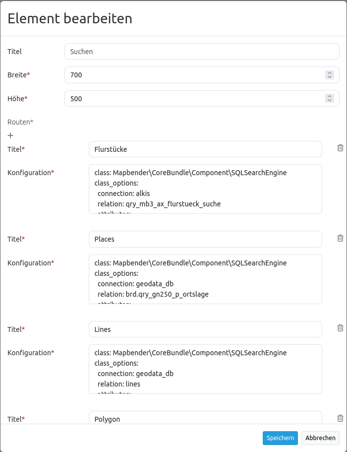

.. _search_router:

Search Router
***********************

Dieses Element erzeugt ein Suchformular mit Trefferausgabe. Das Formular und die Trefferausgabe sind dabei konfigurierbar. Zur Zeit wird eine generische SQL Suche unterstützt, weitere Entwicklungen werden folgen (z.B. WFS, Solr). 

.. image:: ../../../figures/search_router.png
     :scale: 80

Konfiguration
=============

Die Suche greift auf Tabellen in einer Datenbank zu. Dafür muss die Datenbank in Mapbender bekannt gegeben werden. Informationen dazu finden sich unter `Konfiguration der Datenbank <../../customization/database.html>`_.

**Hinweis**: Für die Nutzung der unten beschriebenen Suche können die Tabellen aus der Digitalisierungs-Demo genutzt werden. Die SQLS für die Erstellung der Tabellen befinden sich in der Dokumentation unter `Digitizer <../editing/digitizer.html>`_.

* **Title:** Titel des Elements. Dieser wird in der Layouts Liste angezeigt und wird neben dem Button angezeigt, wenn “Beschriftung anzeigen” aktiviert ist.
* **Target:** Name/ID des Kartenelements, auf das sich das Element bezieht.
* **Dialog:** Einbindung als Dialog über Button (Haken setzen) oder in der Sidepane (Haken nicht setzen)
* **Timeout factor:** Timeout-Faktor (multipliziert mit autcomplete Verzögerung), um die Autovervollständigung zu verhindern, nachdem eine Suche gestartet wurde.
* **Width:** Breite des Dialogs (nur wenn das Element als Dialog eingebunden wurde)
* **Height:** Höhe des Dialogs (nur wenn das Element als Dialog eingebunden wurde)
* **Routes:** Erstellung einer neuen Suche.
* **Title**: Titel der Suche (erscheint erst, wenn über das + bei Routes eine Suche hinzugefügt wurde)
* **Configuration**: Feld für die Konfiguration der Suche (erscheint erst, wenn über das + bei Routes eine Suche hinzugefügt wurde)

Über den Button ``+`` bei Routes können mehrere Suchen erstellt werden. Jede Suche beinhaltet die Felder *Title* und *Configuration*. Der eingegebene Titel bei *Title* ist in der Suche in der Anwendung in einer Auswahlbox selektierbar. So können mehrere Suchen unterschieden und ausgewählt werden. Die Definition der Suche erfolgt im yaml-Syntax im Textfeld *Configuration*. Hier werden die Suchtabelle bzw. Abfrage, die Datenbankverbindung, der Formularaufbau, die Trefferausgabe sowie das Styling der Treffer definiert.
Das Element kann entweder in der Sidepane oder als Button in der Toolbar integriert werden. Zu der Konfiguration des Buttons besuchen Sie die Dokumentationsseite unter `Button <../misc/button.html>`_.

Beispiel einer Such-Konfiguration im Textfeld ``Configuration``:

.. code-block:: yaml

    class: Mapbender\CoreBundle\Component\SQLSearchEngine
    class_options:
        connection: search_db
        relation: ortschaften
        attributes:
            - gid
            - ortsname
        geometry_attribute: geom
    form:
        ortsname:
            type: text
            options:
                required: true
            compare: exact
    results:
        view: table
        count: true
        headers:
            gid: ID
            ortsname: Name
        callback:
            event: click
            options:
                buffer: 10
                minScale: null
                maxScale: null

Vergleichsmodus
-----------------

Für jedes Feld kann ein Vergleichsmodus bestimmt werden, welcher von der Engine verwendet werden soll, wenn die Suchanfrage gestellt wird. Die SQL Suche Engine hat die folgenden Modi:

* **exact:** genauer Vergleich, Schlüssel = Wert (key = val)
* **iexact:** Vergleich, bei der Groß- / Kleinschreibung nicht unterschieden wird (case-insensitive)
* **like:** Standard, zweiseitiges 'like'
* **like-left:** linksseitiges 'like'
* **like-right:** rechtsseitiges 'like'
* **ilike**: zweiseitiges 'like', bei dem Groß- / Kleinschreibung nicht unterschieden wird (case-insensitive - \*searchstring\*)
* **ilike-left:** linksseitiges 'like', bei dem Groß- / Kleinschreibung nicht unterschieden wird (case-insensitive - \*searchstring)
* **ilike-right:** rechtsseitiges 'like', bei dem Groß- / Kleinschreibung nicht unterschieden wird (case-insensitive - searchstring\*)

Styling der Ergebnisse
-----------------------

Standardmäßig werden die Ergebnisse in der Karte in dem default-OpenLayers Style angezeigt, d.h. orange für die Treffer und blau für selektierte Objekte. Das OpenLayer default Styling sieht wie folgt aus:

.. image:: ../../../figures/de/search_router_example_colour_orangeblue.png
     :scale: 80

Sie können diese Farbgebung überschreiben, indem Sie eine styleMap-Konfiguration übergeben, die wie folgt aussehen könnte:

.. code-block:: yaml

    results:
        styleMap:
            default:
                strokeColor: '#00ff00'  # Umrandungsfarbe
                strokeOpacity: 1        # 1 - opak (keine Transparenz)
                strokeWidth: 3          # Umrandingsbreite
                fillColor: '#f0f0f0'    # Füllfarbe                
                fillOpacity: 0          # Opazität Füllung, voll transparent, daher keine Füllung
                pointRadius: 6          # Größe des Punktsymbols
            select:
                strokeColor: '#0000ff'
                strokeOpacity: 1
                strokeWidth: 4
                fillColor: '#ff00ff'
                fillOpacity: 0.8
                pointRadius: 10

Diese Definition füllt die Polygone nicht, da die Transparenz auf Null gesetzt wurde (fillOpacity: 0). Sie werden lediglich grün umrandet dargestellt. Die selektierten Objekte in diesem Beispiel werden mit der Farbe Lila gefüllt und sind transparent mit einem Faktor von 0.8. Umrandet sind die Objekte mit einer blauen Linie. Diese Farbkonfiguration sieht so aus:

.. image:: ../../../figures/de/search_router_example_colour_purplegreen.png
     :scale: 80

Die default-Angaben überschreiben die OpenLayers-Standardangaben. Daher müssen Sie lediglich die Angaben setzen, die Sie überschreiben möchten. Wenn Sie die Angaben weglassen wird der OpenLayers default-Stil verwendet.

Die gleiche Logik wird beim select-Stil verfolgt. Jede Angabe, die Sie machen überschreibt die Angaben des *finalen* default Stils. 

Beachten Sie, dass die hexadezimalen Farbwerte in Anführungszeichen angegeben werden müssen, da das #-Zeichen ansonsten als Kommentar interpretiert wird.

Das folgende Beispiel erzeigt grüne (ungefüllte) Objekte und stellt das selektierte Objekt in rot dar:

.. code-block:: yaml

    results:
        styleMap:
            default:
                strokeColor: '#00ff00'
                strokeOpacity: 1
                fillOpacity: 0
            select:
                strokeColor: '#ff0000'
                fillColor: '#ff0000'
                fillOpacity: 0.4

.. image:: ../../../figures/de/search_router_example_colour_redgreen.png
     :scale: 80

Konfigurationsbeispiele
========================
In diesem Beispiel wurde eine Suche für die Mapbender User konfiguriert. Die Suche wurde in die Sidepane über das ``+`` -Zeichen in der Anwendung unter Layouts, Sidepane hinzugefügt.

.. image:: ../../../figures/de/add_sidepane.png
     :scale: 80

Der Konfigurationsdialog zu diesem Konfigurationsbeispiel sieht wie folgt aus:

Der Elementitel (*Title*) lautet Suchen. Dieser wieder in der Sidepane als Titel angezeigt. Da das Element in der Sidepane eingebunden wird und nicht als Button, wurde bei Dialog kein Haken gesetzt. Der *Timeout factor* wurde auf 2 gestellt. In den Feldern *Width* und *Height* stehen zwar Werte, diese werden in der Anwendung jedoch nicht miteinbezogen, da das Element in der Sidepane konfiguriert wird. Es wurde über das ``+`` -Zeichen bei *Routes* eine Suche eingebunden, die die Bezeichnung (*Title*) Mapbender User trägt. In *Configuration* wurde die yaml-Konfiguration des Elements eingefügt. Vollständig lautet diese:

.. code-block:: yaml

	class: Mapbender\CoreBundle\Component\SQLSearchEngine
	class_options:
	  connection: demo				# die Datenbank, auf die das Element zugreift
	  relation: mapbender_user			# die Tabelle, auf die das Element zugreift
	  attributes:					# entspricht den Tabellenspalten in der Datenbank, die angesprochen werden sollen
	    - gid
	    - orga
	    - town
	    - usertype
	  geometry_attribute: the_geom			# Definition der Geometrie Spalte
	form:						# ab hier beginnt die Konfiguration des Formulars
	  orga:						# Feld für die Suche nach dem Namen des Mapbender Users
	    type: text
	    options:
	      required: false				# kein Pflichtfeld
	      label: 'Mapbender User'			# Überschrift über dem Feld
	      attr:					# zusätzlich definierbare Attribute
	        data-autocomplete: 'on'			# automatische Vervollständigung des eingetippten Suchbegriffs
	        data-autocomplete-distinct: 'on'
	    compare: ilike				# Vergleichsmodus
	  town:						# Feld für die Suche nach der Stadt
	    type: text
	    options:
	      required: false				# kein Pflichtfeld
	      label: Stadt				# Überschrift über dem Feld
	      attr:
	        data-autocomplete: 'on'
	        data-autocomplete-distinct: 'on'
	    compare: ilike
	  usertype:					# Feld für die Suche nach dem Nutzertyp
	    type: choice				# Feld mit Auswahlmöglichkeiten als Dropdown
	    options:
	      empty_value: 'Bitte auswählen...'		# Text, der angezeigt wird, bevor etwas ausgewählt wurde
	      choices:					# die Auswahlmöglichkeiten; werden wie folgt angegeben: "Eintrag in der Spalte der Datenbank": "Angezeiger Name in der Dropdown-Liste"
	        1: Company
	        2: Administration
	        3: University
	        4: User
	      required: false				# kein Pflichtfeld
	      label: Nutzertyp				# Überschrift über dem Feld
	    compare: exact				# Vergleichsmodus
	results:					# Konfiguration der Ergebnisanzeige
	  view: table					# Tabelle ausgeben
	  count: true					# Anzahl der Ergebnisse anzeigen
	  headers:					# Titel der Spalte; werden wie folgt angegeben: Spaltenname in der Datenbank: Bezeichnung der Spalte in der Suchausgabe der Anwendung
	    gid: ID
	    orga: 'Mapbender User'
	    town: Stadt
	  callback:
	    event: click				# bei Klicken wird das Element selektiert
	    options:
	      buffer: 10
	      minScale: null
	      maxScale: 10000
	  styleMap:					# Styling der Punkte in der Karte
	    default:					# Styling aller angezeigten Punkte
	      strokeColor: '#003366'
	      strokeOpacity: 1
	      fillColor: '#3366cc'
	      fillOpacity: 0.5
	    select:					# Styling des selektierten Objekts
	      strokeColor: '#330000'
	      strokeOpacity: 1
	      fillColor: '#800000'
	      fillOpacity: 0.5

Die Suche mit dieser Konfiguration sieht in der Anwendung so aus:

.. image:: ../../../figures/de/search_router_example_search.png
     :scale: 80

Auf dieser Abbildung wird gezeigt, welche Auswirkungen die vorgenommenen Konfigurationen in der yaml-Definition auf das Suchformular haben:

.. image:: ../../../figures/de/search_router_example_search_description.png
     :scale: 80

Dargestellt ist der Ausschnitt der yaml-Definiton, der das Formular konfiguriert. Tabellenspalten orga, town und usertype werden im Formular verwendet und sind jeweils als die Felder Mapbender User, Stadt und Nutzertyp eingebunden. Mapbender User und Stadt sind jeweils vom type Text. Nutzertyp hingegen gibt Auswahlmöglichkeiten in Form einer Dropdown-Liste vor. Der Text, der angezeigt werden soll, wenn noch nichts ausgewählt wurde, ist hier "Bitte auswählen…" (siehe Nr. **1** – empty_value: ‚Bitte auswählen...‘). Der Titel über den Feldern wird mit label festgelegt (siehe Nr. **2**). Das Attribut data-autocomplete: ‚on‘ bewirkt, dass Vorschläge aus der Datenbank zu dem eingegebenen Begriff vorgegeben und als Dropdown angezeigt werden (siehe Nr. **3**). Da der Vergleichsmodus ilike (compare: ilike) konfiguriert wurde, muss der Begriff nicht exakt eingegeben werden. Die Suche findet ebenfalls Ergebnisse die ähnlich zu dem eingegebenen Begriff sind (siehe Nr. **4** – Wheregr (das g wurde klein geschrieben, trotzdem werden die Ergebnisse WhereGroup mit großem G gefunden)). Bei dem Feldtyp choice werden Auswahlmöglichkeiten vorgegeben. Diese Auswahlmöglichkeiten werden unter choices angegeben (siehe Nr. **5**). In der Tabelle sind die Auswahlmöglichkeiten als Zahlen hinterlegt (1, 2, 3, 4). In diesem Beispiel wurde jeder Zahl ein Text zugeordnet, der in der Dropdown-Liste angezeigt werden soll.

Eine vollständig ausgefüllte Suche nach dem Mapbender User WhereGroup, in der Stadt Bonn, des Nutzertyps Company und deren Ergebnis sieht wie folgt aus:

.. image:: ../../../figures/de/search_router_example_search_WG.png
     :scale: 80

Auf dieser Abbildung wird gezeigt, welche Auswirkungen die vorgenommenen Konfigurationen in der yaml-Definition auf die Anzeige der Ergebnisse haben:

.. image:: ../../../figures/de/search_router_example_results_description.png
     :scale: 80

Auf dieser Abbildung ist lediglich die Konfiguration der Ergebnisse angezeigt. Die Anzahl der Ergebnisse wird aufgrund von count: true (siehe Nr. **1**) angezeigt. Anschließend werden die Spaltentitel unter headers definiert (siehe Nr. **2**). Hier wird zuerst die Bezeichnung der Spalte in der Tabelle angegeben, so dass definiert wird auf welche Tabellenspalte sich die Ergebnisanzeige bezieht. Nach dem Doppelpunkt wird dann angegeben, welcher Titel in der Anwendung angezeigt werden soll. In dem Block styleMap wird das Styling der Punkte vorgenommen. Der Block default (siehe Nr. **3**) bezieht sieht dabei auf alle Punkte und der Block select (siehe Nr. **4**) nur auf das ausgewählte Objekt.

Da keines dieser Felder ein Pflichtfeld ist, kann die Suchabfrage auch nur mithilfe eines Feldes erfolgen.

Weitere Konfigurationsbeispiele
--------------------------------

Beispiel mit Autovervollständigung und individueller Ergebnisanzeige:

.. code-block:: yaml

   Create or Replace view brd.qry_gn250_p_ortslage as Select gid, name, gemeinde, bundesland, oba, ewz_ger,  hoehe_ger ,geom from brd.gn250_p where oba = 'AX_Ortslage' order by name;

.. code-block:: yaml

	class: Mapbender\CoreBundle\Component\SQLSearchEngine
	class_options:
	    connection: search_db
	    relation: brd.qry_gn250_p_ortslage
	    attributes:
		- gid
		- name
		- gemeinde
		- bundesland
		- ewz_ger
		- hoehe_ger
	    geometry_attribute: geom
	form:
	    name:
		type: text
		options:
		    required: false
		    label: Name
		    attr:
		        data-autocomplete: on
		compare: ilike
	    gemeinde:
		type: text
		options:
		    required: false
		compare: ilike
	results:
	    view: table
	    count: true
	    headers:
		name: Name
		gemeinde: Gemeinde
		bundesland: Bundesland
		ewz_ger: Einwohner
		hoehe_ger: Höhe
	    callback:
		event: click
		options:
		    buffer: 1000
		    minScale: null
		    maxScale: null
	    styleMap:
		default:
		    strokeColor: '#00ff00'
		    strokeOpacity: 1
		    fillOpacity: 0
		select:
		    strokeColor: '#ff0000'
		    fillColor: '#ff0000'
		    fillOpacity: 0.8

Beispiel mit Auswahlbox:

.. code-block:: yaml

   Create or Replace view brd.qry_gn250_p as Select gid, name, gemeinde, bundesland, oba, geom from brd.gn250_p where oba = 'AX_Ortslage' OR oba = 'AX_Wasserlauf' order by name;

.. code-block:: yaml

	class: Mapbender\CoreBundle\Component\SQLSearchEngine
	class_options:
	    connection: search_db
	    relation: brd.qry_gn250_p_ortslage
	    attributes:
		- gid
		- name
		- gemeinde
		- bundesland
		- oba
	    geometry_attribute: geom
	form:
	    oba:
		type: choice
		options:
		    empty_value: 'Bitte wählen...'
		    choices:
		        AX_Ortslage: Ort
		        AX_Wasserlauf: 'Gewässer'
	    name:
		type: text
		options:
		    required: false
		    label: Name
		    attr:
		        data-autocomplete: on
		compare: ilike
	    gemeinde:
		type: text
		options:
		    required: false
		compare: ilike
	results:
	    view: table
	    count: true
	    headers:
		name: Name
		gemeinde: Gemeinde
		bundesland: Bundesland
	    callback:
		event: click
		options:
		    buffer: 1000
		    minScale: null
		    maxScale: null

YAML-Definition 
----------------

In der mapbender.yml Datei:

.. code-block:: yaml

   target: map # ID des Kartenelements
   asDialog: true # true, Erebniswiedergabe in einem Dialogfeld
   timeoutFactor:  3 # Timeout-Faktor (multipliziert mit autcomplete Verzögerung) um die Autovervollständigung zu verhindern, nachdem eine Suche gestartet wurde
   height: 500 # Höhe des Dialogs
   width: 700 # Breite des Dialogs
   routes:    # Sammlung von Suchrouten
       demo_polygon:  # für Maschinen lesbarer Name
			class: Mapbender\CoreBundle\Component\SQLSearchEngine  #  Suchmaschine, die verwendet werden soll
			class_options:  # Diese werden an die Suchmaschine weitergegeben
			    connection: digi_suche    # search_db  # DBAL Verbindungsname, der benutzt werden soll, benutzen sie ~ für default
			    relation: polygons # Verbindungsauswahl, Unterabfragen können verwendet werden
			    attributes: 
			        - gid  # Liste von Spalten auswählen, expressions are possible
			        - name 
			        - type
			    geometry_attribute: geom  # Name der Geometriesplate, die genutzt werden soll. Achtung: Projektion muss mit Projektion des map-Elements übereinstimmen
			form:  # Einstellungen für das Suchformular
			    name:  # Feldname, Spaltenname der genutzt werden soll 
			        type: text  # Eingabefeld, normalerweise Text oder Zahlen
			        options:  # Einstellungen für das Eingabefeld
			            required: false  # HTML5 benötigte Attribute
			            label: Name  # benutzerdefinierte Beschriftung eingeben, sont wird die Beschriftung von dem Feldnamen abgeleitet
			            attr:  # HTML5 benötigte Attribute
			                data-autocomplete: on  # Attribut, um Autovervollständigung zu aktivieren
			                data-autocomplete-distinct: on  # Attribut, dass Autovervollständigung aktiviert aber unterscheiden lässt
			                data-autocomplete-using: type   # komma separierte Liste von anderen Eingabefeldern, in denen WHERE Angaben für die Autovervollständigung gemacht werden                
			        compare: ilike  # Siehe unten für weitere Vergleichsformen
			    type:
			        type: choice
			        options:
			            empty_value: Please select a type.
			            required: false
			            choices:
			                A: A
			                B: B
			                C: C
			                D: D
			                E: E
			results:
			    view: table  # Ansicht der Ergebnisse, Ausgabe z.B. als Tabelle
			    count: true # Anzahl der Treffer anzeigen
			    headers:  # hBezeichnung der Tabellenüberschriften und der entsprechenden Ergebnisspalten
			        gid: ID  # Spaltenname -> Überschrift
			        name: Name
			        type: Type
			    callback:  # Was beim Klick und Mauszeiger halten passiert
			        event: click  # Ergebnisliste (click oder mouseover)
			        options:
			            buffer: 10    # Puffert die Geometrieergebnise (Karteneinheiten) vor dem Zoomen
			            minScale: ~   # Maßstabsbegrenzung beim Zoomen, ~ für keine Begrenzung
                        maxScale: ~
			    results:
			        styleMap:  # Siehe unten für weitere Styles
			            default:
			                strokeColor: '#00ff00'
			                strokeOpacity: 1
			                fillOpacity: 0
			            select:
			                strokeColor: '#ff0000'
			                fillColor: '#ff0000'
			                fillOpacity: 0.4

Class, Widget & Style
=====================

* **Class:** Mapbender\\CoreBundle\\Element\\SearchRouter
* **Widget:** mapbender.element.searchRouter.js, mapbender.element.searchRouter.Feature.js, mapbender.element.searchRouter.Search.js
* **Style:** mapbender.element.searchRouter.css

HTTP Callbacks
==============

<route_id>/autocomplete
-----------------------

Automatisch vervollständigter Ajax Endpunkt für die vorgegebene Suchroute. Die Autovervollständigung  wird unter Verwendung von Backbone.js eingesetzt. Das Autovervollständigung-Modul ist implementiert in mapbender.element.searchRouter.Search.js.

<route_id>/search
-----------------

Automatisch vervollständigter Ajax Endpunkt für die vorgegebene Suchroute. Die Suche  wird unter Verwendung von Backbone.js eingesetzt. Das Such-Modul ist implementiert in mapbender.element.searchRouter.Search.js.

JavaScript API
==============

open
----
Wenn das Modul als Dialog konfiguriert wird: open.

close
-----
Wenn das Modul als Dialog konfiguriert wird: close.

