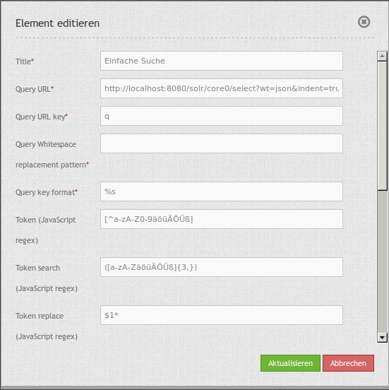

.. _simplesearch_de:

SimpleSearch
************

SimpleSearch bietet eine Einfeldsuche oder Schlagwortsuche. 
Die Suchanfrage wird dabei an einen Suchdienst übermittelt. 
Als Such-Server können Apache Solr, Nominatim, photon oder ein OGC API Features Dienst verwendet werden.

Es wird ein Eingabefeld angeboten, welches direkt in die Toolbar oder in der Seitenleiste (Sidepane) eingebunden werden kann. SimpleSearch sendet den eingegebenen Suchbegriff an eine konfigurierbare URL und empfängt JSON-formatierte Daten, welche eine Beschriftung und Geometrieattribute für jeden Eintrag beinhalten.

Die Geometriedaten können in WKT oder in GeoJSON-Format codiert werden.

Es kann frei konfiguriert werden, welche Informationen in der 
Trefferauswahl angezeigt werden sollen.

.. image:: ../../../figures/simplesearch.png
     :scale: 80

Konfiguration
=============

.. image:: ../../../figures/de/simplesearch_configuration_b.png
     :scale: 80

* **Title:** Titel des Elements. Dieser wird in der Layouts Liste angezeigt und ermöglicht, mehrere Button-Elemente voneinander zu unterscheiden. Der Titel wird außerdem neben dem Button angezeigt, wenn “Beschriftung anzeigen” aktiviert ist.
* **Query URL:** Solr bzw. Nominatim URL, an die der eingegebene Suchbegriff gesendet wird (z.B. ``http://localhost:8080/solr/core0/select?wt=json&indent=true``).
* **Query URL key:** Der Suchparameterschlüssel, der angehängt wird (z.B. ``q``).
* **Query Whitespace replacement pattern:** Muster zum Austausch von Leerzeichen.
* **Query key format:** Einfaches Suchformat (z.B. ``%s``).
* **Token search/ replace (JavaScript regex):** Tokenizer spaltet/ sucht/ ersetzt regexp.

  * Token, z.B.: ``[^a-zA-Z0-9äöüÄÖÜß]``
  * Token search, z.B.: ``([a-zA-ZäöüÄÖÜß]{3,})``
  * Token replace, z.B.: ``$1*``
    
* **Collection path:** Dies kann ein Attributspfad sein, der vom Abfrageergebnis extrahiert wird (z.B. ``response.docs``).
* **Label attribut:** Attribut oder mehrere Attribute , die als Ergebnis angezeigt werden sollen.
* **Geom attribut:** Attributname der Geodaten (z.B. ``geom``).
* **Geom format:** Geodatenformat, kann WKT oder GeoJSON sein (z.B. ``WKT``).
* **Quell-SRS:** EPSG-Code des primären Koordinatenbezugsystems (z.B. ``EPSG:25832``)
* **Delay:** Automatische Vervollständigungs-Verzögerung (z.B. ``300``).
* **Result buffer:** Puffert das Objekt (in Karteneinheiten) vor dem Zoomen (z.B. ``10``).
* **Result minscale/maxscale:** Maßstabsbegrenzung beim Zoomen (z.B. ``1000`` und ``5000``). ~ wenn keine Begrenzung gewünscht wird.
* **Result icon url:** Symbol, das zur Trefferanzeige verwendet werden soll (z.B. ``http://demo.mapbender.org/bundles/mapbendercore/image/pin_red.png``).
* **Result icon offset:** Versatz x und y des Symbols (z.B. ``-6,-38`` für das Stecknadel-Icon).

Flexible Konfigurationsmöglichkeiten für label_attribute
---------------------------------------------------------

Das JSON enthält unterschiedliche Informationen. Ab Version 3.2 können auch mehrere der Attribute als Ergebnis ausgegeben werden.

.. code-block:: yaml

   label_attribute: label

Die Definition bezieht sich relativ zur Angabe unter *Collection path*. 
Zwischen den einzelnen Attributen kann zusätzlicher Text angebenen werden.

.. code-block:: yaml

   label_attribute:  '${properties.address.city} ${properties.address.road} ${properties.address.house_number}'

.. code-block:: yaml

   label_attribute:  'Ort: ${properties.address.city}: ${properties.address.road} - ${properties.address.house_number}'

YAML-Definition
---------------

.. code-block:: yaml

   query_url: http://example.com/solr/core/0/select?wt=json&indent=true&rows=8        # Solr URL (z.B. ``http://localhost:8080/solr/core0/select?wt=json&indent=true``) oder Nominatim URL.
   query_key: q                                                                       # Der Suchparameterschlüssel, der angehängt wird
   query_ws_replace:                                                                  # Pattern zum Austausch von Leerzeichen.
   query_format: '%s'                                                                 # Einfaches Suchformat.
   token_regex: [^a-zA-Z0-9äöüÄÖÜß]                                                   # Tokenizer split regexp.
   token_regex_in: ([a-zA-ZäöüÄÖÜß]{3,})                                              # Tokenizer search regexp.
   token_regex_out: '$1*'                                                             # Tokenizer replace regexp.
   collection_path: response.docs                                                     # Es kann ein Attributspfad sein, der vom Abfrageergebnis extrahiert wird.
   label_attribute: label                                                             # Attributname, der für die Trefferausgabe genutzt wird 
   geom_attribute: geom                                                               # Name des Attributs der Geometriedaten 
   geom_format: WKT                                                                   # Geodatenformat, kann WKT oder GeoJSON sein
   sourceSrs: 'EPSG:25832'                                                            # Projektion in der Die Daten ausgeliefert werden 
   delay: 300
   result:                                                                            # Automatische Vervollständigungs-Verzögerung. 0   
     buffer: 50                                                                       # Puffert den Treffer in Karteneinheiten vor dem Zoomen
     minscale: 1000                                                                   # Maßstabsbegrenzung beim Zoomen, ~ für keine Begrenzung
     maxscale: 5000                                                                   # Maßstabsbegrenzung beim Zoomen, ~ für keine Begrenzung
     icon_url: /bundles/mapbendercore/image/pin_red.png                               # Marker, der zur Trefferanzeige verwendet werden soll
     icon_offset: -6,-38                                                              # Versatz x und y des Symbols
 

Einrichtung von Solr:
=====================

* **Download**: https://solr.apache.org/downloads.html
* **Dokumentation**: https://solr.apache.org/guide
* **Tutorial**: https://solr.apache.org/guide/solr-tutorial.html

Einrichtung von Nominatim:
==========================

* **Download**: http://nominatim.org/release-docs/latest/admin/Installation/
* **Dokumentation**: http://nominatim.org/release-docs/latest/

Einrichtung von photon:
=======================
photon ist ein Open Source Geocoder für OpenStreetMap-Daten.

* **Download & Dokumentation**: https://github.com/komoot/photon

Konfiguration OGC API Features
==============================
Diverse projekte unterstützen OGC API Features wie QGIS, GeoServer, pygeoapi.

HTTP Callbacks
==============

- /search: Proxy-Element, welches die konfigurierbare URL abfragt. Im Entwicklungsmodus wird die endgültige Abfrage-URL zum einfachen Debugging als ein x-mapbender-simplesearch-url Header zurückgegeben.
