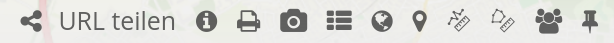

.. _share_de:

Share
*****

Persistente Kartenzustände
==========================

Die Funktion macht bestimmte Kartenparameter und Einstellungen "persistent". Das heißt eine Applikation kann in einem neuen Browser-Tab geöffnet werden, ohne dass dabei bestimmte Informationen verloren gehen.

Persistente und damit wiederherstellbare Informationen umfassen:

* Kartenposition, Maßstab, Koordinatenreferenzsystem, Drehung
* Aktivierte/deaktivierte Layer
* Aktivierte/deaktivierte Layersets
* Transparenz

Die Persistenz beruht nur auf dem eigenen Browserspeicher und ist damit rein lokal. Dies trifft auch auf Systeme mit mehreren Benutzern zu. Die Funktion hat außerdem keinerlei Auswirkung auf den Mapbender Login.

Persistente Kartenzustände werden über eine Checkbox für jede Anwendung einzeln aktiviert unter dem Tab "Basisdaten".

.. image:: ../../../figures/de/persistent_map_view.png
     :scale: 80

Die Funktion kann auch über eine YAML-Anwendung definiert werden. Zu beachten ist hierbei der neue Parameter *persistentView*. Wird dieser weggelassen, dann entspricht dies *false*.

YAML-Definition:
----------------

.. code-block:: yaml

parameters:
    applications:
        mapbender_user:
            title: Mapbender Demo Map
            screenshot: screenshot.png
            published: true
            persistentView: true      # <== neu
            template:  Mapbender\CoreBundle\Template\Fullscreen

Die Einbettung erzeugt eine neue Spalte in der Tabelle *mb_core_application*. Es muss deshalb eine Datenbankaktualisierung durchgeführt werden mit *app/console doctrine:schema:update --force*.

Folgende Kartenparameter und Einstellungen werden momentan nicht unterstützt:

* WMS-Dimensionen
* interaktiv hinzugefügte Instanzen (WMS laden)
* interaktiv entfernte Instanzen (Ebenenbaum Kontextmenü)
* Umstrukturierung von Instanzen im Ebenenbaum (Drag & Drop)
* FeatureInfo Konfiguration für Instanz(en)

URL teilen
==========

Mapbender hinterlegt bestimmte Kartenparameter automatisch in jeder Anwendungs-URL. Dadurch können Kartenausschnitte einfach über Email, Chat etc. durch Weiterleiten der URL geteilt werden.

Die URL beeinhaltet dabei folgende Kartenparameter:

* Kartenposition
* Maßstab
* Drehung
* Räumliches Referenzsystem

Diese Funktion muss nicht extra konfiguriert werden. Sie ist immer aktiviert.

Wenn eine URL in einem neuen Browserfenster geöffnet wird, dann erfolgt auch die Übernahme der zuvor genannten Kartenparameter. Änderungen können über die Browsernavigation vor- bzw. zurückgenommen werden.

Bei Neuladung (F5) werden Nutzer auch zum jeweiligen Kartenausschnitt zurückgeschickt. Soll zur ursprünglichen Konfiguration zurück navigiert werden, dann muss die Anwendung entweder komplett neu geöffnet werden oder eine manuelle Bearbeitung der URL erfolgen.

Hinweis: Folgende Informationen werden nicht hinterlegt: Layer-Auswahl, Layer-Sortierung, temporäre Geometrien, Laufzeitergänzungen, Transparenz sowie interaktiv hinzugefügte Instanzen.

Element "URL teilen"
--------------------

Das Teilen von URLs kann zudem durch den Einbau eines entsprechenden Elements vereinfacht werden. Dieses wird als Button in der Toolbar oder dem Footer eingebunden.

Durch Klick auf das Element wird die URL in der Zwischenablage gespeichert. Standardbrowser-Interaktionen (z.B. Öffnen in einem neuen Tab) sind ebenfalls möglich.

Das Element speichert folgende Informationen:

* Grundlegende Kartenparameter (Kartenposition, Maßstab, Drehung, Referenzsystem)
* Layer- und Layerset-Einstellungen (Auswahl sowie Transparenz)

Folgende Informationen werden *nicht* übergeben: interaktiv hinzugefügte Instanzen (WMS laden), interaktiv entfernte Instanzen (Ebenenbaum Kontextmenü) sowie Änderungen der Layerreihenfolge (Drag & Drop).

YAML-Definition:
----------------

.. code-block:: yaml

    title: Teile diese Kartenansicht   #Optionaler Titel, standardmäßig wird "URL teilen" verwendet (string oder leer).
    tooltip: Ich werde beim Hovern angezeigt   #Optionaler Titel, entpricht bei Weglassung dem Titel (string oder leer).
    label: true   #Aktiviert Darstellung des Titels, zeigt bei FALSE das Element Icon an (Standard: true).
    
