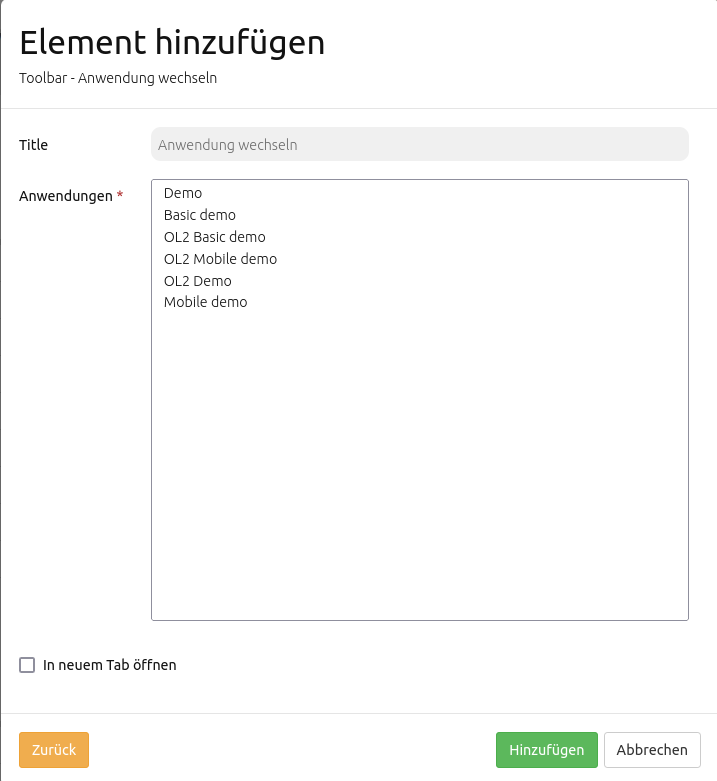

.. _share_de:

Share
*****

Anwendung wechseln
==================

Nutzer können mit diesem Element von ihrer aktuellen Anwendung in eine andere wechseln. Dabei werden die Parameter Kartenposition, Maßstab, Referenzsystem und Rotation beibehalten.

Das Element kann in Toolbar oder Footer implementiert werden. Der Nutzer definiert selbst, zu welchen Anwendungen ein Wechsel möglich ist. Es existiert außerdem die Möglichkeit, ausgewählte Anwendungen in einem neuen Browser-Tab zu öffnen. Diese Einstellung ist über die Elementkonfiguration auswählbar.

YAML-Definition:
----------------

.. code-block:: yaml

  applications: ['mapbender_user', 'mapbender_mobile', 'mapbender_user_basic']   #Definition der auswählbaren Anwendungen
  open_in_new_tab: false                                                         #Öffnet ausgewählte Anwendungen in neuem Tab (Standard: false). 
  
  
Ansichtsverwaltung
==================

Das Element erlaubt die Speicherung und Wiederverwendung von Kartenansichten. Folgende Kartenparameter sind hierin inbegriffen: Kartenposition, Maßstab, Koordinatenreferenzsystem, Drehung, Layer, Layerauswahl sowie Transparenz. Gesetzte Kartenansichten bleiben dabei auch nach Neuladen der Anwendung erhalten.

.. note:: Hinweis: Die Ansichtsverwaltung wird bisher nur in der Sidepane unterstützt.

.. image:: ../../../figures/de/view_manager_overview.png
     :scale: 80

Nutzung
-------

Um eine neue Kartenansicht zu speichern, muss zunächst ein Titel für deren Re-Identifikation vergeben werden. Danach kann die Kartenansicht durch einen Klick auf den Speichern-Button zur Liste hinzugefügt werden.

.. image:: ../../../figures/de/view_manager_create_map_state.png
     :scale: 80

In seiner einfachsten Form kann das Element zur Wiederverwendung von Kartenansichten verwendet werden. Diese Option ist immer vorhanden: Die zuvor gespeicherte Kartenansicht wird nach Klick auf den Abrufen-Button wiederhergestellt. Gespeicherte Ansichten können außerdem überschrieben oder gelöscht werden. Die Einträge in der Sidepane werden dabei entsprechend aktualisiert.

.. note:: Hinweis: Aktuell unterstützt die Ansichtsverwaltung *nicht* folgende Konfigurationen:
* interaktiv hinzugefügte Instanzen (WMS laden)
* interaktiv entfernte Instanzen (Ebenenbaum Kontextmenü)
* alle Werte für WMS-Dimensionen
* dynamisch veränderte Geometrien (Digitizer etc.)

Zugriffsrechte
--------------

Jede Kartenansicht ist einer Anwendung zugeordnet und wird weiter in öffentlich und privat unterteilt. Die Elementkonfiguration enthält die Rechteeinstellungen zum Lesen, Speichern und Löschen von Kartenansichten in öffentlichen Listen. Weiterhin kann hier über Checkboxen definiert werden, ob private Listen die Anzeige privater Kartenansichten ermöglichen sollen, der beim Speichern erstellte Zeitstempel in der Liste angezeigt wird und ob anonyme Besucher öffentliche Kartenansichten speichern dürfen.
Zugriffsrechte müssen für den root Nutzer nicht für öffentliche Ansichten gesetzt werden. Der Administrator kann diese automatisch erzeugen, überschreiben oder löschen. Anonyme Nutzer sind generell von der Arbeit mit privaten Ansichten ausgeschlossen. Sie können öffentliche Einträge außerdem niemals löschen. Ihre Zugriffsrechte für das Speichern sowie Überschreiben von öffentlichen Ansichten wird über die Checkbox "Anonyme Besucher dürfen speichern" gesteuert. Bei Deaktivierung der Option verbleibt anonymen Benutzern noch ein Lesezugriff. Sollen Anonyme Nutzer komplett ausgeschlossen werden, dann kann eine ROLE_USER Zugriffsbeschränkung für das gesamte Element gesetzt werden.

YAML-Definition:
----------------

.. code-block:: yaml

   publicEntries        # String oder leer (Falsche Werte deaktivieren öffentliche Ansichten komplett); andere erlaubte Werte sind ro (nur Lesezugriff), rw (Lese- und Schreibzugriff), rwd (Lese- und Schreibzugriff sowie Löscherlaubnis) (Standard: ro).
   privateEntries       # Schaltet Privatnutzerzustände an mit vollem Zugriff auf Optionen "Speichern", "Wiederverwenden" sowie "Löschen" (Standard: true).
   allowAnonymousSave   # Gibt Speicherrecht für öffentliche Ansichten auch an anonyme Nutzer (Standard: false).
   showDate:            # Zeigt Datum der Erzeugung bzw. Aktualisierung (Standard: true)

Persistente Kartenzustände
==========================

Die Funktion macht bestimmte Kartenparameter und Einstellungen "persistent". Das heißt eine Applikation kann in einem neuen Browser-Tab geöffnet werden, ohne dass dabei bestimmte Informationen verloren gehen.

Persistente und damit wiederherstellbare Informationen umfassen:

* Kartenposition, Maßstab, Koordinatenreferenzsystem, Drehung
* Aktivierte/deaktivierte Layer
* Aktivierte/deaktivierte Layersets
* Transparenz

Die Persistenz beruht nur auf dem eigenen Browserspeicher und ist damit rein lokal. Dies trifft auch auf Systeme mit mehreren Benutzern zu. Die Funktion hat außerdem keinerlei Auswirkung auf den Mapbender Login.

Persistente Kartenzustände werden über eine Checkbox für jede Anwendung einzeln aktiviert unter dem Tab "Basisdaten".

.. image:: ../../../figures/de/persistent_map_view.png
     :scale: 80

Die Funktion kann auch über eine YAML-Anwendung definiert werden. Zu beachten ist hierbei der neue Parameter *persistentView*. Wird dieser weggelassen, dann entspricht dies *false*.

YAML-Definition:
----------------

.. code-block:: yaml

parameters:
    applications:
        mapbender_user:
            title: Mapbender Demo Map
            screenshot: screenshot.png
            published: true
            persistentView: true      # <== neu
            template:  Mapbender\CoreBundle\Template\Fullscreen

Die Einbettung erzeugt eine neue Spalte in der Tabelle *mb_core_application*. Es muss deshalb eine Datenbankaktualisierung durchgeführt werden mit *app/console doctrine:schema:update --force*.

Folgende Kartenparameter und Einstellungen werden momentan nicht unterstützt:

* WMS-Dimensionen
* interaktiv hinzugefügte Instanzen (WMS laden)
* interaktiv entfernte Instanzen (Ebenenbaum Kontextmenü)
* Umstrukturierung von Instanzen im Ebenenbaum (Drag & Drop)
* FeatureInfo Konfiguration für Instanz(en)

URL teilen
==========

Mapbender hinterlegt bestimmte Kartenparameter automatisch in jeder Anwendungs-URL. Dadurch können Kartenausschnitte einfach über Email, Chat etc. durch Weiterleiten der URL geteilt werden.

Die URL beeinhaltet dabei folgende Kartenparameter:

* Kartenposition
* Maßstab
* Drehung
* Räumliches Referenzsystem

Diese Funktion muss nicht extra konfiguriert werden. Sie ist immer aktiviert.

Wenn eine URL in einem neuen Browserfenster geöffnet wird, dann erfolgt auch die Übernahme der zuvor genannten Kartenparameter. Änderungen können über die Browsernavigation vor- bzw. zurückgenommen werden.

Bei Neuladung (F5) werden Nutzer auch zum jeweiligen Kartenausschnitt zurückgeschickt. Soll zur ursprünglichen Konfiguration zurück navigiert werden, dann muss die Anwendung entweder komplett neu geöffnet werden oder eine manuelle Bearbeitung der URL erfolgen.

Hinweis: Folgende Informationen werden nicht hinterlegt: Layer-Auswahl, Layer-Sortierung, temporäre Geometrien, Laufzeitergänzungen, Transparenz sowie interaktiv hinzugefügte Instanzen.

Element "URL teilen"
--------------------

Das Teilen von URLs kann zudem durch den Einbau eines entsprechenden Elements vereinfacht werden. Dieses wird als Button in der Toolbar oder dem Footer eingebunden.

.. image:: ../../../figures/de/share_url.png
     :scale: 60

Durch Klick auf das Element wird die URL in der Zwischenablage gespeichert. Standardbrowser-Interaktionen (z.B. Öffnen in einem neuen Tab) sind ebenfalls möglich.

Das Element speichert folgende Informationen:

* Grundlegende Kartenparameter (Kartenposition, Maßstab, Drehung, Referenzsystem)
* Layer- und Layerset-Einstellungen (Auswahl sowie Transparenz)

Folgende Informationen werden *nicht* übergeben: interaktiv hinzugefügte Instanzen (WMS laden), interaktiv entfernte Instanzen (Ebenenbaum Kontextmenü) sowie Änderungen der Layerreihenfolge (Drag & Drop).

YAML-Definition:
----------------

.. code-block:: yaml

    title: Teile diese Kartenansicht          # Optionaler Titel, standardmäßig wird "URL teilen" verwendet (string oder leer).
    tooltip: Ich werde beim Hovern angezeigt  # Optionaler Titel, entpricht bei Weglassung dem Titel (string oder leer).
    label: true                               # Aktiviert Darstellung des Titels, zeigt bei FALSE das Element Icon an (Standard: true).
