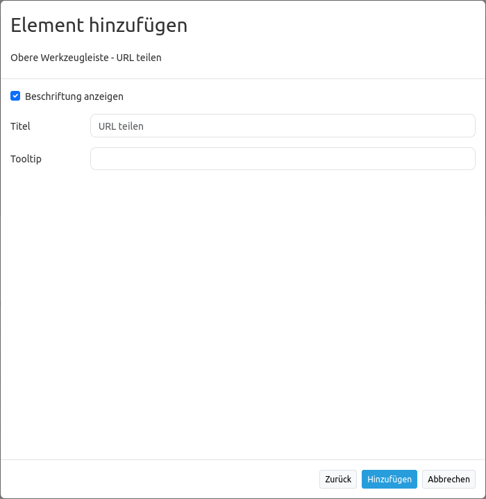

.. _shareurl_de:

URL teilen
**********

Mapbender hinterlegt bestimmte Kartenparameter automatisch in jeder Anwendungs-URL. 
Dadurch ist es möglich, aktuell gewählte Kartenparameter durch Teilen der URL an andere weiterzuleiten. 

Die URL beinhaltet folgende Kartenparameter:

* Kartenposition
* Maßstab
* Drehung
* Räumliches Referenzsystem

Diese Funktion muss nicht extra konfiguriert werden. Sie ist immer aktiviert.

Wenn eine URL in einem neuen Browserfenster geöffnet wird, dann erfolgt auch die Übernahme der genannten Kartenparameter. Änderungen können über die Browsernavigation vor- bzw. zurückgenommen ("Weiter" oder "Zurück") werden.

Nach dem Neuladen des Browserfensters werden Anwender zum jeweiligen Kartenausschnitt zurückgeschickt. Soll zur Start-Konfiguration zurück navigiert werden, dann muss die Anwendung entweder komplett neu geöffnet werden oder eine manuelle Anpassung der URL erfolgen.

.. note:: **Hinweis:** Folgende Informationen werden nicht hinterlegt: Layer-Auswahl, Layer-Sortierung, temporäre Geometrien, Laufzeitergänzungen, Transparenz sowie interaktiv hinzugefügte Instanzen.

Das Teilen von URLs kann durch den Einbau eines entsprechenden Elements vereinfacht werden. Dieses wird als Button in der Toolbar oder dem Footer eingebunden.

.. image:: ../../../figures/de/share_url.png
     :scale: 80

Durch Klick auf das Element wird die URL in der Zwischenablage gespeichert. Standardbrowser-Interaktionen (z.B. Öffnen in einem neuen Tab) sind ebenfalls möglich.

Das Element speichert folgende Informationen:

* Grundlegende Kartenparameter (Kartenposition, Maßstab, Drehung, Referenzsystem)
* Layer- und Layerset-Einstellungen (Auswahl sowie Transparenz)

.. note:: **Hinweis:** Folgende Informationen werden nicht übergeben: interaktiv hinzugefügte Instanzen (WMS laden), interaktiv entfernte Instanzen (Ebenenbaum Kontextmenü) sowie Änderungen der Layerreihenfolge (Drag & Drop).

Konfiguration
=============

YAML-Definition:
----------------

.. code-block:: yaml

    title: Teile diese Kartenansicht          # Optionaler Titel, standardmäßig wird "URL teilen" verwendet (string oder leer).
    class: Mapbender\CoreBundle\Element\ShareUrl
    tooltip: Ich werde beim Hovern angezeigt  # Optionaler Titel, entpricht bei Weglassung dem Titel (string oder leer).
    label: true                               # Aktiviert Darstellung des Titels, zeigt bei FALSE das Element Icon an (Standard: true).

