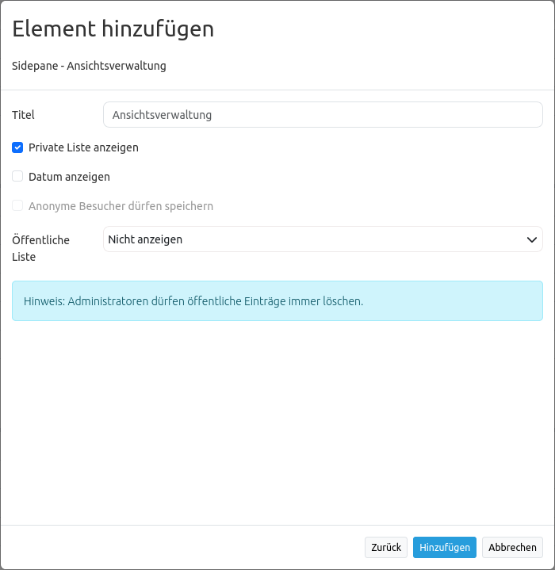

.. _view_manager_de:

Ansichtsverwaltung
******************

Das Element Ansichtsverwaltung erlaubt die Speicherung und Wiederverwendung von Kartenansichten. Folgende Kartenparameter sind hierin inbegriffen: Kartenposition, Maßstab, Koordinatenreferenzsystem, Drehung, Layer, Layerauswahl sowie Transparenz. Gesetzte Kartenansichten bleiben dabei auch nach Neuladen der Anwendung erhalten.

.. note:: Hinweis: Die Ansichtsverwaltung wird bisher nur in der Sidepane unterstützt.

Nutzung
-------

Um eine neue Kartenansicht zu speichern, muss zunächst ein Titel für deren Re-Identifikation vergeben werden. Danach kann die Kartenansicht durch einen Klick auf den Speichern-Button zur Liste hinzugefügt werden.

In seiner einfachsten Form kann das Element zur Wiederverwendung von Kartenansichten verwendet werden. Diese Option ist immer vorhanden: Die zuvor gespeicherte Kartenansicht wird nach Klick auf den Abrufen-Button wiederhergestellt. Gespeicherte Ansichten können außerdem überschrieben oder gelöscht werden. Die Einträge in der Sidepane werden dabei entsprechend aktualisiert.

.. note:: Hinweis: Aktuell unterstützt die Ansichtsverwaltung *nicht* folgende Konfigurationen:

* interaktiv hinzugefügte Instanzen (WMS laden)
* interaktiv entfernte Instanzen (Ebenenbaum Kontextmenü)
* alle Werte für WMS-Dimensionen
* dynamisch veränderte Geometrien (Digitizer etc.)

Zugriffsrechte
--------------

Jede Kartenansicht ist einer Anwendung zugeordnet und wird weiter in öffentlich und privat unterteilt. Die Elementkonfiguration enthält die Rechteeinstellungen zum Lesen, Speichern und Löschen von Kartenansichten in öffentlichen Listen. Weiterhin kann hier über Checkboxen definiert werden, ob private Listen die Anzeige privater Kartenansichten ermöglichen sollen, der beim Speichern erstellte Zeitstempel in der Liste angezeigt wird und ob anonyme Besucher öffentliche Kartenansichten speichern dürfen.

Zugriffsrechte müssen für den root Nutzer nicht für öffentliche Ansichten gesetzt werden. Der Administrator kann diese automatisch erzeugen, überschreiben oder löschen.

Anonyme Nutzer sind generell von der Arbeit mit privaten Ansichten ausgeschlossen. Sie können öffentliche Einträge außerdem niemals löschen. Ihre Zugriffsrechte für das Speichern sowie Überschreiben von öffentlichen Ansichten wird über die Checkbox "Anonyme Besucher dürfen speichern" gesteuert. Bei Deaktivierung der Option verbleibt anonymen Benutzern noch ein Lesezugriff. Sollen Anonyme Nutzer komplett ausgeschlossen werden, dann kann eine ROLE_USER Zugriffsbeschränkung für das gesamte Element gesetzt werden.

Konfiguration
=============

YAML-Definition:
----------------

.. code-block:: yaml

   publicEntries        # String oder leer (Falsche Werte deaktivieren öffentliche Ansichten komplett); andere erlaubte Werte sind ro (nur Lesezugriff), rw (Lese- und Schreibzugriff), rwd (Lese- und Schreibzugriff sowie Löscherlaubnis) (Standard: ro).
   privateEntries       # Schaltet Privatnutzerzustände an mit vollem Zugriff auf Optionen "Speichern", "Wiederverwenden" sowie "Löschen" (Standard: true).
   allowAnonymousSave   # Gibt Speicherrecht für öffentliche Ansichten auch an anonyme Nutzer (Standard: false).
   showDate:            # Zeigt Datum der Erzeugung bzw. Aktualisierung (Standard: true)

