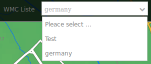
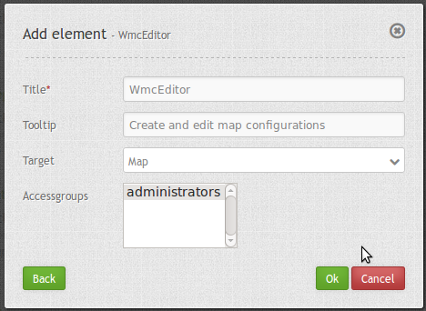

.. _wmc_list_de:

WMC List (WMC Liste)
***********************

Im Mapbender können mit dem WMC Editor Konfigurationen gespeichert und bearbeitet werden. 
Diese Konfigurations können mit WMC-Lader geladen werden. Mehr dazu unter `WMC Loader <wmc_loader.html>`_.

Ihrer Applikation können Konfigurationen von einer Selektbox hinzugefügt werden.

**Beachten Sie:** Alle Konfigurationen sind im Moment öffentlich. In Zukunft soll ACL (Access Control) zu diesem Element hinzugefügt werden.

**Beachten Sie:** Diese Funktion kann nur verwendet werden, wenn ein WMC-Lader vorhanden ist.

Konfiguration
=============

* **Title:** Titel des Elements. Dieser wird in der Layouts Liste angezeigt und ermöglicht, mehrere Button-Elemente voneinander zu unterscheiden. Der Titel wird außerdem neben dem Button angezeigt, wenn “Beschriftung anzeigen” aktiviert ist.
* **Tooltip:** Text, der angezeigt wird, wenn der Mauszeiger eine längere Zeit über dem Element verweilt.
* **Target:** ID des Kartenelements, auf das sich das Element bezieht.
* **Label:** Titel als Beschriftung der Selektbox. Standard ist false.

YAML-Definition:
----------------

.. code-block:: yaml

    title: WMC List         
    tooltip: WMC List           # Text des Tooltips
    target: wmcloader           # Target mit dem interagiert wird, sollte wmcloader sein
    label: true                 # Titel als Beschriftung der Selektbox. Standard ist false
    

Class, Widget & Style
=====================

* **Class:** Mapbender\\WmcBundle\\Element\\WmcEditor
* **Widget:** <Put Widget name here>
* **Style:** <Put name of css file here>

HTTP Callbacks
==============

<action>
--------------------------------

Öffnet einen Dialog mit einem Editor, in dem Konfigurationen gespeichert und bearbeitet werden können.
