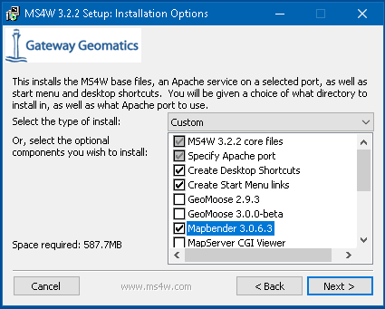
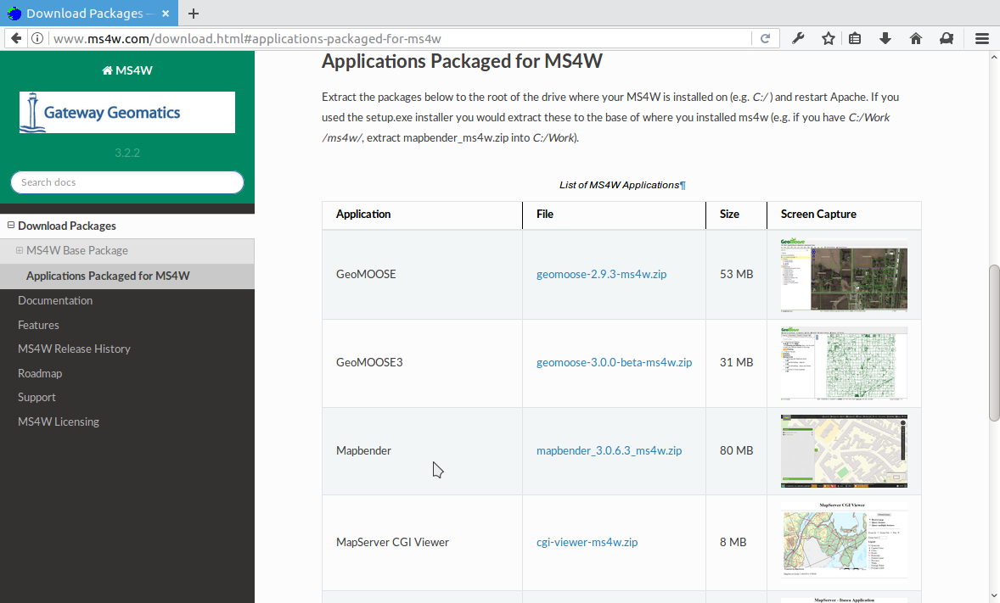

.. _installation_windows_de:

Installation auf Windows
########################

Wir zeigen Ihnen hier zwei Möglichkeiten, Mapbender auf Windows einzurichten. Die `Erste nutzt das MS4W Paket <#installation-uber-das-ms4w>`_ und die darin enthaltene Mapbender Version. Die `zweite Möglichkeit ist die manuelle Installation <#manuelle-installation>`_, bei denen Sie die Anpassungen an PHP und Apache selbst vornehmen und Mapbender per Hand entpacken.

EXE-Installationsdateien für den offiziellen Mapbender bieten wir bislang nicht an, da diese den Mapbender zwar in ein Verzeichnis entpacken kann, die Anpassungen aber an den vorhandenen PHP und Webserver (Apache/Nginx) Installationen vorgenommen werden müssen.

Anmerkungen zur Windows Installation
------------------------------------

Abhängig von der PHP-Version werden unter Windows PHP-Variablen für ein Temp-Verzeichnis nicht richtig gesetzt.

Bitte überprüfen Sie, ob die beiden Variablen

* ``sys_temp_dir`` und
* ``upload_tmp_dir`` gesetzt sind.

Bitte setzen Sie die Variablen in der ``php.ini`` Datei. Falls Sie getrennt eine ``php.ini`` Datei sowohl für den Kommandozeilen Klienten (CLI) als auch für das Web nutzen, ändern Sie beide.

Der Wert für das Web kann über eine ``phpinfo.php`` Seite überprüft werden (bei der Sie daran denken, diese nicht öffentlich zu stellen).

Installation über das MS4W
--------------------------

Mapbender ist Teil von `MS4W (MapServer for Windows) <https://ms4w.com/>`_ und kann über dieses Paket installiert werden, inklusive Mapserver, Apache, GDAL, PHP und anderen. Dabei handelt es sich mehr oder weniger um eine Standard Release Version von Mapbender, die in die MS4W Umgebung von Apache/PHP eingebunden ist.

Wenn Sie das EXE-Installationsprogramm herunterladen, können Sie Mapbender aus einer Liste der Anwendungen auswählen:

Falls Sie sich für das ZIP von MS4W entschieden haben, müssen wie Mapbender per Hand von der `MS4W Download Seite <https://ms4w.com/download.html/>`_ herunterladen und in das MS4W Verzeichnis entpacken.

Bitte schauen Sie auf `der MS4W Homepage <https://ms4w.com>`_ für weitere Details zu MS4W.

Manuelle Installation
---------------------

Beachten Sie die `Systemvoraussetzungen <systemrequirements.html>`_ wo Sie auch die Download-Links für Mapbender finden. Installieren Sie die notwendigen Komponenten:

* fügen Sie den Pfad zum PHP-bin Verzeichnis zu Ihrer PATH Variable hinzu 
* aktivieren Sie die PHP Erweiterungen in der php.ini Konfigurationsdatei
* laden Sie das Apache Modul rewrite

.. code-block:: ini

 # php.ini
 extension=php_curl.dll
 extension=php_fileinfo.dll
 extension=php_gd2.dll
 extension=php_intl.dll
 extension=php_pdo_pgsql.dll
 extension=php_pdo_sqlite.dll
 extension=php_pgsql.dll
 extension=php_openssl.dll
 extension=php_mbstring.dll

Für die Entwicklung:

.. code-block:: ini

 # php.ini
 extension=php_bz2.dll

Zusätzlich für PHP 7:

.. code-block:: ini

 # php.ini
 extension=php_zip.dll
 extension=php_bz2.dll
  

.. code-block:: apache

    # unter Windows Datei httpd.conf (Kommentar # entfernen) und Apache neu starten
    LoadModule rewrite_module modules/mod_rewrite.so

Erstellen Sie den Apache Alias. Es gibt für Windows mehrere Möglichkeiten. Eine übersichtliche Möglichkeit ist, eine Datei mapbender.conf zu erstellen und auf diese in der httpd.conf zu verweisen.

* Erstellen Sie einen Unterordner "alias" im Verzeichnis <apache>/conf. Legen Sie die Datei mapbender.conf dort ab. (Dieses Verzeichnis können Sie dann auch nutzen, um dort weitere Alias-Definitionen übersichtlich abzulegen.)
* Verweisen Sie in der Datei httpd.conf (im Verzeichnis <apache>/conf/) auf diese Datei mapbender.conf.

In der httpd.conf:

.. code-block:: apache

                # Verweis auf Mapbender Alias
                Include "conf/alias/mapbender.conf"

In der mapbender.conf:
  
.. code-block:: apache

 Alias /mapbender c:/mapbender/web/
 <Directory c:/mapbender/web/>
  Options MultiViews FollowSymLinks
  DirectoryIndex app.php
  Require all granted
 
  RewriteEngine On
  RewriteBase /mapbender/
  RewriteCond %{REQUEST_FILENAME} !-f
  RewriteRule ^(.*)$ app.php [QSA,L]
 </Directory>

Wir gehen in diesem Beispiel davon aus, dass Mapbender direkt unter **C:/** entpackt wurde (siehe das Kapitel `Systemvoraussetzungen und den Download <systemrequirements.html#download-von-mapbender>`_ für Details). Sie können auch einfach ein anderes Verzeichnis wählen. Passen Sie dann nur diese Apache mapbender.conf Datei oben an, indem Sie auf das richtige Verzeichnis verweisen.

Starten Sie den Apache Webserver neu.

Optionale Features
==================

Mit den folgenden Schritten kann die Performance unter Windows gesteigert werden.

SASS Compiler
-------------

Der SASS Compiler ist Bestandteil von Mapbender 3.0.5 und seit Version 3.0.6.0 sorgt ein Filter dafür, dass die generierten CSS Anweisungen in eine temporäre Datei abgelagert und nicht in einer Pipe ausgeliefert werden.

mod_fcgid
---------

Der Handler "mod_fcgid" ist für Windows Installationen mit Apache empfehlenswert, weil darüber Serveranfragen parallel ausgeführt werden können. Diese Anleitung ist ein Vorschlag des Deployments, es gibt dabei aber auch mehrere Variationen, auf die wir im Rahmen dieser Doku nicht eingehen können.

Der gängige Weg ist, PHP einfach als Modul in den Apache einzuhängen:

.. code-block:: apache

                # LoadModule php5_module "c:/bin/php/5.6.30/php5apache2_4.dll"
                # AddHandler application/x-httpd-php .php

                # configure the path to php.ini
                # PHPIniDir "c:/bin/php/5.6.30"

Diese Methode wird gegen die FCGID Methode ausgetauscht. Sie benötigt etwas Vorbereitung, da das Modul nicht automatisch bei den Apache Installationen mitgegeben wird.

* Webseite: https://httpd.apache.org/mod_fcgid/
* Download für Windows (VC 11, bitte Abhängigkeit beachten): https://www.apachelounge.com/download/VC11/ und dort die **modules-...zip** Datei.
* Entpacken Sie die mod_fcgid.so Datei aus dem Archiv in das module-Verzeichnis von Apache.

In der httpd.conf:

.. code-block:: apacheconf

                # FCGI
                LoadModule fcgid_module "modules/mod_fcgid.so"
                FcgidInitialEnv PHPRC "c:/bin/php/5.6.30"
                AddHandler fcgid-script .php
                FcgidWrapper "c:/bin/php/5.6.30/php-cgi.exe" .php

Fügen Sie in der Mapbender-Apache-Site Datei (mapbender.conf), den "ExecCGI" Parameter hinzu, zum Beispiel:

.. code-block:: apacheconf

                <Directory c:/srv/mapbender-starter-3.0.6.0/web/>
                    # [...]
                    Options MultiViews FollowSymLinks ExecCGI
                    # [...]
                </Directory>

WinCache PHP (optional)
-----------------------

Die Windows Cache (WinCache) Erweiterung für PHP ein PHP-Beschleuniger, der verwendet wird, um die Geschwindigkeit von PHP-Anwendungen zu erhöhen. Die Erweiterung enthält PHP opcode cache, user data cache, session cache, file system cache und relative path cache.

Informationen dazu unter:

- https://www.iis.net/downloads/microsoft/wincache-extension
- https://sourceforge.net/projects/wincache/

**WinCache Installation**

- Download: https://sourceforge.net/projects/wincache/
- Der Download ist ein selbst extrahierendes Archiv (.exe)

  .. code-block:: none
                
                To install and enable the extension, use the following steps:
                Unpack the package that is appropriate for the PHP version you are using.
                Copy the php_wincache.dll file into the PHP extensions folder. Typically this folder is called "ext" and it is located in the same folder with all PHP binary files. For example:
                "C:\Program Files\PHP\ext".
                Using a text editor, open the php.ini file, which is usually located in the same folder where all PHP binary files are. For example:
                "C:\Program Files\PHP\php.ini".
                Add the following line at the end of the php.ini file:
                extension = php_wincache.dll
                Save and close the php.ini file.

**session.handler auf WinCache umstellen:**

.. code-block:: none
                
                To change the location of the session file use session.save_path directive.
                sesion.save_handler = wincache
                session.save_path = C:\inetpub\tmp\session\

**wincache.reroute_enabled aktivieren**

.. code-block:: none
                
                The reroutes are not enabled by default. To enable them, set the reroute_enabled directive in either the php.ini or the .user.ini.
                wincache.reroute_enabled = 1

OpCache (optional)
------------------

OpCache ist eine PHP-Erweiterung, die seit PHP >= 5.5.5 zwar ausgeliefert, aber per Voreinstellung nicht freigeschaltet ist. Sie beschleunigt die Reaktionszeit von Mapbender.

Mehr info: https://www.sitepoint.com/understanding-opcache/

**OPcache Installation**

- http://php.net/manual/de/book.opcache.php

In der php.ini:

.. code-block:: ini
                
                [opcache]
                ; Pfad zur php_opcache.dll
                zend_extension=C:/bin/php/5.6.30/ext/php_opcache.dll

                ; Determines if Zend OPCache is enabled
                opcache.enable=1
 
                ; Determines if Zend OPCache is enabled for the CLI version of PHP
                ;opcache.enable_cli=0
 
                ; The OPcache shared memory storage size.
                opcache.memory_consumption=64
                ; The amount of memory for interned strings in Mbytes.
                opcache.interned_strings_buffer=4
                ; The maximum number of keys (scripts) in the OPcache hash table.
                ; Only numbers between 200 and 100000 are allowed.
                opcache.max_accelerated_files=2000
                ; The maximum percentage of "wasted" memory until a restart is scheduled.
                opcache.max_wasted_percentage=5
                
Symfony empfiehlt, den **opcache.max_accelerated_files** Wert höher zu setzen: http://symfony.com/doc/3.1/performance.html#optimizing-all-the-files-used-by-symfony

Diese Dokumentationsseite von PHP gibt Ihnen eine Empfehlung, welche Cache-Variante Sie unter bestimmten Windows-Voraussetzungen hinzufügen sollten: http://php.net/manual/de/install.windows.recommended.php

Überprüfung
===========

und prüfen Sie, ob der Alias erreichbar ist:

* http://localhost/mapbender/

Öffnen Sie das Symfony Welcome Script config.php. Das Skript prüft, ob alle notwendigen Komponenten installiert wurden und ob die Konfiguration erfolgte. Sofern noch Probleme vorliegen, sollten diese behoben werden.
 
* http://localhost/mapbender/config.php

.. image:: ../../figures/mapbender3_symfony_check_configphp.png
     :scale: 80 

Passen Sie die Mapbender Konfigurationsdatei parameters.yml (app/config/parameters.yml) an und definieren Sie die Datenbank, die Sie erzeugen möchten. Mehr Informationen dazu finden Sie im Kapitel `Konfiguration der Datenbank <../customization/database.html>`_.

.. code-block:: yaml

    database_driver:   pdo_pgsql
    database_host:     localhost
    database_port:     5432
    database_name:     mapbender
    database_path:     ~
    database_user:     postgres
    database_password: geheim

Rufen Sie die app/console Befehle über die php.exe auf. Hierzu müssen Sie ein Standardeingabefenster öffnen.

.. code-block:: text
 
 c:
 cd mapbender
 php.exe app/console doctrine:database:create
 php.exe app/console doctrine:schema:create
 php.exe app/console assets:install web
 php.exe app/console fom:user:resetroot
 php.exe app/console doctrine:fixtures:load --fixtures=./mapbender/src/Mapbender/CoreBundle/DataFixtures/ORM/Epsg/ --append
 php.exe app/console doctrine:fixtures:load --fixtures=./mapbender/src/Mapbender/CoreBundle/DataFixtures/ORM/Application/ --append

Hiermit ist die Installation von Mapbender fertig.

Prüfen Sie die config.php erneut 

* http://localhost/mapbender/config.php

Sie können Mapbender nun nutzen. Starten Sie Mapbender im Entwicklermodus, indem Sie das Skript app_dev.php aufrufen.

* http://localhost/mapbender/app_dev.php

**Hinweis:** Klicken Sie auf den Login-Link oben rechts, um zur Abmeldung zu gelangen. Melden Sie sich mit dem neu erstellten Benutzer an. 

Wenn Sie mehr über Mapbender erfahren möchten, schauen Sie sich das `Mapbender Quickstart Dokument <../quickstart.html>`_ an.

