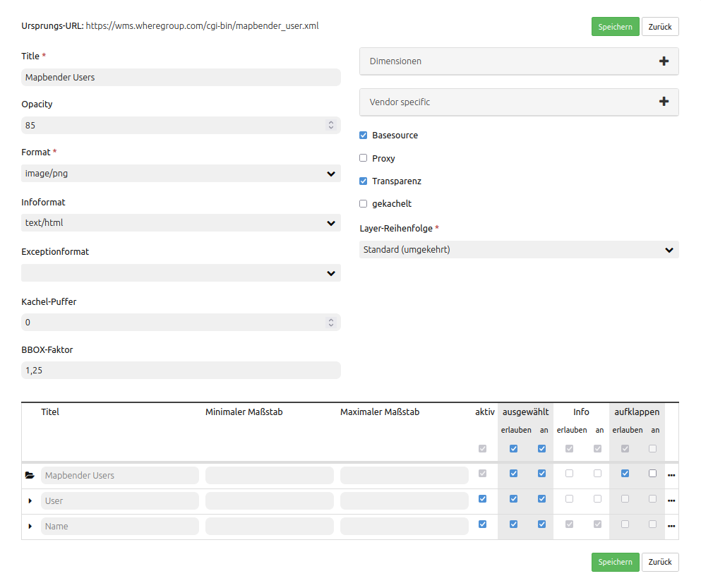

.. _quickstart_de:

:Author: OSGeo-Live
:Author: Astrid Emde
:Version: osgeo-live8.5
:License: Creative Commons Attribution-ShareAlike 3.0 Unported  (CC BY-SA 3.0)
:Thanks: mapbender-user list
:Date: |date|

  .. |mapbender-button-show| image:: ../figures/mapbender_button_show.png

  .. |mapbender-button-copy| image:: ../figures/mapbender_button_copy.png
  
  .. |mapbender-button-copy| image:: ../figures/mapbender_button_export.png

  .. |mapbender-button-publish| image:: ../figures/mapbender_button_publish.png

  .. |mapbender-button-edit| image:: ../figures/mapbender_button_edit.png

  .. |mapbender-button-delete| image:: ../figures/mapbender_button_delete.png

  .. |mapbender-button-add| image:: ../figures/mapbender_button_add.png

  .. |mapbender-button-key| image:: ../figures/mapbender_button_key.png

  .. |mapbender-button-update| image:: ../figures/mapbender_button_update.png
  
  
.. image:: ../_static/mapbender_logo.png
  :scale: 100 %
  :alt: project logo
  :align: right

##################################################
Mapbender Schnellstart: Erste Schritte mit Mapbender
##################################################

Mapbender ist ein web-basiertes Geoportal Framework zum Veröffentlichen, Registrieren, Anzeigen, Navigieren und Überwachen von Diensten, mit der Möglichkeit Dienste gesichert anzubieten. Administrationsoberflächen ermöglichen es Administratoren, Karten- und Datendienste zu verwalten und zu kategorisieren. Über die Administration können einzelnen Benutzern und Gruppen Zugriffe gewährt werden. Mapbender wurde unter Verwendung moderner Webtechnologien komplett neu geschrieben. Die Grundlage bildet das Symfony Framework. Auf der Clientseite finden Sie OpenLayers.

Mit dieser neuen Code-Grundlage wird die Mapbender Idee eines Geoportal Frameworks fortgesetzt.

  * Anwendungen können direkt im Browser erstellt, konfiguriert und gestylt werden.
  * Dienste wie WMS können in einem Service Repository verwaltet und mit Anwendungen verbunden werden.
  * Das Rechtemanagement ist sowohl für einzelne Benutzer als auch Gruppen einfach zu verwalten, egal ob sie in einer Datenbank oder über LDAP gespeichert werden.
  * Der Administrator braucht keine Zeile Code zu schreiben, da die Konfiguration über die webbasierte 	  Administrationsoberfläche erfolgt.
  * Suchen können konfiguriert werden.
  * Anwendungen zur Digitalisierung können aufgebaut werden
  * Ein Mobiles Template kann für das Erstellen von Anwendungen für Smartphones und Tablets verwendet werden

Sie brauchen nichts weiter als einen Standard Webbrowser für diesen Schnellstart.

Dieser Schnellstart beschreibt, wie Sie:

  * Mapbender starten
  * eine Anwendung erstellen
  * einen Dienst wie z.B. Web Map Service (OGC WMS) laden
  * Dienste konfigurieren
  * eine individuelle Anwendung erstellen
  * Benutzer und Gruppen anlegen und verwalten
  * Zugriffsrechte für Anwendungen und Elemente bestimmten Benutzer/Gruppen zuweisen
  * Ihre Anwendung beim Start positionieren

Eine Mapbender Anwendung kann wie folgt aussehen:

  .. image:: ../figures/mapbender3_basic_application.png
     :scale: 80

Installation
============

Hinweise zur Installation von Mapbender finden Sie unter `Installation <installation.html>`_.

Starten Sie Mapbender
=====================

#. Wählen Sie ``Mapbender`` aus dem Startmenü (sofern vorher eine solche Verknüpfung erstellt wurde) oder besuchen Sie http://localhost/mapbender/app.php (Adresse kann etwas abweichen, je nachdem wie der Apache Alias in der Datei /etc/apache2/sites-available/mapbender.conf erstellt wurde, nähere Informationen dazu unter `Installation <installation.html>`_).

#. Die Anwendung braucht eine kurze Zeit, um zu starten.

Falls Sie Schwierigkeiten haben, Mapbender zu starten, überprüfen Sie, ob der Apache Web Server und die PostgreSQL Datenbank laufen.

Starten von Mapbender im Entwicklungsmodus 
==========================================

Symfony bietet einen Entwicklungsmodus mit einer Reihe von Informationen über die Anwendung an (Logging, Fehlermeldungen, Datenbankabfragen, Speicherverbrauch, Zeit und mehr). Dieser Modus ist nur über localhost verfügbar.

#. Start des Entwicklungsmodus: http://localhost/mapbender/app_dev.php

  .. image:: ../figures/de/mapbender_app_dev.png
     :scale: 80

#. Schauen Sie sich an, welche Information im Entwicklungsmodus angezeigt werden.

  .. image:: ../figures/mapbender_symfony_profiler.png
     :scale: 80

Die Willkommensseite
====================

#. Die Willkommensseite listet die öffentlichen Anwendungen auf, die von allen Benutzern aufgerufen werden können. Die Anwendungen werden mit Vorschaubild, Titel, URL Titel und Beschreibung aufgelistet.

#. Die Anwendung kann per Klick auf den Titel, das Vorschaubild oder den |mapbender-button-show| ``Button`` aufgerufen werden.

#. Um Mapbender verwalten zu können, muss zunächst eine Anmeldung erfolgen. Klicken Sie auf den Link **Anmelden** oben rechts, um die Loginseite aufzurufen. Sie können sich mit dem Benutzer anmelden, der während der Installation erzeugt wurde. Er kann ``root`` heißen mit dem Kennwort ``root`` (Dies ist der Standardbenutzer/Kennwort nach der Installation von Mapbender auf der OSGeo-Live. Bitte ändern Sie das Kennwort, wenn Sie eine Produktivumgebung betreiben. Löschen Sie den Benutzer ``root`` nicht.). 

Nach erfolgreicher Anmeldung werden Sie zur ``Mapbender Administration`` weiter geleitet.

Anwendungsübersicht
===================

In der Anwendungsübersicht finden Sie eine Liste mit allen freigegebenen Anwendungen. Für den root Nutzer stehen folgende Funktionen zur Verfügung:

 * Titel, URL Titel und Beschreibung
 * Vorschaubild zur Anwendung (sofern bereitgestellt)
 * Filtertextfeld zur Suche von Anwendungen
 * Option zum Anlegen neuer Anwendungen
 * |mapbender-button-show| Link zur Anwendung
 * |mapbender-button-copy| Kopieren der Anwendung
 * |mapbender-button-export| Export der Anwendung 
 * |mapbender-button-edit| Bearbeiten der Anwendung
 * |mapbender-button-publish| Veröffentlichen der Anwendung
 * |mapbender-button-delete| Löschen der Anwendung
 
  .. image:: ../figures/de/mapbender_app_dev.png
     :scale: 80
     

Erstellen einer Anwendung
=========================

Es gibt drei verschiedene Möglichkeiten, durch die neue Anwendungen erstellt werden können:

Einerseits besteht die Option **1**, diese aus bereits vorhandenen Anwendungen zu erstellen. Dies erfolgt über einen Klick auf den |mapbender-button-copy| Button in der Anwendungsübersicht. Die Applikation erhält dabei den gleichen Titel und URL Titel zuzüglich dem Zusatz *"_imp"*. Alle zuvor definierten Elemente und Konfigurationen werden ebenfalls übernommen. Eine weitere Möglichkeit **2** ist der Import einer Anwendung. Weitere Informationen hierzu finden sich auf der Seite :ref:`yaml_de:yaml-anwendungsdateien`. Es können außerdem **3** komplett neue Anwendungen über das Backend definiert werden. Die einzelnen Arbeitsschritte werden hierfür im folgenen näher erläutert:

#. Wählen Sie zunächst *"Anwendung anlegen"* auf der Anwendungsübersichtsseite.

#. Wählen Sie eine Layoutvorlage für die Anwendung. Die Vorlage bestimmt den Aufbau der Anwendung. Zur Auswahl stehen: Fullscreen, Fullscreen alternative, Mapbender Mobile template. Es ist ebenfalls möglich, eigene Vorlagen anzulegen.

.. tip:: Beachten Sie, dass Layout-, Icon- und Farbanpassungen online über den CSS_Editor oder in css- und twig-Dateien erfolgen. Lesen Sie dazu die Dokumentation unter `Wie werden eigene Vorlagen (templates) erzeugt? <customization/templates.html>`_.

#. Geben Sie einen Titel, URL-Titel und ggf. eine Beschreibung für die Anwendung an. Titel und URL-Titel können identisch sein. Letzterer sollte aber keine Leer- oder Sonderzeichen enthalten.

#. Laden Sie ggf. eine Bilddatei hoch. Diese wird dann als Vorschaubild in der Anwendungsübersicht angezeigt.

#. Setzen Sie ein Häkchen bei *"Kartenzustand merken"*, um bestimmte Kartenparameter und -einstellungen persistent zu machen. Weitere Informationen finden Sie auf der Seite zu den `Share-Elementen <share.html>`_.

#. Klicken Sie *"speichern"*, um die Anwendung zu erzeugen.

Anwendungen können jederzeit bearbeitet werden. Von der Anwendungsüberssichtsseite aus ist eine Navigation zu jeder Applikation (mit gegebenen Nutzungsrechten) über den |mapbender-button-edit| ``Button`` möglich. Weiterhin findet sich hier ein |mapbender-button-show| Button für jede Anwendung, mit dem diese im Frontend aufgerufen werden kann. Es besteht außerdem die Option, Anwendungen zu |mapbender-button-export| exportieren, |mapbender-button-delete| löschen sowie diese für nicht angemeldete Nutzer |mapbender-button-publish| zu aktivieren bzw. deaktivieren.

  .. image:: ../figures/de/mapbender_create_application.png
     :scale: 80  

Elemente in eine Anwendung einfügen
===================================

Mapbender besteht aus den Bereichen Toolbar, Sidepane, Content und Footer. In diese können eine Vielzahl von Elementen eingebunden werden.

#. Wählen Sie ``Anwendungen -->`` |mapbender-button-edit| ``Button --> Layouts`` 

#. Klicken Sie auf den |mapbender-button-add| ``Button`` neben einem Bereich, um einen Überblick über die Mapbender-Elemente zu erhalten.

#. Wählen Sie ein Element aus der Liste aus. Beachten Sie dabei den jeweiligen Bereich Ihrer Anwendung. Es können dabei nicht alle Elemente zu jedem Bereich hinzugefügt werden. Beispielsweise ist die Übersichtskarte (overview) nur in den Content-Bereich integrierbar.

#. Konfigurieren Sie das Element. Hinweis: Wenn Sie ein Element z.B. **Karte (map)** auswählen, sehen Sie lediglich die Optionen für dieses Element und können es entsprechend konfigurieren.

#. Die Position von Elementen kann über drag & drop innerhalb und zwischen Bereichen verändert werden.

#. Schauen Sie sich Ihre Anwendung an. Öffnen Sie Ihre Anwendung über den Button |mapbender-button-show|.

Jetzt sollten sie eine Idee davon haben, wie einfach es ist, eine Mapbender-Anwendung ohne Codes zu verändern.

  .. image:: ../figures/de/mapbender_application_add_element.png
     :scale: 80

Im folgenden finden Sie eine vollständige Liste aller Elemente inlusive ihrer Funktion. Detaillierte Informationen können Sie in den jeweiligen Kapiteln der `Mapbender Dokumentation <index.html>`_ nachlesen.

* Aktivitätsanzeige:		zeigt die HTTP-Aktivität an
* Ansicht zurücksetzen:	stellt den ursprünglichen Kartenausschnitt und Diensteeinstellungen wieder her
* Ansichtsverwaltung:		speichert Kartenzustände zum späteren Abruf
* Anwendung wechseln:		wechselt unter Beibehaltung der aktuellen Kartenposition zu einer anderen 					Anwendung
* Bildexport:			Export eines Kartenausschnitts
* Button:			zum Einbinden von Elementen als Button
* Copyright:			zeigt Nutzungsbedingungen an
* Data manager:		erzeugt und speichert Sachinformationen in einer Datenbank 
* Digitizer			erzeugt und speichert von Geometrieinformationen in einer Datenbank
* Dimensions-Handler:		für die Einbindung von Diensten mit einer zeitlichen Dimension
* Druck:			Druckdialog
* Ebenenbaum:			Übersicht mit allen eingebundenen Layersets und Layern
* Einfache Suche:		individuelle Suche via Solr (Apache) oder Nominatim (OSM)
* GPS-Position:		Button zur Anzeige der GPS-Position
* HTML:			freie Definition von HTML zur Einbindung von Bilder, Texten, Links
* Hintergrund wechseln:	Hintergründe können definiert und gewechselt werden
* Information:			Informationsausgabe eines Dienestes 
* Karte:			Element in welches die Layersets und Layer eingebunden sind
* Koordinaten Utility:		transformiert Koordinaten und navigiert zu ihnen auf der Karte
* Koordinatenanzeige:		zeigt Mausposition in den Kartenkoordinaten an
* Legende:			Anzeige der Legende von aktiven Diensten
* Linien- und Flächenmessung:  erlaubt die Zeichnung von Linien und Flächen in der Karte
* Link:			Link zu externer URL
* Maßstabsanzeige:		zeigt aktuellen Maßstab numerisch an
* Maßstabsauswahl:		Maßstände können im Frontend über eine Auswahlbox selektiert werden
* Maßstabsleiste:		zeigt den aktuellen Maßstab graphisch an
* MeetingPoint (POI):		Treffpunkt wird mit Hinweistexten generiert und über eine URL verschickt
* Navigationswerkzeug:		zur Navigation in der Karte
* SRS Auswahl:			Auswahl der Projektion (SRS) über eine Auswahlbox
* Skizzen:			Zeichenwerkzeug
* Suchen:			individuelle Datenbanksuche über SQL
* URL teilen:			teilt die aktuelle Kartenansicht über eine URL
* WMS laden:			lädt einen WMS per getCapabilities-Request
* Über Mapbender-Dialog:	zeigt Informationen über Mapbender an
* Übersicht (overview):	kleinere Übersichtskarte

Versuchen Sie es selber
-----------------------

* Fügen Sie ein Kartenelement zum Content-Bereich Ihrer Anwendung hinzu.
* Fügen Sie ein Ebenenbaum zum Content-Bereich Ihrer Anwendung hinzu.
* Fügen Sie einen Button in die Toolbar, der den Layertree öffnet.
* Fügen Sie das Navigationswerkzeug in den Content-Bereich hinzu.
* Fügen Sie ein Copyright-Element hinzu und ändern Sie den Copyright-Text.
* Fügen Sie eine SRS Auswahl in den Footer-Bereich ein.

Datenquellen (Sources)
======================

In Mapbender können Dienste vom Typ OGC WMS und OGC WMTS/TMS eingeladen werden. Durch einen Klick auf ``Datenquellen`` kann zu einer Übersicht mit allen hinzugefügten Diensten navigiert werden. Diese ist noch einmal in eine Liste mit allen Datenquellen sowie den freien Instanzen untergliedert. Mehr Informationen zu privaten und freien Instanzen finden sich auf folgender Seite :ref:`layerset_de:.

Die Übersichtsseite bietet dem Nutzer folgende Funktionen:

 * Datenquelle hinzufügen
 * Filtertextfeld zur Suche von Datenquellen
 * |mapbender-button-show| Link zur Datenquelle 
 * |mapbender-button-update| Aktualisieren der Datenquelle
 * |mapbender-button-delete| Löschen der Datenquelle

  .. image:: ../figures/de/mapbender_sources.png
     :scale: 80
     
     
Laden von Datenquellen
----------------------

Sie können OGC Web Map Services (WMS) und Web Map Tile Services (WMTS) in Ihre Anwendung laden. Mapbender unterstützt dabei die Versionen 1.0.0 und 1.3.0. Ein Dienst liefert ein XML, wenn das getCapabilities-Dokument angefordert wird. Diese Information wird von Mapbender ausgelesen. Der Client erhält alle notwendigen Informationen über den Dienst aus diesem XML.

.. tip:: Sie sollten das Capabilities-Dokument zuerst in Ihrem Browser überprüfen, bevor Sie versuchen, den Dienst in Mapbender zu laden.

#. Um eine neue Datenquelle einzuladen, klicken Sie auf den Button ``Datenquelle hinzufügen``.

#. Definieren Sie den *"Typ"* des Dienstes: OGC WMS oder OGC WMTS/TMS.

#. Geben Sie den Link zur getCapabilities URL in das Textfeld *"Dienst-URL"* ein.

#. Geben Sie Benutzername und Kennwort ein, sofern der Dienst eine Authentifizierung benötigt.

#. Klicken Sie *"Laden"*, um den Dienst in das Repository zu laden.

#. Nach erfolgreicher Registrierung des Dienstes zeigt Mapbender eine Übersicht der Informationen an, die der Dienst geliefert hat.

  .. image:: ../figures/de/mapbender_add_sources.png
     :scale: 80

Hinzufügen von Diensten zu Anwendungen
--------------------------------------

Nachdem ein Dienst in Mapbender geladen wurde, kann dieser zu einer oder mehreren Anwendungen hinzugefügt werden.

#. Navigieren Sie zunächst zur Übersichtsseite mit allen Anwendungen. Klicken Sie dann auf den |mapbender-button-edit| ``Button`` der jeweiligen Anwendung und navigieren zum Tab *Layersets*.

#. Im Bereich *Layersets* besteht die Möglichkeit, einzelne hochgeladene Dienste zu einer Anwendung hinzuzufügen. Klicken Sie hierfür zunächst auf den |mapbender-button-add| ``Button`` neben der Filterfunktion, um ein Layerset anzulegen. Alle Dienste in einer Anwendung müssen einem bestimmten Layerset zugeordnet sein. Vergeben Sie für dieses einen Titel (z.B. "main" für die Hauptkarte und "overview" für die Übersichtskarte).

#. Jetzt können Sie Dienste zum Layerset hinzufügen. Wählen Sie dafür den |mapbender-button-add| ``Button`` des jeweiligen Layersets.

#. Die Reihenfolge der Dienste kann über drag & drop verändert werden.

  .. image:: ../figures/de/mapbender_add_source_to_application.png
     :scale: 80

Konfiguration von Diensten
--------------------------

Sie können Dienste für Ihre Anwendung konfigurieren. Vielleicht möchten Sie nicht alle Ebenen anzeigen oder Sie möchten die Reihenfolge oder den Titel der Ebenen ändern, die Info-Abfrage für einzelne Ebenen verhindern oder den Minimal-/Maximalmaßstab ändern.

#. Wählen Sie  ``Anwendung -->`` |mapbender-button-edit| ``Button --> Layerset -->`` |mapbender-button-edit| ``Editier-Button``, um eine Instanz zu konfigurieren.

#. Sie können nun Ihren Dienst konfigurieren.

#. Sie können die Reihenfolge der Layer über drag & drop ändern.

**Dienstekonfiguration:**

* Titel: 			Name der bei der Anwendung angezeigt wird
* Opacity: 			Durchlässigkeit (Deckkraft) des Dienstes in Prozent
* Format: 			das Format für den getMap-Requests
* Infoformat: 			das Format für getFeatureInfo-Requests (text/html für die Ausgabe als HTML wird 					empfohlen)
* Exceptionformat: 		das Format für Fehlermeldungen
* Kachel-Puffer:		Dieser Parameter gilt für Dienste, die gekachelt angefordert werden und gibt 				an, ob weitere umgebende Kacheln abgerufen werden sollen. Damit sind diese bei 					einer Pan-Bewegung schon heruntergeladen und sichtbar. Je höher der Wert, desto 					mehr umgebende Kacheln werden abgerufen (Standard: 0).
* BBOX-Faktor: 		Dieser Parameter gilt für Dienste, die nicht-gekachelt angefordert werden. Hier 					kann man angeben, wie groß das zurückgegebene Bild sein soll. Ein Wert größer 1 					wird ein größeres Kartenbild anfordern. Default: 1.25 und kann auf 1 gesetzt 				werden.
* BaseSource: 			soll der Dienst als BaseSource behandelt werden (BaseSources können beim 					Ebenenbaum ein-/ausgeblendet werden)
* Proxy: 			bei Aktivierung wird der Dienst über Mapbender als Proxy angefordert
* Transparenz: 		Standard ist aktiviert, deaktiviert wird der Dienst ohne transparenten 					Hintergrund angefordert (getMap-Request mit TRANSPARENT=FALSE)
* Tiled: 			Dienst wird in Kacheln angefordert, Standard ist nicht gekachelt (kann bei 					großer Karte sehr hilfreich sein, wenn der Dienst die Kartengröße nicht 					unterstützt)

**Dimensionen:**

Diese Funktion ist für WMS-Dienste mit einer zeitlichen Dimension von Relevanz. Weitere Informationen hierzu finden Sie auf der Seite des `Dimensions Handler <dimensions_handler.html>`_.

**Vendor Specific Parameter:**

In einer Layerset Instanz können Vendor Specific Parameter angegeben werden,
die an den WMS Request angefügt werden. Die Umsetzung folgt den Angaben der
multi-dimensionalen Daten in der WMS Spezifikation.

In Mapbender können die Vendor Specific Parameter genutzt werden, um z.B.
Benutzer und Gruppeninformation des angemeldeten Benutzers an die WMS Anfrage zu
hängen. Es können auch feste Werte übermittelt werden.

Das folgende Beispiel zeigt die Definition eines Parameters „group“, der als
Inhalt die Gruppe des gerade in Mapbender angemeldeten Nutzers weitergibt.

.. image:: ../figures/de/layerset/mapbender_vendor_specific_parameter.png
   :scale: 80

* Vstype: 	Mapbender spezifische Variablen: Gruppe (groups), User (users), Simple
* Name: 	Parameter Name im WMS Request
* Default: 	Standardwert
* Hidden:       Wenn der Wert gesetzt ist, werden die Anfragen serverseitig versendet, sodass die Parameter 			nicht direkt sichtbar sind.

Momentan eignet sich das Element, um Benutzer und Gruppeninformationen
weiterzugeben, z.B. für Benutzer die $id$ und für Gruppen den Parameter
$groups$.

**Layerkonfiguration:**

* Titel:		Layertitel
* Min./Max. Maßstab: 	Maßstabsbereich, in dem der Layer angezeigt wird
* Aktiv an/aus:	aktiviert/deaktiviert ein Thema
* Ausgewählt erlauben: Layer wird angezeigt und ist auswählbar im Ebenenbaum
* Ausgewählt an:	Layer ist bei Anwendungsstart aktiv
* Info erlauben:	Infoabfrage wird für diesen Layer zugelassen
* Info an:		Layer Infoabfrage wird beim Start aktiviert
* Aufklappen erlauben: erlaubt aufklappen des Layers beim Start der Anwendung
* Aufklappen an: 	klappt Layer auf beim Start der Anwendung
* Layer-Reihenfolge:	Layer können in der Standard- oder QGIS-Reihenfolge dargestellt werden.
* ... 			öffnet einen Dialog mit weiteren Informationen
* ID:			ID des Layers
* Name: 		Layername der Service Information (wird beim getMap-Request verwendet und ist nicht 			veränderbar)
* Style: 		Wenn ein WMS mehr als einen Stil anbietet, können Sie einen anderen Stil als den 				Standard-Stil (default) wählen.

Versuchen Sie es selber
-----------------------

#. Laden Sie verschiedene Dienste in Mapbender hinein.

#. Fügen Sie einige Dienste zu Ihrer Anwendung hinzu. 

#. Verändern Sie die Konfiguration der Dienste.

*Hier sind einige Beispieldienste:*

* Germany demo:
http://wms.wheregroup.com/cgi-bin/germany_workshop.xml?VERSION=1.1.1&REQUEST=GetCapabilities&SERVICE=WMS

* WhereGroup OSM WMS:
http://osm-demo.wheregroup.com/service

* Omniscale OSM WMS (siehe auch http://osm.omniscale.de/)
http://osm.omniscale.net/proxy/service?

Benutzer- und Gruppenverwaltung
===============================

Der Zugriff auf eine Mapbender Anwendung benötigt Authentifizierung. Nur öffentliche Anwendungen können von allen Anwendern genutzt werden.

Benutzer oder Gruppen können Berechtigungen bekommen, um auf eine oder mehrere Anwendungen und Dienste zuzugreifen.

.. NOCH NICHT IMPLEMENTIERT
  Es gibt keinen vorgegebenen Unterschied zwischen Rollen wie ``guest``, ``operator`` oder ``administrator``. Die ``role`` eines Benutzers beruht auf den Funktionen und des Diensten, aud die der Benutzer durch diese Anwendung Zugriff hat.

Benutzer anlegen
----------------

#. Um einen Benutzer anzulegen, gehen Sie zu ``Sicherheit --> Benutzer --> Neuen Benutzer hinzufügen``.

#. Wählen Sie einen Namen und ein Kennwort für Ihren Benutzer.

#. Geben Sie eine E-Mail-Adresse für den Benutzer an.

#. Speichern Sie Ihren neuen Benutzer.

#. Weitere Angaben zum Benutzer können im Reiter ``Profil`` erfolgen.

  .. image:: ../figures/de/mapbender_create_user.png
   :scale: 80

Gruppen anlegen
---------------

#. Erzeugen Sie eine Gruppe über  ``Sicherheit --> Gruppen --> Neue Gruppe hinzufügen``.

#. Wählen Sie einen Namen und eine Beschreibung für Ihre Gruppe.

#. Speichern Sie Ihre neue Gruppe.

Benutzer einer Gruppe zuweisen
------------------------------

#. Weisen Sie einen Benutzer einer Gruppe über ``Benutzer -->`` |mapbender-button-edit| ``Button  -->  Gruppen`` zu.

  .. image:: ../figures/de/mapbender_assign_user_to_group.png
   :scale: 80

Rechte
------

Mapbender bietet verschiedene Rechte an, die Sie vergeben können. Diese beruhen auf dem Symfony ACL System. 

* view:	kann anzeigen
* edit:	kann editieren
* delete:	kann löschen
* operator:	kann anzeigen, editieren und löschen
* master:	kann anzeigen, editieren und löschen und diese Rechte außerdem weitergeben
* owner:	Besitzer darf alles (darf auch master- und owner-Recht vergeben)

Weisen Sie einem Benutzer über ``Sicherheit --> Benutzer --> Benutzer bearbeiten --> Sicherheit`` Rechte zu.

  .. image:: ../figures/de/mapbender_roles.png

Zuweisen einer Anwendung zu einem Benutzer/einer Gruppe
-------------------------------------------------------

#. Bearbeiten Sie Ihre Anwendung über ``Anwendungen -->`` |mapbender-button-edit| ``Button`` einer Anwendung.

#. Wählen Sie ``Sicherheit``.

#. Veröffentlichen Sie Ihre Anwendung über die Auswahl *"öffentlicher Zugriff"* unter ``Sicherheit`` oder den Button zur Veröffentlichung |mapbender-button-publish| bei der Anwendungsübersicht. Ist diese Einstellung aktiviert, dann haben auch nicht angemeldete Nutzer einen Zugriff auf die Anwendung.

#. Setzen Sie die Zugriffsrechte für einen Benutzer oder eine Gruppe.

#. Testen Sie die Konfiguration. Melden Sie sich dafür über ``Logout`` aus und melden sich unter der neuen Benutzerbezeichnung an.

  .. image:: ../figures/de/mapbender_security.png
     :scale: 80

Zuweisen einzelner Elemente zu Benutzern/Gruppen
------------------------------------------------

Standardmäßig stehen alle Elemente den Benutzern/Gruppen zur Verfügung, die Zugriff auf eine Anwendung haben. Der Zugriff kann darüberhinaus für einzelne Elemente noch genauer definiert werden, sodass diese nur bestimmten Benutzern/Gruppen zur Verfügung stehen.

#. Bearbeiten Sie Ihre Anwendung über ``Anwendungen -->`` |mapbender-button-edit| ``Button`` einer Anwendung.

#. Wählen Sie ``Layouts``.

#. Jedes Element verfügt über einen |mapbender-button-key| ``Button``.

#. Wählen Sie den |mapbender-button-key| ``Button`` zu dem Element, das nur ausgewählten Benutzern/Gruppen zur Verfügung stehen soll

#. Setzen Sie Berechtigungen wie view, edit, delete, operator, master, owner.

#. Weisen Sie das Element Benutzern/Gruppen zu.

#. Testen Sie die Konfiguration.

Anwendung beim Start positionieren
==================================

Sie können eine Anwendung beim Start positionieren. Dies kann über einen Punkt erfolgen. Beim Start können dabei auch Texte zur Anzeige mitgegeben werden. Diese Funktionalität nutzt das Element Treffpunkt (MeetingPoint).

Sie können dabei einen oder mehrere Punkte (POIs) in der URL übergeben. Jeder Punkt verfügt dabei über die folgenden Parameter:

- Punkt (point): Koordinatenpaar, die Werte werden mit Komma getrennt (zwingend)
- Beschriftung (label): Beschriftung, die angezeigt werden soll (optional)
- Maßstab (scale): Maßstab, in dem der Punkt angezeigt werden soll (optional, Angabe ist nur bei der Anzeige eines Punktes sinnvoll)

Wenn Sie mehr als einen Punkt im Aufruf übergeben, zoomt die Karte auf 150% der POI-Boundingbox.

Format für die Übergabe eines einzelnen Punktes:

* ?poi[point]=363374,5621936&poi[label]=Hello World&poi[scale]=5000

* http://demo.mapbender.org/application/mapbender_user?poi[point]=363374,5621936&poi[label]=Hello World&poi[scale]=5000

  .. image:: ../figures/mapbender_position_poi_label.png

Für die Übergabe vieler Punkte wird das folgende Format verwendet:

* ?poi[0][point]=363374,5621936&poi[0][label]=Hello&poi[1][point]=366761,5623022&poi[1][label]=World

Was kommt als Nächstes?
=======================

Dies waren nur die ersten Schritte mit Mapbender. Es gibt viele weitere Funktionen, die Sie ausprobieren können.

Mapbender Webseite: https://mapbender.org/

Sie finden Tutorials unter: https://doc.mapbender.org

Beteiligen Sie sich: https://mapbender.org/community/
