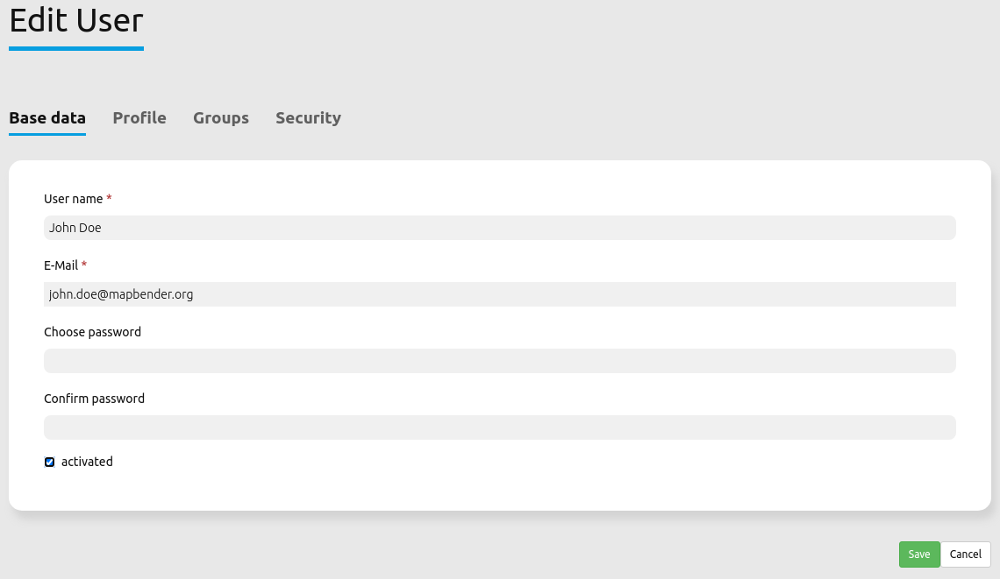

.. _users:

Users
=====

User are implemented as FOM\\UserBundle\\Entity\\User and stored in the database. The entity has only some basic information about the user itself, more complex user data will have to be implemented by user profiles (yet to be done).

The bundle provides all means to administrate users by admin as well as self-registration and password recovery.

The user with the id 1 (root) is special, as this user is created during installation and will always be given full access. If all is lost, you can use this user to manage everything. And in the event that the credentials for this user are also lost, a :ref:`console command<commands>` (``fom:user:resetroot``) is available for resetting.

Forgot Password
---------------

If a user has forgotten his/her password, he can use the "Forgot password?" link in the Login screen to request a new one. For that he types in his username or email address.

After that, the user should receive an email with a link which leads to a page where a password reset is possible. The link is not valid anymore after this operation. The text of the mail can be customized in the `/FOM/UserBundle/Resources/translations/messages.en.xlf` file.

The functionality can be switched off in the *doctrine.yaml*.

.. code-block:: yaml

                fom_user:
                    reset_password: true # true/false

Registration
------------

Users can self-register themselves in Mapbender. For this, you have to adjust the setting ``fom_user:selfregister`` in the *doctrine.yaml* to ``true``.

.. code-block:: yaml

                fom_user:
                    selfregister: false # true/false

The Login dialog contains a *Register* button. This opens a page where the user can type in their name, password and email address.

After that, the user gets a confirmation mail to complete the registration. Until then, Mapbender will handle the user as inactive.
The text of the confirmation mail can be customized in the `/FOM/UserBundle/Resources/translations/messages.en.xlf` file.

Activation of users
-------------------

Users can be set activated or deactivated by Administrators with the *Edit* right. For this purpose, an **activated** checkbox exists in the Edit User dialog. A user with administration rights cannot activate or deactivate himself.

A user who is deactivated cannot login into Mapbender anymore until re-activation.
Users who self-registered but did not approve the activation email can be activated by an administrator.

Assign permission management to users or groups
-----------------------------------------------

#. Go to **Security** → **Global Permissions**.

#. Choose **Permission management**.

#. Add users or groups via the **Add users and groups** button. This will assign the *Global Permission Management* right.

#. You have now assigned a user/group controlling options over other user accounts.

#. With this permission, users and groups can assign rights to other users and groups via **Security** → **Users** or **Security** → **Groups**.

Login Failures
--------------

Login failures are responded with the Message "Bad credentials". For security reasons it is not shown if the error is based on a wrong username or a wrong password. Login failures will not lock the account indefinitely after four attempts.  Rather the account will be locked for a given period of time.

The doctrine.yaml allows to adjust this behaviour:

.. code-block:: yaml

   fom_user:

       # Allow to create user log table on the fly if the table doesn't exits.
       # Default: true
       auto_create_log_table: true

       # Time between to check login tries
       login_check_log_time: "-5 minutes"

       # Login attemps before delay starts
       login_attempts_before_delay: 3

       # Login delay after all attemps are failed
       login_delay_after_fail: 2 # Seconds

* **auto_create_log_table:** Backwards compatibility parameter (default: true).
* **login_check_log_time:** Cleaning of the login-failure table (default: -5 minutes)
* **login_attempts_before_delay:** Number of login failures before the login delay starts (default: 3)
* **login_delay_after_fail:** Number of seconds of the login-delay (default: 2).
