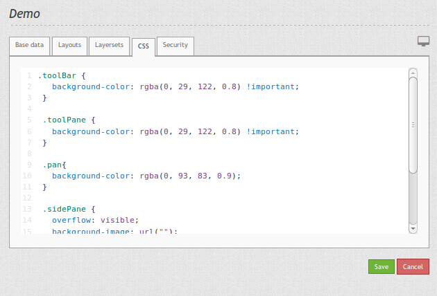

.. _css:

CSS editor
##########

Mapbender offers an CSS editor for every application which easily allows you to change its style (colors, sizes, icons, ...). It is possible to define additional CSS classes that will overwrite the default style. You can use scss in the editor. And you can refer to an scss-file in your bundle. 

.. tip:: A browser inspect tool can help you to find out the CSS classes you want to change.

Example
=======

Add scrollbar to the top toolbar
--------------------------------
When you use the menu option in the top toolbar you can define at what size of the screen the height should be reduced and a scrollbar should appear. This enhances the usability of the application on mobile devices.

.. code-block:: css

  // Scrollbar in Toolbox
  .dropdown-menu {
    overflow-y: auto;
    max-height: calc(100vh - 100px);
  }

The function itself can be found in the :ref:`layouts` tab: Click the gear button and activate the checkbox ``Generate menu for buttons``.