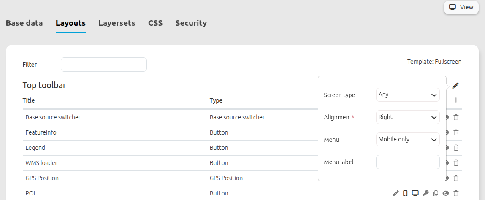
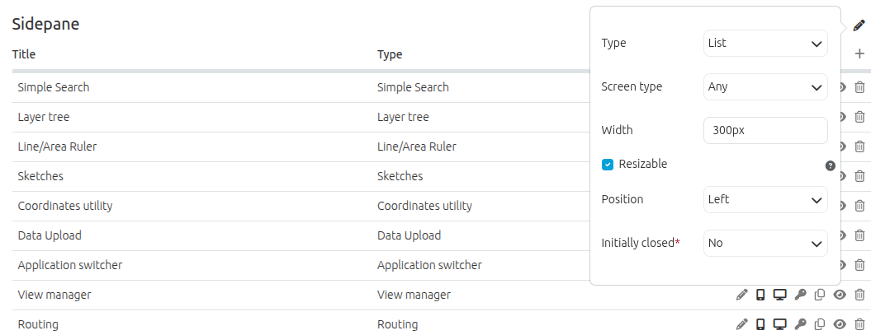
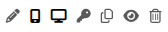
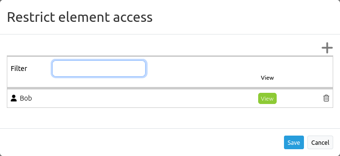
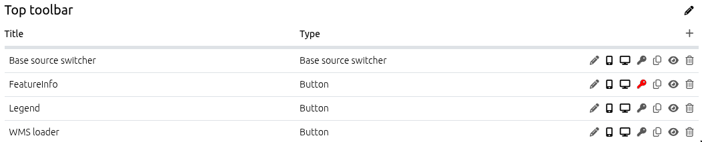

.. _layouts:

Layouts
#######

 .. |mapbender-button-add| image:: ../../../figures/mapbender_button_add.png

 .. |mapbender-button-edit| image:: ../../../figures/mapbender_button_edit.png

 .. |mapbender-button-key| image:: ../../../figures/mapbender_button_key.png

The Layouts section in the :ref:`backend` of an application gives an overview of the regions (layout sections) of the application. In those regions, the elements of the application are listed.
An overview of all elements is available under :ref:`elements`.

.. note:: Different templates can have different regions: In the demo applications we use the same region layouts. Not every element can be used in every region. Mapbender cares about that.

Layout of the Fullscreen template:

* **Top toolbar** - region for Buttons, Links, HTML,...
* **Sidepane** - region for Layertree, Legend, Search, Print, HTML,...
* **Map area** - region for Map, Scalebar,...
* **Footer** - region for Copyright, Activity Indicator, Scale select,...

The |mapbender-button-add| button located at the top right of each region allows adding elements. After pressing the button, a dialog will open, which allows for the selection of an element and its subsequent configuration.

All elements in an application can be moved between regions using drag and drop.

The regions themselves can be configured using the |mapbender-button-edit| button in the top right corner of each region.

The regions Top toolbar and Footer provide the following configuration options:

Configuration of the Top toolbar and the Footer
***********************************************
The Top toolbar and the Footer provide the following configuration options:

* **Screen type**: (Any, Mobile, Desktop. Default: Any) The region will not be displayed when other screen types are used. *Any* will always show the region.
* **Alignment**: (Left, Right, Center. Default: Right) Sets the alignment for the buttons, texts, links.
* **Generate menu for buttons**: (No, Desktop only, Mobile only, Desktop + Mobile, Default: Mobile only) Creates a dropdown menu for the elements.
* **Menu label input field**: Labeling for the dropdown menu. Default no Labeling.

.. tip:: **Note**: Using the dropdown menu is especially handy on mobile devices. There is a code snippet in :ref:`CSS` that adds a scroll bar to the menu and helps to increase the user experience. 

YAML Configuration
==================
This template can be used to configure the **properties** of the toolbar in a YAML application:

.. code-block:: yaml

    - name: toolbar
      properties:
        item_alignment: right  # right/left/center - default right
        screenType: all         # desktop/mobile/all - default all
        generate_button_menu: only_mobile # no/yes/only_desktop/only_mobile - default only_mobile
        menu_label: "Menu" # NULL or text

Besides, this template can be used to configure the **properties** of the footer in a YAML application:

.. code-block:: yaml

    - name: footer
      properties:
        item_alignment: right # right/left/center - default right
        screenType: all # all/desktop/mobile - default all
        generate_button_menu: only_mobile # no/yes/only_desktop/only_mobile - default only_mobile
        menu_label: "Menu" # NULL or text

Configuration of the Sidepane
*****************************
The Sidepane provide the following configuration options through their |mapbender-button-edit| button:

* **Type** (Buttons, Accordion, List, Unstyled. Default: Accordion): See explanation below.
* **Screen type** (Any, Mobile, Desktop. Default Any): The region will not be displayed when other screen types are used. Any - will always show the region.
* **Width** (in px) (in px. Default: 350px): Width of the Sidepane in Pixels.
* **Resizable** (Default: true): Allows to resize the width of the sidepane.
* **Position** (Left, Right. Default: Left): Defines the placement of the sidepane.
* **Initially closed** (No, Desktop only, Mobile only, Desktop + Mobile): Defines whether the Sidepane should be closed or open on start of the application.

The option **Type** adjusts the inserted elements:

- ``Buttons`` shows elements via buttons.

- ``Accordion`` shows elements via tabs.

- ``List`` shows elements as a list. The active element takes up the entire area of the Sidepane.

- ``Unstyled`` does not contain any styling options at all and displays the elements in the configured :ref:`backend` order.

The option **Resizable** uses a minimum size of 120 px and a maximum of 95 % of the screen's width. These values can be further restricted by using custom css:

.. code-block:: css
   
    .sidePane.resizable {
      min-width: 200px;
      max-width: 500px;
    }

YAML Configuration
==================
This template can be used to configure the **properties** of the sidepane in a YAML application:

.. code-block:: yaml

    - name: sidepane
      properties:
        name: accordion # tabs (for button) / accordion / NULL (for unstyled)
        align: right # right/left
        closed: no # no/yes/only_desktop/only_mobile
        screenType: all # all/desktop/mobile
        width: "654px"

Button area (Elements)
**********************
Every element offers a set of buttons for configuration. The button area helps configuring elements in their specific regions.

The following button functions are available:

* **Edit**: Adjusts an element.
* **Show on mobile screens**: Displays an element only on mobile-sized screens.
* **Show on Desktop screens**: Displays an element only on Desktop-sized screens.
* **Restrict element access**: Sets specific visibility permissions for an element.
* **Duplicate element**: Creates a copy of the element with the same settings.
* **Toggle show/hide element**: A shown element is visible in the application. A hidden one is not visible in the application itself, but can still be adjusted in the :ref:`backend`.
* **Delete**: Removes an element from both front- and :ref:`backend`.

Edit
====
The |mapbender-button-edit| button opens a configuration mask for a specific element. The :ref:`elements` overview page can help you to look up a setting for a specific element.

Restrict element access
=======================
The |mapbender-button-key| button opens a **Secure element** window that allows the configuration of the *View* right for users/groups. 

Without configuration, an element has no access restriction and is avaible to the users/groups that can access the application.

When **View** access rights are set, only the defined users/groups get access to the element.

Add users to restrict access to them with the |mapbender-button-add| button. A set checkmark next to the user account provides the necessary rights.

After setting specific access rights, the security key turns red.

You can find more security details under :ref:`en/backend/FOM/index:Permission management`.

