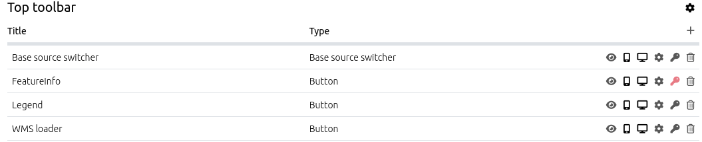

.. _layouts:

 .. |mapbender-button-add| image:: ../../../figures/mapbender_button_add.png

 .. |mapbender-button-edit| image:: ../../../figures/mapbender_button_edit.png

 .. |mapbender-button-key| image:: ../../../figures/mapbender_button_key.png

Layouts
#######

In the Layouts section of an application you get an overview of the regions (layout sections) of the application. In the regions, the elements of the application are listed.
An overview of all elements is available under :ref:`functions`.

.. note:: Different templates can have different regions: In the demo applications you can see two different region layouts. Not every element can be used in every region. Mapbender cares about that.

Layout of the Fullscreen template:

  * Top toolbar (region for Buttons, Links, HTML,...)
  * Sidepane (region for Layertree, Legend, Search, Print, HTML,...)
  * Map area (region for Map, Scalebar,...)
  * Footer (region for Copyright, Activity Indicator, Scale select,...)

Layout of the Mobile template:

  * Footer (region for Copyright, Activity Indicator, Scale select,...)
  * Map area (region for Map, Scalebar,...)
  * MobilePane (region for dialogs like Layertree, Legend, BaseSourceSwicther, FeatureInfo,...)

The |mapbender-button-add| button located at the top right of each region allows adding elements. After pressing the button, a dialog will open, which allows for the selection of an element and its subsequent configuration.

All elements in an application can be moved between regions using drag and drop.

The regions themselves can be configured using the |mapbender-button-edit| button at right. There is no configuration option for region Map area and MobilePane.

The regions Top toolbar and Footer provide the following configuration options:

Configuration of the Top toolbar and the Footer
***********************************************
The Top toolbar and the Footer provide the following configuration options:

* **Screen type** (Any, Mobile, Desktop. Default: Any): The region will not be displayed when other screen types are used. *Any* will always show the region.
* **Alignment** (Left, Right, Center. Default: Right): Sets the alignment for the buttons, texts, links.
* **Generate menu for buttons**:Creates a dropdown menu for the elements.
* **Menu label input field**: Labeling for the dropdown menu.

.. tip:: **Note**: Using the dropdown menu is especially handy on mobile devices. There is a code snippet in :ref:`CSS` that adds a scroll bar to the menu and helps to increase the user experience. 

Configuration of the Sidepane
*****************************
The Sidepane provide the following configuration options through their |mapbender-button-edit| button:

.. image:: ../../../figures/sidepane_backend.png
    :alt: Mapbender Sidepane Options

* **Type** (Accordion, Buttons, Unstyled. Default: Accordion): See explanation below.
* **Screen type** (Any, Mobile, Desktop. Default Any): The region will not be displayed when other screen types are used. Any - will always show the region.
* **Width** (in px) (in px. Default: 350px): Width of the Sidepane in Pixels.
* **Position** (Left, Right. Default: Left): Defines the placement of the sidepane.
* **Initially closed** (Default: disabled): Defines whether the Sidepane should be closed or open on start of the application.

The option **Type** adjusts the inserted elements:

- ``Accordion`` shows elements via tabs.

- ``Buttons`` shows elements via buttons.

- ``Unstyled`` does not contain any styling options at all and displays the elements in the configured backend order.

Button area (Elements)
**********************
Every element offers a set of buttons for configuration. The button area helps configuring elements in their specific regions.
The following button functions are available:

.. image:: ../../../figures/mapbender_layouts_button_area.png

* **Toggle show/hide element**: A shown element is visible in the application. A hidden one is not visible in the application itself, but can still be adjusted in the backend.
* **Show on mobile screens**: Displays an element only on mobile-sized screens.
* **Show on Desktop screens**: Displays an element only on Desktop-sized screens.
* **Edit**: Adjusts an element.
* **ACL element**: Sets specific visibility permissions for an element.
* **Delete**: Removes an element from both front- and backend.

Edit
====
The |mapbender-button-edit| button opens a configuration mask for a specific element. The :ref:`functions` overview page can help you to look up a setting for a specific element.

Acl element
===========
The |mapbender-button-key| button opens a **Secure element** window that allows configuration of the :ref:`acl` **View** right for users/groups. 

Without configuration, an element has no access restriction and is avaible to the users/groups that can access the application.

When via Acl element View access rights are set, only the defined users/groups get access to the element.

Add users to restrict access to them with the |mapbender-button-add| button. A set checkmark next to the user account provides the necessary rights.

.. image:: ../../../figures/de/fom/acl_secure_element.png
     :width: 100%

After setting specific access rights, the security key turns red. If you hover over the key with the cursor, you will see the names of the users who have rights to the element.

You can find more security details under :ref:`security`.

Delete
======
Removes an element from both front- and backend.