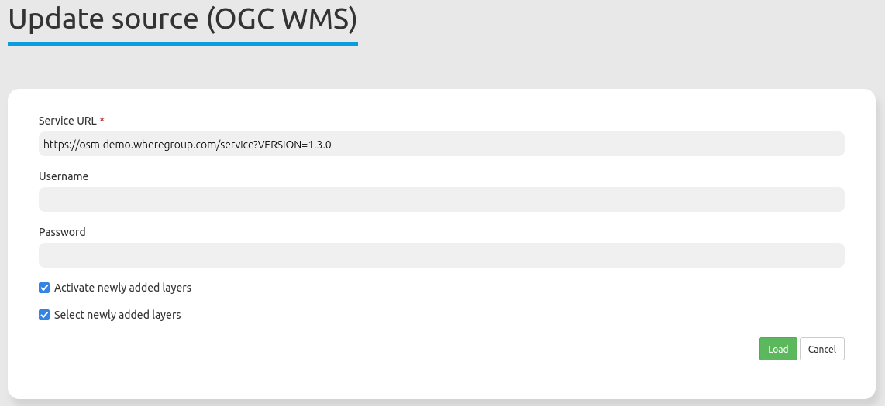

.. _sources:

Sources
=======

With Sources, you can register OGC WMS and OGC WMTS/TMS services in version 1.1.1 and 1.3.0 in Mapbender.

Further information about the registration process of services and their usage in applications is available in the Quickstart chapter :ref:`load_sources`.

Load sources
------------

.. tip:: It is important to check the service before it is registered in Mapbender. To do that, open the getCapabilities-Request (see example in Service URL) in your browser.

  .. |mapbender-button-add| image:: ../../figures/mapbender_button_add.png

To register a service, click on |mapbender-button-add| **Add source**:

* **Type**: Mandatory service type selection (OGC WMS or OGC WMTS / TMS).

* **Service URL**: URL to the Capabilities document of the service (e.g. `OGC WMS Version 1.3.0: <https://osm-demo.wheregroup.com/service?SERVICE=WMS&Version=1.3.0&REQUEST=GetCapabilities>`_)

* **Username / Password**: Input of the username and the password for secured services.

Click on ``Load`` to register the service to the repository.

  .. image:: ../../figures/mapbender_add_source.png
     :width: 100%

After a successful registration, Mapbender will provide an overview of the service.

Sources Overview
----------------

The sources and shared instances sections list and provide additional information about the services registered:

* **Filter**: Search for services names, URLs, types and descriptions.
* **Show metadata**: Shows metadata about a specific service. Opens a new field that lists specific metadata, Mapbender applications that use the source, contact information, details (e.g. service version) and layers.
* **Update source**: Updates service information by reloading the getCapabilities document.
* **Delete source**: Removes the registered service from Mapbender.

  .. image:: ../../figures/mapbender_sources.png
     :width: 100%

Sources menu button
-------------------

In the metadata dialog of a specific service, it is also possible to click on the menu button (top right) that allows:

* **Update source**: Updates service information by reloading the getCapabilities document.
* **Create shared instance**: Creates a new shared instance from the specific service. The instance is listed in the Shared instances tab.
* **Delete**: Removes the registered shared instance from Mapbender.

  .. image:: ../../figures/source_overview.png
     :width: 100%

Updating sources
----------------

  .. |mapbender-button-update| image:: ../../figures/mapbender_button_update.png

To update a source in the :ref:`backend`, you first need to navigate to the ``Sources`` :ref:`backend` list.
On this page, look for the layer you wish to update via scrolling or use the search box.
After you've found it, click on its |mapbender-button-update| **Refresh** button.
You can then update the WMS: If you wish, modify the URL or other settings, such as user name and/or password.

.. hint:: Of course, it is possible to update a source without changing any parameters. The Capabilities document is loaded again. 

Moreover, there are two checkboxes handling layer updates:

* **Activate newly added layers**: If active, the newly added layers will automatically set active in embedded applications. If the checkbox is not checked, new layers will not appear in the layertree.
* **Select newly added layers**: If active, the newly added layers will automatically be visible and set active in embedded applications. However, ``Activate newly added layers`` must also be set for this. If ``Select newly added layers`` is not set, the layer will appear in the layertree but will not be activated.

If you want to save the changes, click the ``Load`` button to refresh the WMS. This will re-read the getCapabilities document. The updated version will be displayed in the configuration settings, with changes applied in applications using the service.

