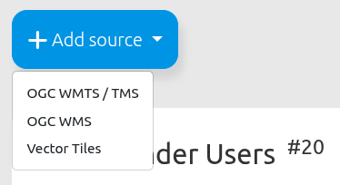
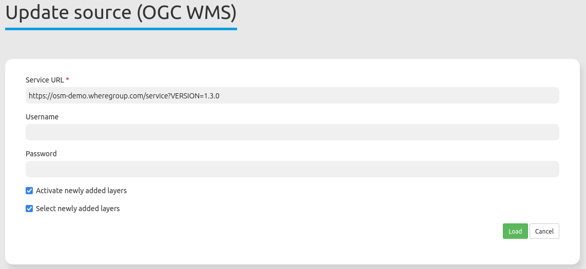

.. _sources:

Sources
=======

With Sources, you can register:

* **OGC WMS**: Web Map Service
* **OGC WMTS/TMS**: Web Map Tile Service
* **Vector Tiles**: Vector Tile Service

Further information about the registration process of services and their usage in applications is available in the Quickstart chapter :ref:`en/quickstart:Load sources`.

Load sources
------------

.. tip:: It is important to check the service before it is registered in Mapbender. To do that, open the getCapabilities-Request (see example in Service URL) in your browser.

  .. |mapbender-button-add| image:: ../../figures/mapbender_button_add.png

    
To register a service, click on |mapbender-button-add| **Add source** and select a source type. Then a configuration field opens with the following parameters:

* **Service URL**: URL to the Capabilities document of the service (e.g. `OGC WMS Version 1.3.0: <https://osm-demo.wheregroup.com/service?SERVICE=WMS&Version=1.3.0&REQUEST=GetCapabilities>`_)

* **Username / Password**: Input of the username and the password for secured services.

Click on ``Load`` to register the service to the repository.

  .. image:: ../../figures/mapbender_add_source.png
     :width: 100%

After a successful registration, Mapbender will provide an overview of the service.

Sources Overview
----------------

The sources and shared instances sections list and provide additional information about the services registered:

* **Filter**: Search for services names, URLs, types and descriptions.
* **Show metadata**: Shows metadata about a specific service. Opens a new field that lists specific metadata, Mapbender applications that use the source, contact information, details (e.g. service version) and layers.
* **Update source**: Updates service information by reloading the getCapabilities document.
* **Delete source**: Removes the registered service from Mapbender.

  .. image:: ../../figures/mapbender_sources.png
     :width: 100%

Sources menu button
-------------------

In the metadata dialog of a specific service, it is also possible to click on the menu button (top right) that allows:

* **Update source**: Updates service information by reloading the getCapabilities document.
* **Create shared instance**: Creates a new shared instance from the specific service. The instance is listed in the Shared instances tab.
* **Delete**: Removes the registered shared instance from Mapbender.

  .. image:: ../../figures/source_overview.png
     :width: 100%

Updating sources
----------------

  .. |mapbender-button-update| image:: ../../figures/mapbender_button_update.png

To update a source in the :ref:`backend`, you first need to navigate to the ``Sources`` :ref:`backend` list.
On this page, look for the layer you wish to update via scrolling or use the search box.
After you've found it, click on its |mapbender-button-update| **Refresh** button.
You can then update the WMS: If you wish, modify the URL or other settings, such as user name and/or password.

.. hint:: Of course, it is possible to update a source without changing any parameters. The Capabilities document is loaded again. 

Moreover, there are two checkboxes handling layer updates:

* **Activate newly added layers**: If active, the newly added layers will automatically set active in embedded applications. If the checkbox is not checked, new layers will not appear in the layertree.
* **Select newly added layers**: If active, the newly added layers will automatically be visible and set active in embedded applications. However, ``Activate newly added layers`` must also be set for this. If ``Select newly added layers`` is not set, the layer will appear in the layertree but will not be activated.

If you want to save the changes, click the ``Load`` button to refresh the WMS. This will re-read the getCapabilities document. The updated version will be displayed in the configuration settings, with changes applied in applications using the service.

Details about the Data Sources:

* **WMS**:

  * **type**: must be wms
  * **title**: The source title as displayed in the layer tree
  * **version**: WMS version (default: 1.1.1)
  * **url**: URL to the service's Get capabilities XML
  * **format**: Mime type for the image format requested (default: image/png)
  * **info_format**: Mime type for the feature info format (default: text/html)
  * **proxy**: Bool value whether the service should be proxied (default: false)
  * **tiled**: Bool value whether the wms data should be requests as tiles (default: false)
  * **layerorder**: "standard" or "reverse" (the latter is used mainly for QGIS Server). (default: parameter wms.default_layer_order which again defaults to "standard")
  * **isBaseSource**: boolean value if the source should be treated as a base source
  * **transparent**: boolean value whether the TRANSPARENT flag should be set (default: true)
  * **opacity**: int 0 (fully transparent)-100 (fully opaque) (default: 100)
  * **visible**: initial selected state of the root layer. (default: true)
  * **toggle**: initial folder state of the root layer in the layer tree (default: true = folder is expanded)
  * **allowToggle**: can the user collapse/expand the root layer? (default: true)
  * **minScale**: minimum scale (1:x) where the root layer is displayed (default: unset)
  * **maxScale**: maximum scale (1:x) where the root layer is displayed (default: unset)
  * **legendurl**: url for the root layer's legend
  * **layers**: optional object to modify individual sublayers. The key is arbitrary, but should be unique. The value is an object with the following settings:
    
    * **name**: The layer's name, as in the <Name> tag of the layer within the GetCapabilities XML
    * **title**: The layer title as displayed in the layer tree
    * **visible**: initial selected state of the layer. (default: true)
    * **toggle**: initial folder state of the layer in the layer tree (default: false = folder is collapsed)
    * **allowToggle**: can the user collapse/expand the layer? (default: true)
    * **minScale**: minimum scale (1:x) where this layer is displayed (default: unset)
    * **maxScale**: maximum scale (1:x) where this layer is displayed (default: unset)
    * **legendurl**: url for this layer's legend
    * **layers**: sublayers, array with the same structure as the layers on the top level

* **WMTS/TMS**:

  * **type**: must be wmts or tms
  * **url**: URL to the service's Get capability XML. Note that to obtain the TileMatrices this document will be downloaded for every page view (unlike for database WMTS sources, where this information is cached in the database)
  * **title**: The source title as displayed in the layer tree
  * **basesource (alias: isBaseSource)**: boolean value if the source should be treated as a base source
  * **opacity**: int 0 (fully transparent)-100 (fully opaque)
  * **selected (alias: visible)**: initial selected state of the root layer. (default: true)
  * **allowSelected**: can the user change state of the root layer in the layertree? If selected and allowSelected are both false, the layer is ignored. (default: true)
  * **toggle**: initial folder state of the root layer in the layer tree (default: true = folder is expanded)
  * **allowToggle**: can the user collapse/expand the root layer? (default: true)
  * **layers**: optional object to modify individual sublayers. The key should be the value of the <ows:Identifier> attribute in the GetCapabilities document (for WMTS) or the url suffix of the layer for TMS. For example, if The URL of the Capability document is https://osm-demo.wheregroup.com/tms/1.0.0/ and the layer's href in the TileMap tag is defined as https://osm-demo.wheregroup.com/tms/1.0.0/osm/webmercator, the layer key will be osm/webmercator.
    
    * **title**: The layer title as displayed in the layer tree
    * **active**: if false, the layer is ignored and won't be available in the application at all (default: true)
    * **selected (alias: visible)**: initial selected state of the layer. (default: true)
    * **allowSelected**: can the user change state in the layertree? If selected and allowSelected are both false, the layer is ignored, as if active was set to false. (default: true)

* **Vector Tiles**:

  * **type**: must be vector_tiles
  * **title**: The source title as displayed in the layer tree
  * **jsonUrl**: URL to the Mapbox Style Spec JSON file
  * **basesource (alias: isBaseSource)**: boolean value if the source should be treated as a base source
  * **opacity**: int 0 (fully transparent)-100 (fully opaque) (default: 100)
  * **selected (alias: visible)**: initial selected state of the layer. (default: true)
  * **allowSelected**: can the user change the selected state? (default: true)
  * **toggle**: initial folder state of the root layer in the layer tree (default: true = folder is expanded)
  * **allowToggle**: can the user collapse/expand the root layer? (default: true)
  * **minScale**: minimum scale (1:x) where the source is displayed (default: unset)
  * **maxScale**: maximum scale (1:x) where the source is displayed (default: unset)
  * **featureInfo**: is featureinfo enabled by default? (default: true)
  * **featureInfoAllowToggle**: can the user toggle the feature info state? (default: true)
  * **featureInfoPropertyMap**: If not empty, only the specified properties will be displayed in the feature info. Specify as YAML array. The key is the name of the field, the optional value is the translation. Example:
    
    .. code-block:: yaml

      class
      name
      layer: Layer-Name

  * **hideIfNoTitle**: Hide features with empty title in the featureInfo (default: true)
  * **featureInfoTitle**: Property/Properties of the feature that is/are displayed as title above the table. ${property} will be replaced by the property's value. If not specified, the first non-empty value from "label", "name", and "title" will be used.
  * **printScaleCorrection**: Resolution correction for printing. Default value is 1.0. Higher values result in more details and smaller labels; lower values in less details and larger labels.
  * **legendEnabled (alias: legend)**: should a legend be displayed for this source? (default: false)
  * **legendPropertyMap**: If not empty, only the specified layers will be shown in the legend. Specify as a YAML array. The key is the layer ID from the "layers" field in the style JSON; the optional value is the translation. Example:

    .. code-block:: yaml

      City
      Stations
      Transport: Public Transport

  * **bbox**: Bounding box (array xmin, ymin, xmax, ymax) for the source
