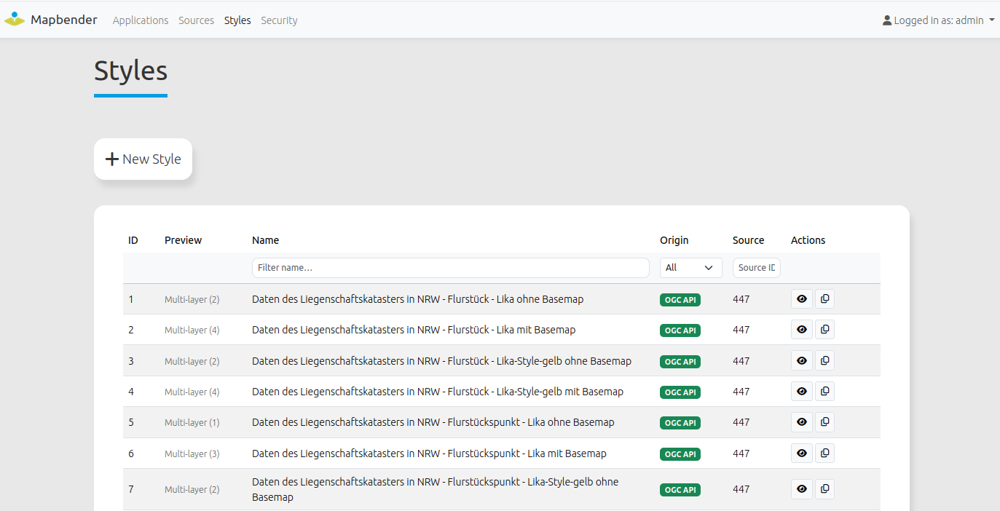
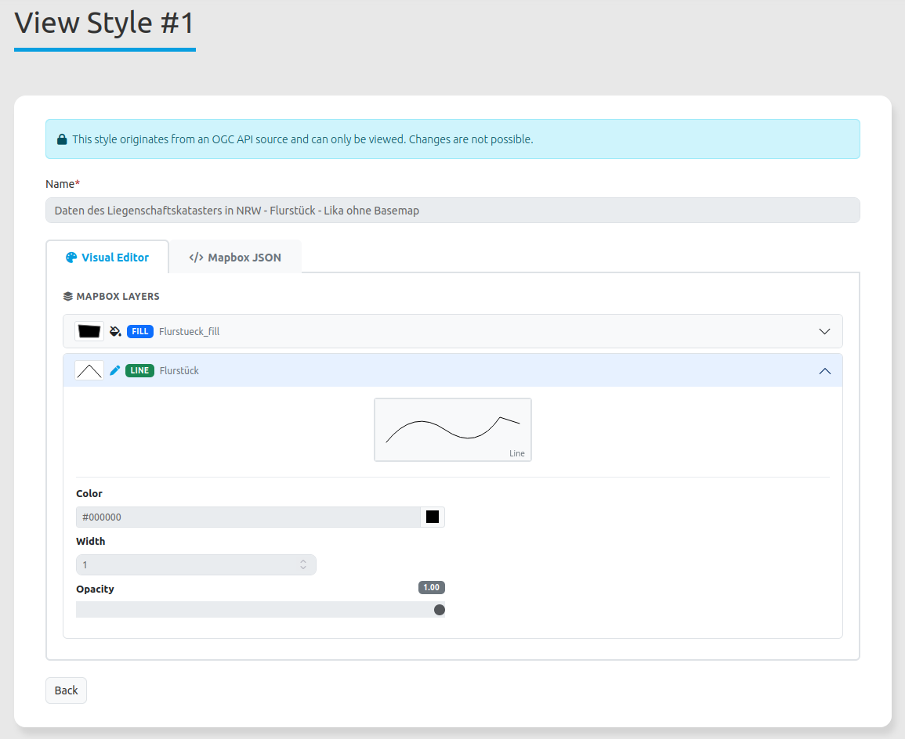
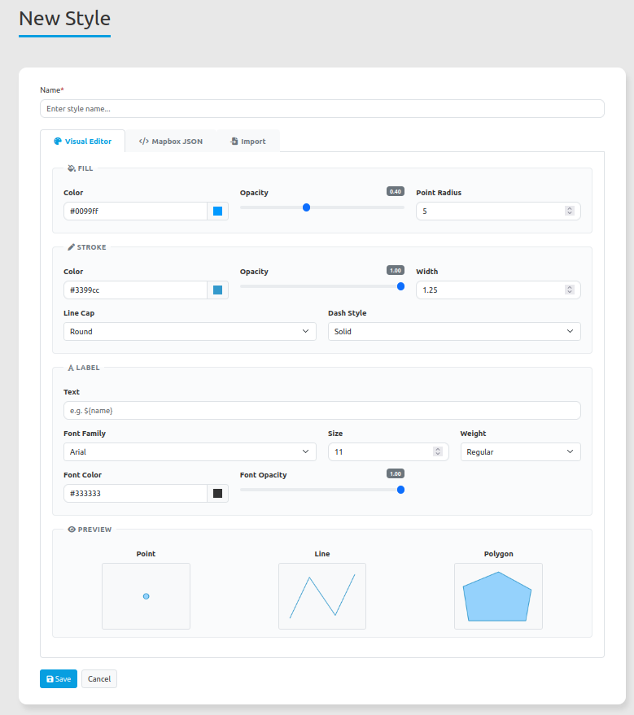
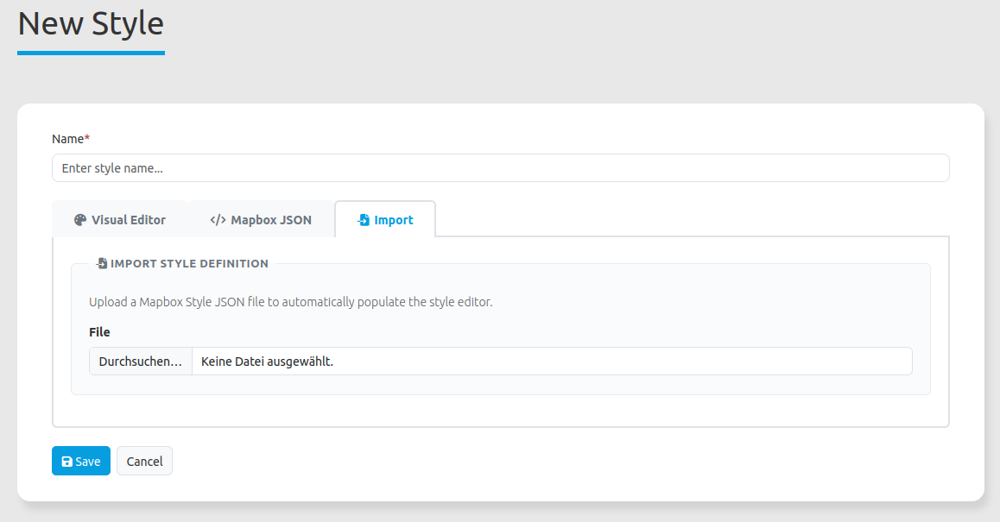

.. _styles:

Styles
======

Vector data need a style definition to be visualized in an individual style. This style has to be registered in Mapbender and can then be used with vector data.

You can upload styles or create new styles. Collections of OGC API - Features services can refer to styles for visualizing the data. These styles will be registered in Mapbender when loading the service.

Unterstützte Stile sind:

* Mapbox Style https://docs.mapbox.com/style-spec/guides/
    

Stile can be viewed and copied.

Create a Style with the Style generator
---------------------------------------

The Style generator provides default values for a style. You can change these values. You can modify the color, opacity, line style and width. You also can define a label for the style. The label can refer to a data attribute via ${name}.

You have to provide a name for the new style.
    

    
Upload Style
-----------------

You have to provide a name for the new style and refer to the Mapbox-Style-JSON-file.

.. tip:: You can create your favorite style with QGIS and export it as Mapbox-Style-JSON-file. Then you can upload it to Mapbender and use it to visualize vector data. A nice QGIS plugin for style export is the GeoCatBridge Plugin.
    

        
