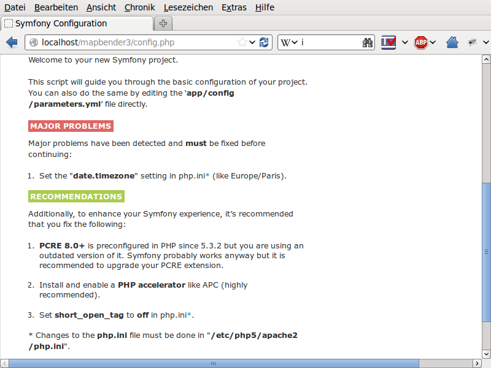

.. _installation_windows:

Installation on Windows
#######################

Please take note of the `system requirements <systemrequirements.html>`_ where you can also find the Download links to Mapbender3. Install the neccessary components:

 * add the path to your PHP-bin directory to the PATH variable 
 * activate the PHP extensions in your php.ini configuration file
 * load the Apache module rewrite

.. code-block:: ini

 # php.ini
 extension=php_curl.dll
 extension=php_fileinfo.dll
 extension=php_gd2.dll
 extension=php_intl.dll
 extension=php_pdo_pgsql.dll
 extension=php_pdo_sqlite.dll
 extension=php_pgsql.dll
 extension=php_openssl.dll

For development:

.. code-block:: ini

 # php.ini
 extension=php_bz2.dll

 

Additional for PHP 7:

.. code-block:: ini

 # php.ini
 extension=php_zip.dll
 extension=php_bz2.dll
 extension=php_mbstring.dll
  

.. code-block:: apache

    # Windows: edit file httpd.conf (remove the comment-sign #) and restart apache
    LoadModule rewrite_module modules/mod_rewrite.so

Create the Apache alias. In Windows there are several ways. A clear way is to create a file mapbender3.conf and to refer to that file in Apaches httpd.conf

* Create a subfolder "alias" in the directory "<apache>/conf". Create the mapbender3.conf file there. (You can use this directory to place additional Alias definition-files for other sites there.)
* In the httpd.conf (in directory <apache>/conf/)refer to this file mapbender3.conf

In httpd.conf:

.. code-block:: apache

                # Refer to Mapbender3 alias
                Include "conf/alias/mapbender3.conf"

In mapbender3.conf:

.. code-block:: apache

 Alias /mapbender3 c:/mapbender3/web/
 <Directory c:/mapbender3/web/>
  Options MultiViews FollowSymLinks
  DirectoryIndex app.php
  Require all granted
 
  RewriteEngine On
  RewriteBase /mapbender3/
  RewriteCond %{REQUEST_FILENAME} !-f
  RewriteRule ^(.*)$ app.php [QSA,L]
 </Directory>

We assume in this example, that Mapbender3 is unzipped directy under **C:/** (see the `System Requirements and Download <systemrequirements.html#download-of-mapbender3>`_ chapter for details). You can easily choose a different directory and have to adjust the Apache mapbender3.conf file above to the right location.

Restart the Apache webserver and check that the Alias is accessible:

* http://localhost/mapbender3/

Open Symfony´s Welcome Script config.php. This script checks whether all necessary components are installed and configurations are done. If there are still problems, you should fix them.
 
* http://localhost/mapbender3/config.php

Adapt the Mapbender3 configuration file parameters.yml (app/config/parameters.yml) and define the database you want to create. Further information is available in the chapter `Configuring the database <../database.html>`_.

.. code-block:: yaml

    database_driver:   pdo_pgsql
    database_host:     localhost
    database_port:     5432
    database_name:     mapbender3
    database_path:     ~
    database_user:     postgres
    database_password: secret

Run the app/console commands with php. First you have to open a terminal (cmd).

.. code-block:: text
 
 c:
 cd mapbender3
 php.exe app/console doctrine:database:create
 php.exe app/console doctrine:schema:create
 php.exe app/console assets:install web
 php.exe app/console fom:user:resetroot
 php.exe app/console doctrine:fixtures:load --fixtures=./mapbender/src/Mapbender/CoreBundle/DataFixtures/ORM/Epsg/ --append
 php.exe app/console doctrine:fixtures:load --fixtures=./mapbender/src/Mapbender/CoreBundle/DataFixtures/ORM/Application/ --append

Installation of Mapbender3 is done. 

Check the config.php again:

* http://localhost/mapbender3/config.php

You can start using Mapbender3 now. You can open the developer mode when you run app_dev.php.

* http://localhost/mapbender3/app_dev.php

**Notice:** Go to the login link at the right-top and log in with the new user you created. 

To learn more about Mapbender3 have a look at the `Mapbender3 Quickstart <../quickstart.html>`_.

