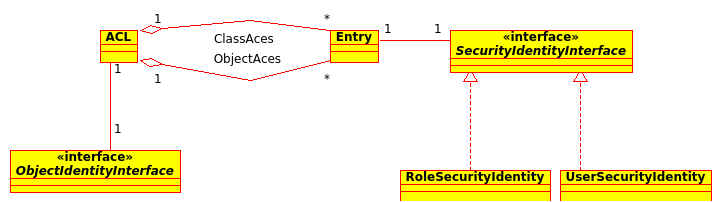

Access Control Lists
====================

Security for domain objects (generally database entities) is implemented using
Access Control Lists (ACL). ACLs provide flexible permissions for individual
objects.

For each domain object class up to 30 individual permissions can be given. In
general, 7 are used most often:

- View: View object
- Create: Create a new object
- Edit: Edit an existing object
- Delete: Delete an existing object
- Undelete: Undelete an object marked as deleted
- Operator: View, Create, Edit, Delete and Undelete permission
- Master: Operator permission, can manage all permissions up to operator level.
- Owner: Master permission, can grant master permission as well.

Each ACL is composed by an object identity and several Access Control Entries
(ACE).

Object identites
----------------
ACLs are not assigned to objects directly, but to so called object identities.
They represent individual objects or classes (the create permission is a
class-based permission for example).

Access Control Entries
----------------------
Each ACE holds the permissions for a single user or role. The permissions are
stored as an integer bitmask, therefore 32 permissions can be used - as some
PHP implementations use 30 bit long integers, 30 is the cross-platform maximum
number of permissions. But as laid out above, 7 are already enough to model
an enhanced CRUD workflow, leaving 23 for custom-tailored permission if needed.

Security Identities
-------------------
ACEs can be associated with either users or roles by means of encapsulating both
with an security identity.

