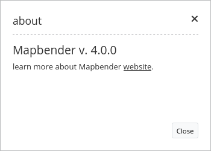
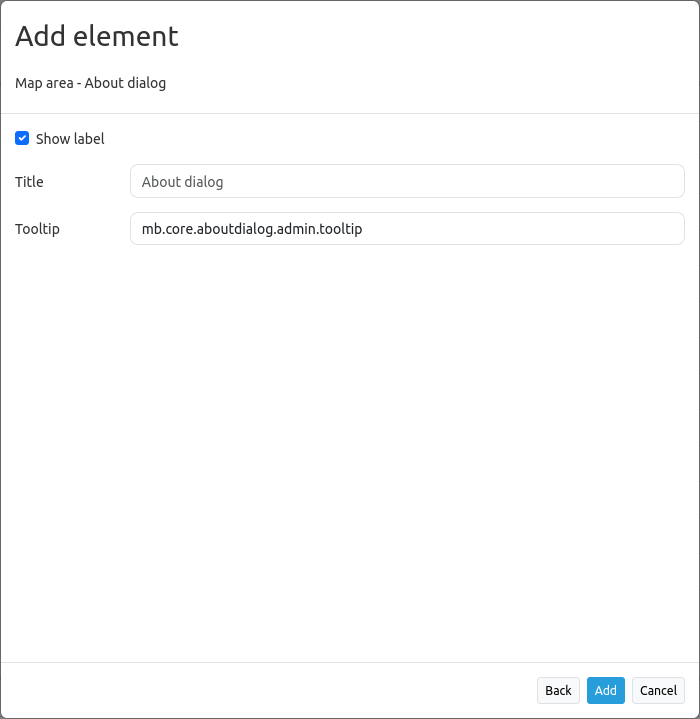

.. _about_dialog:

About Dialog
************

This element renders a `button <../elements/button.html>`_ which shows a simple about dialog, listing Mapbender's version. For the default-template the button can be placed, as usual, into the toolbar but can be also positioned into the footer region.

Configuration
=============

* **Show Label:** Enable/Disable about dialog text next to the icon.
* **Title:** Text indicated next to the about dialog icon. 
* **Tooltip:** Text to use as a tooltip. Appears when hovering over the icon. 

YAML-Definition:
----------------

.. code-block:: yaml

   title: 'About Mapbender3'    # text indicated next to the about dialog icon. 
   tooltip: 'About Mapbender3'  # text to use as tooltip
   label: true                  # false/true to label the button, default is true
   icon: 'icon-about'           # icon to display on button

   
Class, Widget & Style
=====================

* **Class:** Mapbender\\CoreBundle\\Element\\AboutDialog
* **Widget:** mapbender.mbAboutDialog
* **Style:** mapbender.elements.css

HTTP Callbacks
==============

about
-----

Retrieves dialog contents.

JavaScript API
==============

None.

JavaScript Signals
==================

None.

