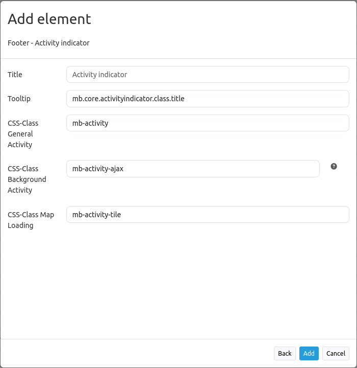

.. _activity_indicator:

Activity Indicator
******************

The activity indicator element provides a simple widget showing background activity (Ajax calls and pending map tile requests).
In the default configuration it uses a Font symbol. This can be easily modified by changing the CSS for the 
widget in the css-file ``fom//src//FOM//CoreBundle//Resources//public//css/frontend//mapbender3_theme.css``.

Configuration
=============

* **Title:** Title of the element.
* **Tooltip:** The text entered as a tooltip will be indicated by hovering over the element with the mouse cursor a longer time.
* **Activity class:** CSS class to indicate activity (Ajax or tile).
* **Ajax activity class:** CSS class to indicate Ajax activity.
* **Tile activiy class:** CSS class to indicate tile loading activity.

YAML-Definition:
----

.. code-block:: yaml

    activityClass: mb-activity          # CSS class to indicate activity (Ajax or tile)
    ajaxActivityClass: mb-activity-ajax # CSS class to indicate Ajax activity
    tileActivityClass: mb-activity-tile # CSS class to indicate tile loading activity

Class, Widget & Style
============================

* **Class:** Mapbender\\CoreBundle\\Element\\ActivityIndicator
* **Widget:** mapbender.element.activityindicator.js
* **Style:** mapbender.elements.css

HTTP Callbacks
==============

None.

JavaScript API
==============

None.

JavaScript Signals
==================

None.
