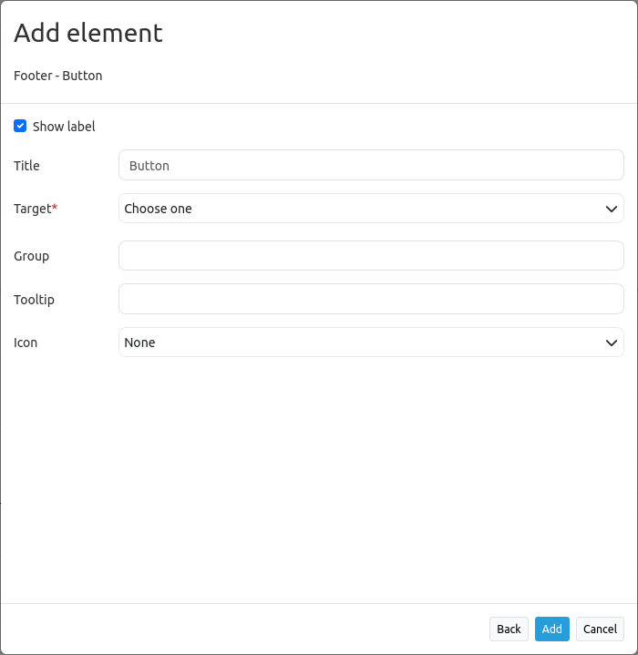

.. _button:

Button
******

The button element provides a push button widget, which can optionally be
grouped, so that only one button in a group can be active at any given time.

Configuration
=============

YAML-Definition:

.. code-block:: yaml

    title:        # Title
    tooltip:      # Tooltip
    icon: ~       # Icon CSS class to use
    label: true   # true/false Icon label to use
    group: ~      # Group to put the button into. Only one button per group can be active
    click:        # Refer to a website or script like http://mapbender3.org
    target: ~     # Title (Id) of target element
    action: ~     # method of target to call when button is activated
    deactivate: ~ # method of target to call when button is deactivated

Class, Widget & Style
=====================

* Class: Mapbender\\CoreBundle\\Element\\Button
* Widget: mapbender.mbButton (mapbender.element.button.js)
* Style: mapbender.elements.css

HTTP Callbacks
==============

None.

JavaScript API
==============

activate
--------

Activates button. Get's called on click if button is deactivated.

deactivate
----------

Deactivates button. Gets called on click if button is active or when another button of the same group gets activated.

JavaScript Signals
==================

None.

