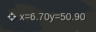

.. _coordinates_display:

Coordinates Display
********************

The coordinates display element shows your mouse position in map coordinates.

Configuration
=============

.. image:: ../../../../../figures/coordinates_display_configuration.png
     :scale: 80

YAML-Definition:

.. code-block:: yaml

   tooltip: 'coordinates display' # text to use as tooltip
   numDigits: 2                   # the number of digits each coordinate shall have when being rendered, default 2
   target: ~                      # id of Map element to query 
   label: true                    # true/false to label coordinates display, default is false
   empty: 'x= - y= -'             # show the following text, if the mouse is not on the map
   prefix: 'x= '                  # show prefix before x-coordinate
   separator: ' y= '              # show separator before y-coordinate

Class, Widget & Style
=====================

* Class: Mapbender\\CoreBundle\\Element\\CoordinatesDisplay
* Widget: mapbender.element.coordinatesdisplay.js
* Style: mapbender.elements.css

HTTP Callbacks
==============

None.

JavaScript API
==============

reset
-----

<>

showHidde
----------

<>

JavaScript Signals
==================

None.
