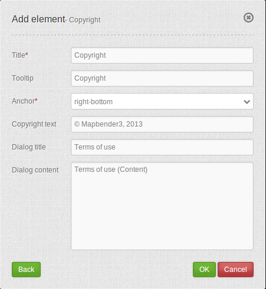

.. _copyright:

Copyright
************

The copyright shows a copyright label and terms of use as a dialog.

Configuration
=============

* **Autoopen:** Enable or disable autoopening of the copyright window, when starting the application. (Default: disabled)
* **Title:** Title of the element. It will be indicated next to the button.
* **Tooltip:** Text used as a tooltip. It will be indacted when hovering with the mouse cursor over the button. It also used as a header in the copyright window.
* **Content:** Content of the copyright window, displayed when clicking on the button (or autoopened by starting the application, if enabled)

YAML-Definition:
----

.. code-block:: yaml

   tooltip: "Copyright"             # text to use as tooltip
   width: 200px                     # copyright width, default '200px'
   anchor: 'inline'/'left-top'/     # copyright alignment, default 'left-bottom'
     'left-bottom'/'right-top'/     # use inline f.e. in sidebar
     'right-bottom'                 
   position: array('0px','0px')     # copyright position, default: x=0px, y=0px
   copyrigh_text: "© XXX # 2013"    # edit the text you want to display as copyright text
   copyright_link: "Terms of use"   # title for a link to "terms of use" content, default is 'Terms of use'
   dialog_title: "Terms of use"     # title of the dialog, default is 'Terms of use'
   dialog_content: "Terms of use (Content)"  # the content of the "terms of use", default is 'Terms of use (Content)'
   link_url: ''/'http://example.de' # url from "Terms of use (Content)" as a website
   link_type: ''/'dialog'/'url'     # use '' for a link to hide "Terms of use" components,
                                    # use 'dialog' to show "Terms of use (Content)" at dialog,
                                    # use 'url' to call a website as "Terms of use (Content)"

Class, Widget & Style
============================

* **Class:** Mapbender\\CoreBundle\\Element\\Copyright
* **Widget:** mapbender.element.copyright.js
* **Style:** mapbender.elements.css

HTTP Callbacks
==============

None.

JavaScript API
==============

None.

JavaScript Signals
==================

None.
