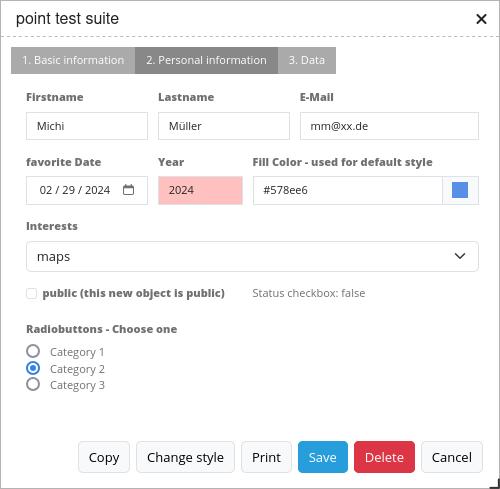

.. _digitizer:

Digitizer
*********

This documentation refers to Digitizer 1.1.x.

The Digitizer element allows building editing-interfaces. Currently you can build up your interface for point, line and polygon editing with a YAML-definition. 
Right now PostgreSQL is supported as a database. Oracle and SpatialLite can be used experimentally. The development of the digitizer allows other data sources so that it can be extended to support - for example - OGC WFS services.

The Digitizer-Element offers complex editing functionality:

* move objects
* add vertices (lines, polygons)
* generation of enclaves, exclaves, circles and ellipses

In connection with the digitization, very complex forms can be generated for the acquisition of data.
    

.. image:: ../../../../../figures/digitizer.png
     :scale: 80

The following option for the construction of the forms are available:

* define more then one feature types for digitalisation. You can switch from one feature type to the other with a select box
* use a table as source. You can also define a filter to get a subset of the table
* Textfields
* Selectboxes, Multiselectboxes
* Radiobuttons, Checkboxes
* Textareas
* Datepicker
* File upload and Image Display
* Definition of tabs
* Definition breaklines
* Definition of Text 
* Mandatory fields, regular expressions to valida the content are possible
* Help texts

Configuration
=============

.. image:: ../../../../../figures/digitizer_configuration.png
     :scale: 80

You can use the element in the sidepane.

* **Title:** Title of the element. This is displayed in the layouts list and allows you to define several elements.
* **Target:** (ID) of the map.
* **Schemes:** YAML-Definition of the element digitiizer

The Ditigitzer needs access to a database where the editable tables are. You have to define a new database configuration to be able to connect with the geo database. 
Read more about this at http://doc.mapbender3.org/en/book/database.html

The definition of the digitizer is done in YAML syntax in the textarea configuration at schemes. Here you define the database connection, the editable table, the form to display the table, the attribute form and other behaviour.
If errors occur in the database, fields or form, various error messages appear. Via the normal call and app.php comes a general error message.
If you want to reproduce the exact error, you should call the page via app_dev.php. In this case, detailed error messages about the error behavior appear.

Element definition in web interface in the configuration area:

YAML-Definition for the element digitizer in mapbender.yml:

.. code-block:: yaml

                sidepane:
                    digitizer:
                        class: Mapbender\DigitizerBundle\Element\Digitizer
                        title: Digitalisation
                        target: map
                        schemes:
                            ...

YAML-Definition for the element digitizer in the textarea schemes
-----------------------------------------------------------------------------------------

In the following YAML block, the example definition for three digitizer forms is included. Copy the following block into your digitizer element to test the capture of points, lines, and polygons.
You must first create the database connection and the three demo tables. The SQL commands for creating the tables can be found below.
The functionality of the built-in features and additional functions are explained in more detail in this example.

.. code-block:: yaml

    poi:
        label: point digitizing
        inlineSearch: true
        maxResults: 500
        featureType:
            connection: search_db
            table: poi
            uniqueId: gid
            geomType: point
            geomField: geom
            srid: 4326
        openFormAfterEdit: true
        zoomScaleDenominator: 500
        allowEditData: true
        allowDelete: true
        allowDigitize: true
        useContextMenu: true
        clustering:
              -
                  scale: 10000
                  distance: 60
              -
                  scale: 2500
                  distance: 40
              -
                  scale: 1000
                  distance: 20
              -
                  scale: 500
                  distance: 1
                  disable: true
        toolset:
            - type: drawPoint
            - type: modifyFeature
            - type: moveFeature
            - type: selectFeature
            - type: removeSelected
        popup:
            title: point test suite
            width: 500px
        searchType: currentExtent
        tableFields:
            gid: {label: Nr. , width: 20%}
            name: {label: Name , width: 80%}
        styles:
            default:
                strokeWidth: 2
                strokeColor: '#0e6a9e'
                fillColor: '#1289CD'
                fillOpacity: 1
                fillWidth: 2
                pointRadius: 10
            select:
                strokeWidth: 3
                strokeColor: '#0e6a9e'
                fillOpacity: 0.7
                pointRadius: 10
        formItems:
           - type: tabs
             children:
               - type: form
                 title: Basic information
                 css: {padding: 10px}
                 children:
                     - type: label
                       title: Welcome to the digitize demo. Try the new Mapbender3 feature!
                     - type: input
                       title: Name
                       mandatory: true
                       name: name
                       mandatoryText: Please give a name to the poi.
                       infoText: "Help: Please give a name to the new object."
                     - type: input
                       title: Title
                       mandatory: false
                       name: title
                       mandatoryText: Please give a title to the poi.
                     - type: textArea
                       name: abstract
                       title: Abstract
                       placeholder: 'please edit this field'
                     - type: select
                       title: Type
                       name: type
                       options: {A: A, B: B, C: C, D: D, E: E}
                     - type: breakLine
               - type: form
                 title: Personal information
                 css: {padding: 10px}
                 children:
                     - type: label
                       title: Please give us some information about yourself.
                     - type: fieldSet
                       children:
                           - type: input
                             title: Firstname
                             name: firstname
                             css: {width: 30%}
                           - type: input
                             title: Lastname
                             name: lastname
                             css: {width: 30%}
                           - type: input
                             title: E-Mail
                             name: email
                             css: {width: 40%}
                     - type: select
                       multiple: false
                       title: Interests
                       name: interests
                       options: {maps: maps, reading: reading, swimming: swimming, dancing: dancing, beer: beer, flowers: flowers}
                     - type: date
                       title: favorite Date
                       name: date_favorite
                       placeholder: Please add a date in the following style dd-mm-yy.
                       dateFormat: dd-mm-yy
                       value: 01-01-2016
                       mandatory: true
                       css: {width: 25%}
                     - type: breakLine
                     - type: breakLine
                     - type: checkbox
                       name: public
                       value: true
                       title: public (this new object is public)
    line:
        label: line digitizing
        inlineSearch: true
        maxResults: 1500
        featureType:
            connection: search_db
            table: lines
            uniqueId: gid
            geomType: line
            geomField: geom
            srid: 4326
        openFormAfterEdit: true
        allowDelete: true
        useContextMenu: true
        toolset:
            - type: drawLine
            - type: modifyFeature
            - type: moveFeature
            - type: selectFeature
            - type: removeSelected
        popup:
            title: line test suite
            width: 500px
        searchType: currentExtent
        tableFields:
            gid: {label: Nr. , width: 20%}
            name: {label: Name , width: 80%}
        styles:
            default:
                strokeWidth: 2
                strokeColor: '#0e6a9e'
                fillColor: '#1289CD'
                fillOpacity: 1
                fillWidth: 2
                pointRadius: 10
            select:
                strokeWidth: 3
                strokeColor: '#0e6a9e'
                fillOpacity: 0.7
                pointRadius: 10
        formItems:
           - type: form
             title: Basic information
             css: {padding: 10px}
             children:
                 - type: label
                   title: Welcome to the digitize demo. Try the new Mapbender3 feature!
                 - type: input
                   title: Name
                   name: name
                   mandatory: true
                   mandatoryText: Please give a name to the new object.
                   infoText: "Help: Please give a name to the new object."
                 - type: select
                   title: Type
                   name: type
                   options: {A: A, B: B, C: C, D: D, E: E}
    polygon:
        label: polygon digitizing
        inlineSearch: true
        maxResults: 1500
        featureType:
            connection: search_db
            table: polygons
            uniqueId: gid
            geomType: polygon
            geomField: geom
            srid: 4326
        openFormAfterEdit: true
        allowDelete: false
        useContextMenu: true
        toolset:
            - type: drawPolygon
            - type: drawRectangle
            - type: drawDonut
            - type: drawEllipse
            - type: drawCircle
            - type: modifyFeature
            - type: moveFeature
            - type: selectFeature
            - type: removeSelected
        popup:
            title: polygon test suite
            width: 500px
        searchType: currentExtent
        tableFields:
            gid: {label: Nr. , width: 20%}
            name: {label: Name , width: 80%}
        styles:
            default:
                strokeWidth: 2
                strokeColor: '#0e6a9e'
                fillColor: '#1289CD'
                fillOpacity: 1
                fillWidth: 2
                pointRadius: 10
            select:
                strokeWidth: 3
                strokeColor: '#0e6a9e'
                fillOpacity: 0.7
                pointRadius: 10
        formItems:
           - type: form
             title: Basic information
             css: {padding: 10px}
             children:
                 - type: label
                   title: Welcome to the digitize demo. Try the new Mapbender3 feature!
                 - type: input
                   title: Name
                   mandatory: true
                   name: name
                   mandatoryText: Please give a name to the new object.
                   infoText: "Help: Please give a name to the new object."
                 - type: select
                   title: Type
                   name: type
                   options: {A: A, B: B, C: C, D: D, E: E}

SQL for the demo tables
------------------------------

The following SQL commands must be executed in your database. You create three demo tables so that the individual functions can be tested using the YAML definition shown above.

.. code-block:: yaml

    Create table public.poi (
        gid serial,
        name varchar,
        type varchar,
        abstract varchar,
        public boolean,
        date_favorite date,
        title varchar,
        firstname varchar,
        lastname varchar,
        email varchar,
        interests varchar,
        user_name varchar,
        group_name varchar,
        modification_date date,
        my_type varchar,
        file_reference varchar,
        x float,
        y float,
        geom geometry(point,4326),
        CONSTRAINT pk_poi_gid PRIMARY KEY (gid)
    );

.. code-block:: yaml

    Create table public.lines (
        gid serial,
        name varchar,
        type varchar,
        abstract varchar,
        public boolean,
        date_favorite date,
        title varchar,
        firstname varchar,
        lastname varchar,
        email varchar,
        interests varchar,
        length float,
        category varchar,
        user_name varchar,
        group_name varchar,
        modification_date date,
        my_type varchar,
        file_reference varchar,
        x float,
        y float,
        geom geometry(linestring,4326),
        CONSTRAINT pk_lines_gid PRIMARY KEY (gid)
    );

.. code-block:: yaml

    Create table public.polygons (
        gid serial,
        name varchar,
        type varchar,
        abstract varchar,
        public boolean,
        date_favorite date,
        title varchar,
        firstname varchar,
        lastname varchar,
        email varchar,
        interests varchar,
        area float,
        category varchar,
        user_name varchar,
        group_name varchar,
        modification_date date,
        my_type varchar,
        file_reference varchar,
        x float,
        y float,
        geom geometry(polygon,4326),
        CONSTRAINT pk_polygons_gid PRIMARY KEY (gid)
    );

Feature basic definition
--------------------------

.. code-block:: yaml

    poi:
        label: point digitizing        # label of the digitizer popup
        maxResults: 500                # maximal results of the table
        featureType:                   # connection to the database from the parameters/config.yml
            connection: search_db
            table: poi
            uniqueId: gid
            geomType: point
            geomField: geom
            srid: 4326
        openFormAfterEdit: true        # Set to true (default): after creating a geometry the form popup is opened automatically to insert the attribute data.
        zoomScaleDenominator: 500
        allowEditData: true            # Allow or disable functions to edit or remove data.
        allowDelete: true
        allowDigitize: true 
        popup:
            [...]

Definition of the popup
-----------------------

.. code-block:: yaml

        popup:             # Define the form as a popup. Further experimental adaptations here: http://api.jqueryui.com/dialog/
            title: POI     # Definition of the popup title
            height: 400    # height of the popup
            width: 500     # width of the popup

            #modal: true   # Everything except the form window is grayed out and the position and size of the window is fixed for the duration of the data collection.
            #position: {at: "left+20px",  my: "left top-460px"}  # Position of the popup in the browser area

Definition of the feature table
------------------------------------------------------------------------

The digitizer provides an object table. This can be used to navigate to features (zoom on the objects) and open the editing form. The object table can be sorted. 
The width of the individual columns can optionally be specified in percent or pixels.

* tableFields - define the columns for the feature table. 
* searchType **all** or **currentExtent**

.. code-block:: yaml

        searchType: currentExtent   # all - lists all features in the table, currentExten - list only the features displayed in the current extent in the table (default) 
        tableFields:                # definition of the colums to be displayed
            gid: {label: Nr. , width: 20%} # [table column]: {label: [label text], width: [css-definition, like width]}  # Definition of a column
            name: {label: Name , width: 80%}

Definition of tabs (type tabs)
------------------------------

.. code-block:: yaml

        formItems:
           - type: tabs                      # Type tabs creates tabs in the popup
             children:                       # The tabs are defined as sub-objects (children) of the form.
               - type: form
                 title: Basic information    # title of the tabs
                 css: {padding: 10px}
                 children:                   # Multiple subobjects in groups can be used to arrange data in the form next to each other
                     - type: label
                       title: Welcome to the digitize demo. Try the new Mapbender3 feature!
                       ...

Definition of a textfield (type input)
--------------------------------------

.. code-block:: yaml

                                                 - type: input                    # element type definition
                                                   title: Title for the field     # labeling (optional)
                                                   name: column_name              # reference to table column (optional)
                                                   mandatory: true                # specify mandatory field (optional)
                                                   mandatoryText: You have to provide information.
                                                   cssClass: 'input-css'          # additional css definition (optional)
                                                   value: 'default Text'          # define a default value  (optional)
                                                   placeholder: 'please edit this field' # placeholder appears in the field as information (optional)

Definition of a selectbox (selectbox or multiselect [type select])
-------------------------------------------------------------------------

By defining a selectbox, predefined values ​​can be used in the form.
You can choose between a selectbox with a selectable entry (type select) or a multiselectbox with several selectable entries (type multiselect).

1) **select** - one selectable entry

.. code-block:: yaml

                                                 - type: select                     # element type definition
                                                   title: select a type             # labeling (optional)
                                                   name: my_type                    # reference to table column (optional)                    
                                                   multiple: false                  # define a multiselect, default is false
                                                   options:                         # definition of the options (key, value)
                                                       1: pub
                                                       2: bar
                                                       3: pool
                                                       4: garden
                                                       5: playground

2) **multiselect** - several selectable entries

The use of the Multiselect-Box is still experimental. When storing entries, only numbers are stored (eg selection a and b -> 1,2).
You can not specify the label (example: options: [1: pub, 2: bar, 3: pool]).

.. code-block:: yaml

                                                 - type: select                       # element type definition
                                                   title: select some types           # labeling (optional)
                                                   name: my_type                      # reference to table column (optional)
                                                   multiple: true                     # define a multiselect, default is false
                                                   options: [a,b,c] # definition of the options (key, value)

                                                   # Example of a list using Paramter seperator
                                                   separatator: ','
                                                   fieldType: 'array'
                                                   options:  ['Prof.','Dr.', 'med.', 'jur.','vet.','habil.']

**Get the options for the selectbox via SQL**

.. code-block:: yaml

                                                 - type: select                     # element type definition
                                                   title: select some types         # labeling (optional)
                                                   name: my_type                    # reference to table column
                                                   connection: connectionName       # Define a connection selectbox via SQL
                                                   sql: 'SELECT DISTINCT key, value FROM tableName order by value' # get the options of the

Definition of a text (type label)
--------------------------------------------------

.. code-block:: yaml

                                                 - type: label                        # element type definition, label writes a non-editable text to the form window.
                                                   text: 'Please give information about the poi.' # define a text 

Definition of a text
-------------------------------

Texts can be defined as a label in the form. In this case, fields of the data source can be accessed by using JavaScript.

.. code-block:: yaml

                                                - type: text              # Type text for generating dynamic texts from the database
                                                  title:       Name       # Label (optional)
                                                  name:        name       # Name of the field (optional)
                                                  css:         {width: 80%} # CSS definition (optional)
                                                  text: data.gid + ': ' + data.name
                                                  # Text definition in JavaScript
                                                  # data - data is the object, that gives access to all fields.
                                                  # z.B.: data.id + ':' + data.name

Definition of a textarea (type textarea)
--------------------------------------------------

Similar to the text field via type input (see above), text areas can be created that can contain several lines using type textArea.

.. code-block:: yaml

                                                 - type: textArea      # Typ textArea creates a text area
                                                   rows: 4             # Number of rows for the text area that appears when the form is opened. Field can be expanded by mouse in the form.
                                                   name: beschreibung  # table column
                                                   title: Bestandsaufnahme Bemerkung # Label (optional)

Definition of a breakline (type breakline)
--------------------------------------------------

.. code-block:: yaml

                                                 - type: breakline                     # element type definition, will draw a line 

Definition of a checkbox (type checkbox)
----------------------------------------

.. code-block:: yaml

                                                 - type:  checkbox        # Type checkbox creates a checkbox. When activated, the specified value (here 'TRUE') is written to the database.
                                                   title: Is this true?   # Label (optional)
                                                   name:  public          # table column 
                                                   value: true            # parameter when activating the checkbox is stored in DB (here 'TRUE').

Definition of a mandatory field
--------------------------------------------------

The notes for a mandatory field appear above the used fields. In the case of a missing entry in a defined mandatory field, this will be marked in red and (if defined) a speech bubble will appear. The object can not be saved if mandatory data is missing.

Note: When using multiple tabs in the form, the creator may set an entry incorrectly on a non-visible tab in a mandatory field, so the saving process does not work.
No error message appears outside the form. The applicant has to check the information in the form (label: red border / speech bubble with reference) before it can be stored correctly.

.. code-block:: yaml

                                                 - type:  [Angabe zum Feldtyp]           # Each field can be made mandatory

                                                   mandatory: true                       # true - field has to be set. Else you can't save the object. Regular expressions are possible too - see below.
                                                   mandatorytitle: Mandatory info!       # Text that appears in the field when the field is not filled or filled with an invalid value.
                                                   mandatoryText: Please choose a type!  # Text that is displayed in a speech bubble above the field when the field is not filled when it is saved or invalid.
                                                   mandatory: /^\w+$/gi                  # You can define a regular expression to check the input for a field. You can check f.e. for email or numbers. Read more http://wiki.selfhtml.org/wiki/JavaScript/Objekte/RegExp

                                                   # Check if input is a number
                                                   mandatory: /^[0-9]+$/
                                                   mandatoryText: Only numbers are valid for this field!

Definition of a datepicker
--------------------------------------------------

.. image:: ../../../../../figures/digitizer_datepicker.png
     :scale: 80

.. code-block:: yaml

                     - type: date              # click in the textfield opens a datepicker
                       title: favorite Date    # Label (optional)
                       name: date_favorite     # data table
                       placeholder: Please add a date in the following style yy-dd-mm   # placeholder for the dateformat (optional)
                       dateFormat: yy-dd-mm    # define the display of the dateformat (optional), default is dd.mm.yy which means 16.01.2016. Examples yy/mm/dd (2017/01/16) or yy-mm-dd (2017-01-16).
                       value: 2016-01-01       # define a start value for the datepicker (optional)

When using a column with the table format date, the date is written into the date database column, regardless of the dateFormat specification in the format YYYY-MM-DD.
If the parameter dateFormat is used with a different dateFormat, a table field in the text format (for example, date_text varchar) must be created.

Definition of information (type infotext)
------------------------------------------------------------------------------------------

The infotext can appear over every field, regardless of whether this is a mandatory field or not. If a infotext is specified, an info button appears above the field. Clicking on this button opens the information text.

.. code-block:: yaml

                                                 - type:  [type name]           # every field, regardless of whether this is a mandatory field or not

                                                   infoText:  Please note - only numbers are valid for this field. # Notice which will be displayed by i-symbol

Definition of element groups (type: fieldSet)
--------------------------------------------------

Elements can be grouped together in one row to provide logical connections or save space. To define a group you have to set type fieldSet and afterwards define the children which shall be grouped.

For each children you can define a width to controll the pace for each element.

.. code-block:: yaml

                     - type: fieldSet             # Grouping of fields, regardless of field type
                       children:                  # Define the group elements by children
                           - type: input
                             title: Firstname
                             name: firstname
                             css: {width: 30%}    # Specifies the width of the group element. Together, the elements should be 100%.
                           - type: input
                             title: Lastname
                             name: lastname
                             css: {width: 30%}
                           - type: input
                             title: E-Mail
                             name: email
                             css: {width: 40%}

Definition of a file upload field
--------------------------------------------------

The file upload can be used to link files to a database column in the form. To do this, the uploaded files are stored in Mapbender3 and the path is noted in the column.
The storage path and the name of the stored files can not yet be changed. The file upload always saves to the same directory.
Path: http://localhost/mapbender3/uploads/featureTypes/[table_name]/file_reference/[filename].png

The image-element can be added to view the uploaded images.

.. code-block:: yaml

                    - type: file                # Typ file for the upload of files
                      title: Dateiupload        # Label (optional)
                      text: Laden Sie ein Bild hoch. # Informationtext (optional)
                      name: file_reference      # table column for the storage path

                      # Experimental parameters:
                      #accept: image/*          # Pre-selection of elements in the image format (window for file upload opens with restriction filter) 
                                                # Stores e.g. png and does not save pdf/txt. Caution: No error message appears in the wrong format! 

Definition of an image
--------------------------------------------------

The image-element can be used to view an picture in the form. You can display images by specifying a URL in a database field or URL using the src parameter.
Images, which are marked by the element file in a table column can thus also directly integrated and displayed.
The image can be specified by specifying the two parameters src and name.
* **src**: Url-path or file path (can be relative path)
* **name**: Url-path or file path from the table column (can't be relative path)
* definition of name and src together: The content of the database column from name is taken. If the column is empty, the src is used.

.. code-block:: yaml
                      
                    - type: image               # Feature type field name image.
                      name: file_reference      # Reference to the database column. If defined, the path or URL in the field can be used and replaces "src" option
                      src: "bundles/mapbendercore/image/logo_mb3.png"  # Specify a path or URL to an image. If the path is relative use relative: true.
                      relative: true            # Optional. Default value is false. If true, the "src" path is determined from the "/web" directory.
                      enlargeImage: true        # Image is enlarged to original size/ maximum resolution by clicking on the preview image. Caution: No scaling to screen size.

                      # Experimental information about styling
                      imageCss:
                        width: 50%              # Image CSS Style: Scales the preview image in the form, different from the original size in percent.
                        height: 50%             # Specifying width and height is better for the view, otherwise parts may be truncated.
                      css: {width: 25%}         # ImageContainer CSS Style: Scaled down when specifying with imagecss, therefore not recommended.

Caution: If only name and not name and src are specified, the wrong image appears from the previous data entry, if the column is empty.
Dynamic paths (eg "bundles/mapbendercore/image/[nr].png" or 'bundles/mapbendercore/image/' + data.image_reference) can not be specified.
One way to work around this is to create a trigger that will merge the path and contents of a table field into the database column.

Definition of toolset types
------------------------------------------------------------------------

Toolset types

* **drawPoint** - draw point
* **drawLine** - draw a line
* **drawPolygon** - draw polygon
* **drawRectangle** - draw rectangle
* **drawCircle** - draw circle
* **drawEllipse** - draw ellipse
* **drawDonut** - draw a donut (enclave)
* **modifyFeature** - move vertices of a geometry
* **moveFeature** - move geometry
* **selectFeature** - geometry de-/select
* **removeSelected** - delete selected geometry
* **removeAll** - Caution: remove all geometries from the table

YAML-Definition of toolset types

.. code-block:: yaml

    polygon:
        label: polygon digitizing
        maxResults: 1500
        featureType:
            connection: search_db
            table: polygons
            uniqueId: gid
            geomType: polygon
            geomField: geom
            srid: 4326
        openFormAfterEdit: true
        allowDelete: false
        toolset:
            - type: drawPolygon
            - type: drawRectangle
            - type: drawDonut
            - type: removeSelected

Definition of inline Search
------------------------------------------------------------------------

You can use the inline search to search for a element in the table. 
The activated element displays a search bar above the table. It shows all the search results for records of the table.

.. code-block:: yaml

  poi:
      ...
      inlineSearch: true      # true: allows the search in the table, default is true
      ...

Definition of the Context Menu
------------------------------------------------------------------------

Using the context menu, an object on the map can be considered in more detail.
After the activation you can open a context menu via the right mouse click on an object or cluster.

.. image:: ../../../../../figures/digitizer_contextmenu.png
     :scale: 80

Items of the Context Menu: 

* **Zoom to:** Zoom to the map extent of the object
* **Edit features:** Edit the features of the objekt. Opens the digitizer dialog. 
* **Remove:** Remove the selected object. 

.. code-block:: yaml

  poi:
      ...
      useContextMenu: true
      ...

Definition of Clustering
------------------------------------------------------------------------

By clustering the objects can be combined on the map. 
Depending on the defined distance and zoom level different numbers of objects can be clustered.

.. image:: ../../../../../figures/digitizer_clustering.png
     :scale: 80

Definition of the cluster element: 

* **scale:** Zoom level.
* **distance:** distance between features in m to activate the clustering.
* **disable:** zoom level to disable the clustering. 

.. code-block:: yaml

  poi:
      ...
      clustering:
          -
              scale: 10000        # Zoom level
              distance: 60        # distance between features to cluster
          -
              scale: 2500
              distance: 40
          -
              scale: 1000
              distance: 20
          -
              scale: 500
              distance: 1
              disable: true       # disable clustering at defined zoomlevel
      ...

Definition for securing fields and storing user data
------------------------------------------------------

By defining the user roles, groups etc. the data can be protected according to predefined fields. The specification of a database field with the appropriate information is necessary.

There are several events that can be used to either make data accessible to only certain persons or to store certain user information:

* **onBeforeSave**: Event before the storage of new/ modified information
* **onBeforeSearch**: Event before the search in SearchField of the digitizer
* **onBeforeRemove**: Event before deleting data
* **onAfterSearch**: Event after the search in SearchField of the digitizer
* **onAfterSave**: Event after the storage of new/ modified informationn
* **onAfterRemove**: Event after deleting data

The events can also be used in the DataStore in a similar form.
Die Events können in ähnlicher Form auch bei den Sachdaten ohne Geometrien im DataStore genutzt werden. More info can be found on the :doc:`data_manager`.

.. code-block:: yaml

    poi:
        label: point digitizing
        inlineSearch: true
        maxResults: 500
        featureType:
            connection: search_db
            table: poi
            uniqueId: gid
            geomType: point
            geomField: geom
            srid: 4326
            events:        # Store the user name, group name and modification time after saving an object
              onBeforeSave: | 
                $feature->setAttribute('user_name', $user->getUsername()); 
                $feature->setAttribute('modification_date', date('Y-m-d'));
                $feature->setAttribute('group_name', implode(',',$userRoles));

Definition of DataStore connection
--------------------------------------

To display arttribute data without geometries of an DataManager element and edit them, you can set up a connection to an existing DataStore.
For this, a select-box must be added stating the DataStore connection.

.. code-block:: yaml

        - type: select
          id: interests_datastore
          name: interests_datastore
          dataStore:          # Connection to the DataManager element
            id: interests          # DataStore ID
            text: name
            uniqueId: gid
            editable: true    # true enables the editing of attribute data
            popupItems:                 # dialog form
              - { name: name, title: Name, type: input }
              - { name: sports, title: Sportart, type: input }
              - { name: healthy, title: Gesund, type: input }
              - { name: comment, title: Kommentar, type: input }

.. image:: ../../../../../figures/digitizer_datamanager.png
     :scale: 80

.. image:: ../../../../../figures/digitizer_datamanager_popup.png
     :scale: 80

**Definition of user roles for the DataStore**

With the help of user roles data can be saved. You can secure the data by specifying the database field of the user roles.

.. code-block:: yaml

        - type: select
          id: interests_datastore
          name: interests_datastore
          dataStore:          # Connection to the DataManager element
              connection: search_db
              table: public.interests_datastore
              uniqueId: gid
              fields: [name, sports , healthy, comment]
            popupItems:
               - name: User_Roles              # Securing the data by user roles by specifying the DB-field
                 title: 'user roles'
                 type: select
                 service:
                     serviceName: security.context
                     method: getRolesAsArray

**Definition of datastores for connection**

Now, the definition of datastores for the correct display of the data in the digitizer element is shown. Here the fields and records can be secured to a group or user.
The digitizer can automatically write the username, group and moddate in specifiable fields.The saving and deleting of an attribute is only possible if the user belongs to a particular group / role.

Extract from the parameters.yml:

.. code-block:: yaml

    dataStores:
         interests:
            connection: search_db
            table: interests_datastore
            uniqueId: gid
            fields: [name, sports, healthy, comment]                                 # table fields to use for the datastore 
            events:
              onBeforeSave: |
                  $item["user_name"] = $user->getUsername();                         # storing the username of the object
              onBeforeUpdate:
                  $item["user_name"] = $user->getUsername();

In all events, the user-object $user and the user-role $userRoles are available. In the remove- and save-functions is still the orignal database-object $originData available.

Definition of Styles
------------------------------------------------------------------------

By specifying a style the way the objects are displayed on the map can be defined. 
*Default* defines the normal display of the objects on the map and *Select* defines the appearance of the selected objects.

.. code-block:: yaml

  poi:
      ...
      styles:
          default:
              strokeWidth: 2
              strokeColor: '#0e6a9e'
              fillColor: '#1289CD'
              fillOpacity: 1
              fillWidth: 2
              pointRadius: 10
          select:
              strokeWidth: 3
              strokeColor: '#0e6a9e'
              fillOpacity: 0.7
              pointRadius: 10
      ...

Class, Widget & Style
===========================

* Class: Mapbender\\DigitizerBundle\\Element\\Digitizer
* Widget: mapbender.element.digitizer.js
* Style: sass\\element\\digitizer.scss

HTTP Callbacks
==============

<action>
--------------------------------

JavaScript API
==============

<function>
----------

JavaScript Signals
==================

<signal>
--------

