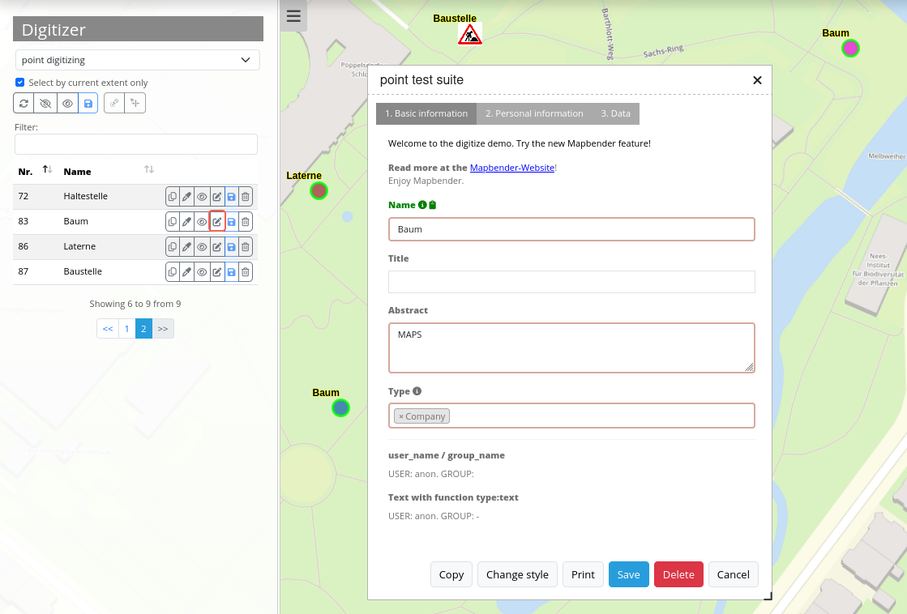

.. _digitizer:

Digitizer
**********************************

Das Digitizer-Element ermöglicht den Aufbau von Erfassungsoberflächen. Derzeit kann über eine YAML-Definition eine Erfassungsmaske für Punkte, Linien oder Flächen aufgebaut werden. Dabei wird bisher PostgreSQL als Datenquelle unterstützt. Oracle und SpatiaLite sind experimentell verfügbar. Die Entwicklung wurde so durchgeführt, dass die Erfassung auch auf andere Datenquellen wie z.B. OGC WFS erweitert werden kann.

The Digitizer-Element offers komples editing functionality:

  * move objects
  * add vertices (lines, polygons)
  * generation of enclaves, exclaves, circles and ellipses

You can define very complex formss for the attributes.

The following option for the construction of the forms are available:

  * define more then one feature types for digitalisation. You can switch from one feature type to the other with a select box
  * use a table as source. You can also define a filter to get a subset of the table
  * textfields
  * Selectboxes, Multiselectboxes
  * Radiobuttons, Checkboxes
  * Textareas
  * Datepicker
  * File upload
  * Definition of tabs
  * Definition breaklines
  * Definition of Text 
  * Mandatory fields, regular expressions to valida the content are possible
  * Help textes

Configuration
=============

.. image:: ../../../../../figures/digitizer_configuration.png
     :scale: 80

You can use the element in the sidepane or as a dialog with a button.

The Ditigitzer needs access to a database where the editable tables are. You have to define a new database configuration to be able to connect with the geo database. Read more about this at http://doc.mapbender3.org/en/book/database.html

The definition of the digitizer is done in YAML syntax in the textarea configuration at schemes. Here you define the database connection, the editable table, the form to display the table, the attribute form and other behaviour.

Element definition in web interface in the configuration area:

YAML-Definition for the element digitizer in mapbender.yml:

.. code-block:: yaml

                sidepane:
                    digitizer:
                        class: Mapbender\DigitizerBundle\Element\Digitizer
                        title: Digitalisation
                        target: map
                        schemes:
                            ...

YAML-Definition for the element digitizer in the textarea schemes:

    poi:
        label: point digitizing
        maxResults: 1500
        featureType:
            connection: search_db
            table: poi
            uniqueId: gid
            geomType: point
            geomField: geom
            srid: 4326
        openFormAfterEdit: true
        popup:
            title: point test suite
            width: 500px
        tableFields: {gid: {label: Nr.}, name: {label: Name}}
        formItems:
           - type: tabs
             children:
               - type: form
                 title: Basic information
                 css: {padding: 10px}
                 children:
                     - type: label
                       title: Welcome to the digitize demo. Try the new Mapbender3 feature!
                     - type: input
                       title: Name
                       mandatory: true
                       name: name
                       mandatoryText: Please give a name to the poi.
                       infoText: "Help: Please give a name to the new object."
                     - type: input
                       title: Title
                       mandatory: false
                       name: title
                       mandatoryText: Please give a title to the poi.
                     - type: textArea
                       name: abstract
                       title: Abstract
                       placeholder: 'please edit this field'
                     - type: select
                       title: Type
                       name: type
                       options: {A:A, B:B, C:C, D:D, E:E}
                     - type: breakLine
               - type: form
                 title: Personal information
                 css: {padding: 10px}
                 children:
                     - type: label
                       title: Please give us some information about yourself.
                     - type: fieldSet
                       children:
                           - type: input
                             title: Firstname
                             name: firstname
                             css: {width: 30%}
                           - type: input
                             title: Lastname
                             name: lastname
                             css: {width: 30%}
                           - type: input
                             title: E-Mail
                             name: email
                             css: {width: 40%}
                     - type: select
                       multiple: true
                       title: Interests
                       name: interests
                       options: {maps:maps, reading:reading, swimming:swimming, dancing:dancing, beer:beer, flowers:flowers}
                     - type: date
                       title: favorite Date
                       name: date_favorite
                       mandatory: true
                       css: {width: 25%}
                     - type: breakLine
                     - type: breakLine
                     - type: checkbox
                       name: public
                       value: true
                       title: public (this new object is public)               
    line:
        label: line digitizing
        maxResults: 1500
        featureType:
            connection: search_db
            table: lines
            uniqueId: gid
            geomType: line
            geomField: geom
            srid: 4326
        openFormAfterEdit: true
        popup:
            title: line test suite
            width: 500px
        tableFields: {gid: {label: Nr.}, name: {label: Name}}
        formItems:
           - type: form
             title: Basic information
             css: {padding: 10px}
             children:
                 - type: label
                   title: Welcome to the digitize demo. Try the new Mapbender3 feature!
                 - type: input
                   title: Name
                   mandatory: true
                   name: name
                   mandatoryText: Please give a name to the new object.
                   infoText: "Help: Please give a name to the new object."
                 - type: select
                   title: Type
                   name: type
                   options: {A:A, B:B, C:C, D:D, E:E}
    polygon:
        label: polygon digitizing
        maxResults: 1500
        featureType:
            connection: search_db
            table: polygons
            uniqueId: gid
            geomType: polygon
            geomField: geom
            srid: 4326
        openFormAfterEdit: true
        allowDelete: false
        toolset:
            - type: drawPolygon
            - type: drawRectangle
            - type: drawDonut
            - type: removeSelected 
        popup:
            title: polygon test suite
            width: 500px
        tableFields: {gid: {label: Nr.}, name: {label: Name}}
        formItems:
           - type: form
             title: Basic information
             css: {padding: 10px}
             children:
                 - type: label
                   title: Welcome to the digitize demo. Try the new Mapbender3 feature!
                 - type: input
                   title: Name
                   mandatory: true
                   name: name
                   mandatoryText: Please give a name to the new object.
                   infoText: "Help: Please give a name to the new object."
                 - type: select
                   title: Type
                   name: type
                   options: {A:A, B:B, C:C, D:D, E:E}     

Definition of the popup

.. code-block:: yaml

                                popup: 
                                    # Options description: 
                                    # http://api.jqueryui.com/dialog/
                                    title: POI                                     # define the title of the popup
                                    height: 400
                                    width: 500
                                    # modal: true
                                    # position: {at: "left+20px",  my: "left top-460px"}

Definition of a textfield (type input)

.. code-block:: yaml

                                                 - type: input                    # element type definition
                                                   title: Title for the field      # labeling (optional)
                                                   mandatory: true                # mandatpory field (optional)
                                                   name: column_name              # reference to table column (optional)
                                                   cssClass: 'input-css'          # additional css definition (optional)
                                                   value: 'default Text'          # define a default value  (optional)
                                                   placeholder: 'please edit this field' # placeholder appears in the field as information (optional)

Definition of a selectbox or multiselect (type select) 

.. code-block:: yaml

                                                 - type: select                     # element type definition
                                                   title: select some types          # labeling (optional)
                                                   name: type_multi                 # reference to table column (optional)                    
                                                   multiple: true                   # define a multiselect, default is false
                                                   options:                         # definition of the options (key, value)
                                                       1: pub
                                                       2: bar
                                                       3: pool
                                                       4: garden
                                                       5: playground
                                                 - type: select                       # element type definition
                                                   title: select some types            # labeling (optional)
                                                   name: type                         # reference to table column (optional)
                                                   options: [1: pub, 2: bar, 3: pool] # definition of the options (key, value)

Definition of a text (type label)

.. code-block:: yaml

                                                 - type: label                        # element type definition, will write a text
                                                   title: 'Please give information about the poi.' # define a text 

Definition of a textarea (type textarea)

                                                 - type: textarea
                                                   title: Bestandsaufnahme Bemerkung

Definition of a breakline (type breakline)

.. code-block:: yaml

                                                 - type: breakline                     # element type definition, will draw a line 

Definition of a checkbox (type checkbox)

.. code-block:: yaml

                                                 - type:  checkbox 
                                                   title: Is this true?
                                                   name:  public
                                                   value: true

Definition of a mandatory field

.. code-block:: yaml

                                                   mandatory: true                    # true - field has to be set. Else you can't save the object. Regular expressions are possible too - see below.

                                                   mandatory: /^\w+$/gi               # You can define a regular expression to check the input for a field. You can check f.e. for email or numbers. Read more http://wiki.selfhtml.org/wiki/JavaScript/Objekte/RegExp
                                                   # Check if input is a number
                                                   mandatory: /^[0-9]+$/
                                                   mandatoryText: Bitte die Zahl Eingeben!

                                                   mandatorytitle: Please chose a type! # define a text that will be displayed if the field is not set.

Definition of a file upload field

.. code-block:: yaml
   
                                                    type: upload

Definition of a datepicker

.. code-block:: yaml

                                                    type: datepicker               # on click in the textfield a datepicker will open
                                                    value: 2015-01-01              # define a start value for the datepicker (optional)
                                                    format: YYYY-MM-DD             # define a dateformat (optional), default is YYYY-MM-DD

Toolset types

  * drawPoint - draw point
  * drawLine - draw a line
  * drawPolygon - draw polygon
  * drawRectangle - draw rectangle
  * drawCircle - draw circle
  * drawEllipse - draw ellipse
  * drawDonut - draw a donut (enclave)
  * modifyFeature - move vertices of a geometry
  * moveFeature - move geometry
  * selectFeature - geometry de/select
  * removeSelected - delete selected geometry
  * removeAll - remove all geometries

Definition of toolset types

.. code-block:: yaml

    polygon:
        label: polygon digitizing
        maxResults: 1500
        featureType:
            connection: search_db
            table: polygons
            uniqueId: gid
            geomType: polygon
            geomField: geom
            srid: 4326
        openFormAfterEdit: true
        allowDelete: false
        toolset:
            - type: drawPolygon
            - type: drawRectangle
            - type: drawDonut
            - type: removeSelected

Class, Widget & Style
===========================

* Class: Mapbender\\CoreBundle\\Element\\Digitizer
* Widget: mapbender.element.digitizer.js
* Style: mapbender.elements.css

HTTP Callbacks
==============

<action>
--------------------------------

JavaScript API
==============

<function>
----------

JavaScript Signals
==================

<signal>
--------

