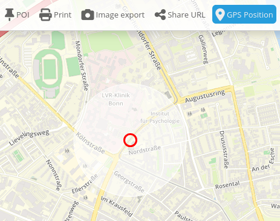
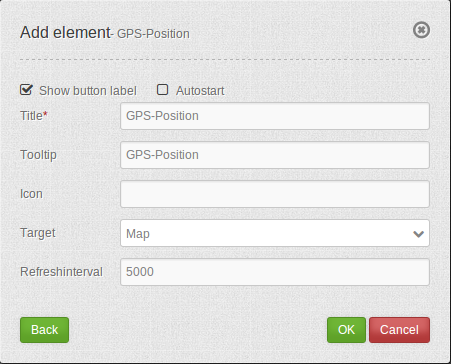

.. _gpspostion:

GPS-Position
***********************

Provides a button to navigate to your current position.

Configuration
=============

YAML-Definition:

.. code-block:: yaml

   tooltip: GPS-Position # text to use as tooltip
   label: true           # true/false to label button
   icon: gpsposition      # icon to display on button
   target: map           # Id of Map element to query
   autoStart: false	 # true/false (default is false)
   refreshinterval: 5000 # refresh interval in ms

Class, Widget & Style
======================

* Class: Mapbender\\CoreBundle\\Element\\GpsPosition
* Widget: mapbender.element.gpsPostion.js
* Style: mapbender.element.gpsPosition.css

HTTP Callbacks
==============

None.

JavaScript API
==============

None.

JavaScript Signals
==================

None.
