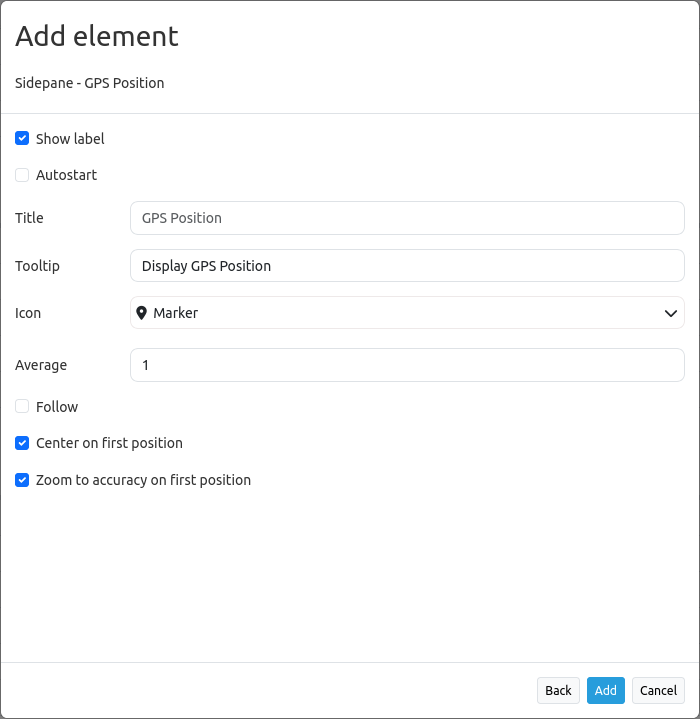

.. _gpspostion:

GPS-Position
************

This element provides a button to navigate to your current position and display a symbol at that position. The scale will not be changed until you activate ``zoom to accuracy (zoom to accuracy on first position)``.

The function is built upon the `Geolocation-API <https://www.w3.org/TR/geolocation-API/>`_ by the W3C. To validate that your browser supports this functionality please take a look at the `Can I Use <http://caniuse.com/#feat=geolocation>`_ page. The function uses the ``High Accurcacy Parameter`` that forces the positioning via GPS. If your device is shipped with a GPS-receiver and if it is activated the positioning is more accurate. Otherwise the WIFI access-points are used for positioning.

The midpoint shows the probable position of the device, the outer circle the accuracy of the positioning, that means the region where the position is probably to find.

.. image:: ../../../../../figures/gps_position.png
     :scale: 80

Configuration
=============

* **Show label:** Switches the button label on/off.
* **Autostart:** true/false, default is false.
* **Title:** Title of the element.
* **Tooltip:** The text entered as a tool tip will be indicated by hovering over the element with the mouse cursor a longer time.
* **Icon:** icon to display on button.
* **Target:** Id of Map element, activated after the click.
* **Average:** calculates the average of the last at parameter average defined amount of received GPS coordinates, default 1.
* **Refreshinterval:**  refresh interval in ms, default is 5000 ms.
* **Follow:** default false, true refreshes the map for every received GPS position received, only use with WMS in tiled mode.
* **Center on first position:** center map only on first received GPS position.
* **Zoom to accuracy:** zoom map according to received GPS position accuracy.
* **Zoom to accuracy on first position:** Zoom map according to first received gps position accuracy.

YAML-Definition:
----------------

.. code-block:: yaml

    tooltip: GPS-Position  # text to use as tool tip
    label: true            # true/false to label button, default is true
    icon: gpsposition      # icon to display on button
    target: map            # Id of Map element to query
    autoStart: false	  # true/false, default is false
    refreshinterval: 5000  # refresh interval in ms, default is 5000 ms
    follow: true           # default false, true refreshes the map for every received GPS position received, only use with WMS in tiled mode
    average: 1             # calculates the average of the last at parameter average defined amount of received GPS coordinates, default 1
    centerOnFirstPosition: true # center map only on first received gps position
    zoomToAccuracy: false  # zoom map according to received gps position accuracy
    zoomToAccuracyOnFirstPosition: true # zoom map according to first received gps position accuracy

Class, Widget & Style
======================

* **Class:** Mapbender\\CoreBundle\\Element\\GpsPosition
* **Widget:** mapbender.element.gpsPostion.js
* **Style:** mapbender.element.gpsPosition.css

HTTP Callbacks
==============

None.

JavaScript API
==============

None.

JavaScript Signals
==================

None.
