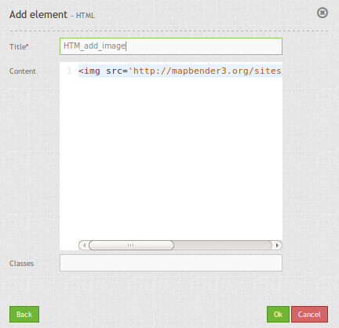

.. _html:

HTML Element
************

This element allows you to add generic HTML anywhere in your application.

Configuration
=============

For example you can add an image to your application:

.. code-block:: yaml

    

.. image:: ../../../../../figures/html_result_application.png
     :scale: 80

YAML-Definition:

.. code-block:: yaml

    content: 
Hello, World!

    classes: my-special-css-class
   

Class, Widget & Style
============================

* Class: Mapbender\\CoreBundle\\Element\\HTMLElement
* Widget: mapbender.mbHTMLElement

HTTP Callbacks
==============

None.

JavaScript API
==============

None.

JavaScript Signals
==================

None.

Examples
==================

Add an image

.. code-block:: yaml

   

Add an Link

.. code-block:: yaml

  <a href='http://mapbender3.org' target='_blank'>Go to the Mapbender3 Webside</a>

