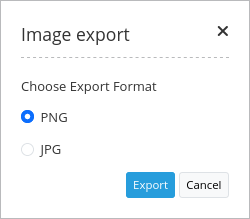

.. _imageexport:

ImageExport
***********************

Image Export allows you to export your current mapview. You can choose png or jpeg format.

Configuration
=============

.. image:: ../../../../../figures/image_export_configuration.png
     :scale: 80

* **Title:** Title of the element. The title will be listed in "Layouts" and allows to distinguish between different buttons. It will be indicated if "Show label" is activated.
* **Target:** Target element (Title(ID)) of the button.

YAML-Definition:
----

.. code-block:: yaml

   target: ~                        # Id of Map element to query

You need a button to show this element. See :doc:`button` for inherited configuration options.

Class, Widget & Style
=========================

* **Class:** Mapbender\\PrintBundle\\Element\\ImageExport
* **Widget:** mapbender.element.imageExport.js

HTTP Callbacks
==============

None.

JavaScript API
==============

None.

JavaScript Signals
==================

None.
