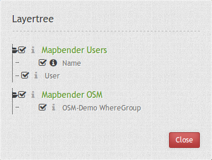
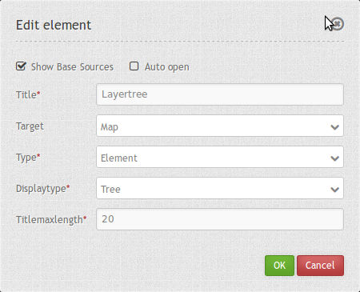

.. _layertree:

Layertree - Table of Content
****************************

The layertree diplays the layers and Service folders. The layertree allows you to activate/deactivate layers in the map. You can also activate/deactivate the info request for layers.

You can change the order of Services and layers via drag & drop.

Configuration
=============

You can optionally use a button to show this element. See :doc:`button` for inherited configuration options. You also can define the layertree with type element. Then you can display the layertree in a frame like the sidebar.

YAML-Definition:

.. code-block:: yaml

   title: layertree             # title of layertree
   target: ~                    # Id of the Map element to query   
   type: ~                      # type of layertree
   displaytype: tree            # only tree in 3.0, future will offer list
   useAccordion: false          # default is false
   autoOpen: false              # true/false open when application is started, default is false
   titleMaxLength: 20           # max length of layer title, default is 20  
   showBaseSource: true         # show base layer, default is true
   showHeader: true             # shows a headline which counts the number of services  
   layerMenu: false             # show contextmenu for the layer (like legend, transparency, zoom to layer, metadata u.o.), default is false, not implemented in 3.0
   layerRemove: false		 # default is false

Class, Widget & Style
======================

* Class: Mapbender\\CoreBundle\\Element\\Layertree
* Widget: mapbender.element.layertree.js
* Style: mapbender.elements.css

HTTP Callbacks
==============

None.

JavaScript API
==============

open
----------

Opens the layertree

reload
----------

JavaScript Signals
==================

None.

