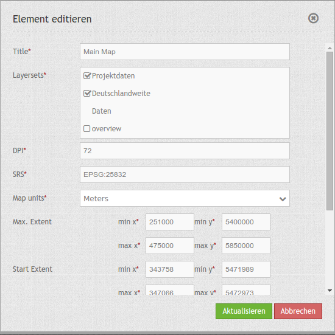
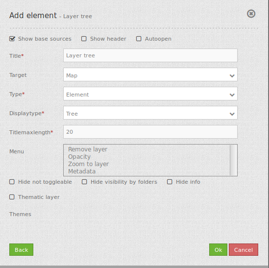

.. _layertree:

Layertree - Table of Content
****************************

The layertree diplays the layers and the service folders. The layertree allows you to activate/deactivate layers in the map. You can also activate/deactivate the info request for layers.

You can change the order of Services and layers via drag & drop.

Starting with version 3.0.5 the layertree allows to display multiple layersets that are displayed as an additional structural level. The following screenshots shows an example:

.. image:: ../../../../../figures/layertree/layertree_example.png
           :scale: 80

..
   .. image:: ../../../../../figures/layertree.png
        :scale: 80

Configuration
=============

To use different layersets in your layertree, you have to adjust different elements. These are:

#. creating different layersets,
#. adjustments in the main map to display the layersets,
#. the configuration of the layertree itself.

The following example defines two layersets each with to instances:

* Projektdaten (project data): with the instances ""Schwalmtal" and ""Projekt NL".
* Deutschlandweite Daten (german wide data): with the instanaces ""bkg" and ""OpenStreetMap (OSM)".

Configuration of the layersets
------------------------------

The layersets are defined - as usual - in the application under the tab
"Layerset". Instances are still references to the WMS services. This dialog
allows you to define new layersets and add the instances. In this example,
the third layerset "overview" is used - also as usual - for the overview
map.

.. image:: ../../../../../figures/layertree/layertree_configuration_layerset.png
           :scale: 80

Configuration in the map element
--------------------------------

The second step is the configuration of the `main map <../elements/map.html>`_ . You define here which
layersets should be shown for the map display. The layerset "overview" for
example should not be used for the main map. Here you can also define how
the layersets should be ordered in the layertree and in the map. Therefore
you can rearrange the order via drag & drop (project data above the
german-wide data). Please mind that themes at the top might cover underlying
themes.

* **Title:** Title of the element. The title will be listed in "Layouts" and allows to distinguish between different buttons. It will be indicated if "Show label" is activated.
* **Layersets:** refer to a layerset, define the layerset first and refer to it
* **DPI:** resolution, default is 72.
* **SRS:** coordinate reference system. Two ways of srs definitions are supported: EPSG: CODE oder EPSG:CODE|MEIN SRS TITEL.
* **Map units:** units to use degrees/meters, default is deegrees.
* **Max. Extent:**  maximal map extents (BBOX with min/max x/y).
* **Start Extent:** map extents for the start of the application (BBOX with min/max x/y).
* **Scales (csv):** a csv scale list.
* **Max. resolution:** at the moment only auto is supported, so please do not change.
* **OL image path:** OpenLayers path of images (bundles/mapbendercore/mapquery/lib/openlayers/img).
* **Other SRS:** other coordinate reference systems. Two srs definitions are supported: EPSG: CODE oder EPSG:CODE|MEIN SRS TITEL.

Configuration of the layertree
------------------------------

The last step is the confguration of the layertree itself. The instances
that you have specified in the main map are defined further.

      

* **Title:** Title of the element. The title will be listed in "Layouts" and allows to distinguish between different buttons. It will be indicated if "Show label" is activated.
* **Target:** Id of the Map element to query.
* **Type:** type of layertree, element or dialog.
* **Displaytype:** only tree in 3.0, future will offer list.
* **Titlemaxlength:** max length of layer title, default is 20.
* **Menu:** show contextmenu for the layer (like opacity, zoom to layer, metadata, remove layer), default is menu: [].
* **Hide not toggleable:** won't show elements without multiple layers.
* **Hide visibility by folders:** visibility of the levels is not displayed and can not be changed.
* **Hide Info:** info is deaktivated.
* **Thematic Layers:** If this option is switched off, the layertree does not use the configured layersets and shows all instances on the root level.

Further options are available if the "thematic layer" option is switched on. The following screenshots shows the four adjustments:

.. image:: ../../../../../figures/layertree/layertree_configuration_thematic_map.png
           :scale: 80

* **(1)** Theme show: If this option is set, the layerset is shown as an additional level. If this option is not set, the included layer-instances are shown at the root-level.
* **(2)** Theme opened: If this option is set (symbol of an opened folder) the theme is automatically opened in the layertree.
* **(3)** Theme: source visibility: If this option is set, the layertree displays the button "show sources".
* **(4)** Theme: layer visibility: If this option is set, the layertree displays the button "show all layers"

These two additinoal buttons are shown in the following screenshot:

.. image:: ../../../../../figures/layertree/layertree_buttons.png
           :scale: 80

* **(1)** The button "show sources": You can set all subsidiary services (instances) visible or set the state back to the pre-configured origin.
* **(2)** The button "Show all layers": You can set all subsidiary services (instances) to visible.

YAML-Definition:
----

.. code-block:: yaml
                
   tbd: later           #  documentation will be handed in later. ;-)

You can optionally use a button to show this element. See :doc:`button` for inherited configuration options. You also can define the layertree with type element. Then you can display the layertree in a frame like the sidebar.
..
   .. image:: ../../../../../figures/layertree/layertree_configuration_pre305.png
        :scale: 80

   You can optionally use a button to show this element. See :doc:`button` for inherited configuration options. You also can define the layertree with type element. Then you can display the layertree in a frame like the sidebar.

   YAML-Definition:

   .. code-block:: yaml

    title: layertree             # title of layertree
    target: ~                    # Id of the Map element to query   
    type: ~                      # type of layertree, element or dialog
    autoOpen: false              # true/false open when application is started, default is false
    useTheme: null
    displaytype: tree            # only tree in 3.0, future will offer list
    titlemaxlength: 20           # max length of layer title, default is 20  

    showBaseSource: true         # show base layer, default is true
    showHeader: true             # shows a headline which counts the number of services  
    menu: [opacity,zoomtolayer,metadata,removelayer]  # show contextmenu for the layer (like opacity, zoom to layer, metadata, remove layer), default is menu: []
    hideInfo: null               #
    hideNotToggleable: null      #
    hideSelect: null             #
    themes: {  }                 #   

Class, Widget & Style
======================

* **Class:** Mapbender\\CoreBundle\\Element\\Layertree
* **Widget:** mapbender.element.layertree.js
* **Style:** mapbender.elements.css

HTTP Callbacks
==============

None.

JavaScript API
==============

open
----------

Opens the layertree

reload
----------

JavaScript Signals
==================

None.

