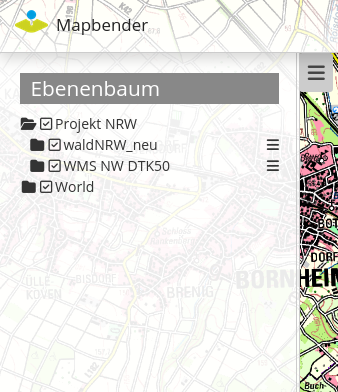

.. _layertree:

Layertree - Table of Content (Layerbaum) 
*****************************************

Functions
=============

**What are the functionalities of the Layertree?**

* Display of layers
* Display of layergroups
* Display of thematic layergroups (since version 3.0.5)
* Enabling and disabling layers
* Enabling and disabling querys for the layers
* Changing the order of layers
* Zoom to map extend of layers
* Query the metadata of layers

.. |Simpel| figure:: ../../../../../figures/layertree/layertree_example_dialog.png
           :scale: 80
           :alt: simple Layertree integrated as dialogue with a Layerset and Layer

           Simple Layertree integrated as dialogue with one Layerset and Layer.

.. |Komplex| figure:: ../../../../../figures/layertree/layertree_example_sidepane.png
           :scale: 80
           :alt: complex Layertree integrated in the sidebar with multiple Layersets divided into thematic groups

           Thematic Layertree integrated in the sidebar with multiple Layersets. 

To configure the Layer tree there are a few linking points to other elements that must be considered:

* `Layersets <../entities/layerset.html>`_
* `Mapelement <../elements/map.html>`_
* `Sources <../entities/source.html>`_

Configuration
=============

General Configuration
-----------------------

**What do we have to do?**

To use the different Layersets in our Layertree, various adjustments are necessary. These relate to:

#. Configuration of various Layersets,
#. Configuration of the map ( Mapelement) to display the Layersets 
#. Configuration of the Layertree itself

Through the use of the Layersets the desired layers are included in the application. The instances are the references to the individual WMS services. With the plus-button [1] new Layersets can be created. Then new layers can be integrated in the application by adding the existing instances [2]. The Layerset "overview " [3] is -as usual- used for displaying the overview map. For a detailed documentation on how the services can be integrated correctly, please refer to the documentation of the `Layersets <../entities/layerset.html>`_ and `sources <../entities/source.html>`_. 

.. figure:: ../../../../../figures/layertree/layertree_configuration_layerset.png
           :scale: 80

In order to let the new integrated Layersets appear in the application, they must be specified in the `Mapelement <../elements/map.html>`_. Here you define by checking [1] the Layersets in the list, which Layersets you want to use in the map. The Layerset "overview " for example is not displayed on the main map. In this step, you define the order in which the Layersets appear in your Layertree and the map. You can move the created Layersets from the list [2] by drag & drop. Please ensure that the first defined themes can cover underlying themes.

.. figure:: ../../../../../figures/layertree/layertree_configuration_map.png
           :scale: 80

Workflow Layertree with basic functions 
----------------------------------------

In the following we walk through an exemplary configuration of a Layertree with basic functions in three steps: 

#. Configuration of a Layerset
#. Configuration of the map ( Mapelement) to display the Layerset
#. Configuration of the Layertree itself

In the example we defined one Layerset with one instance:

* Layerset World: 
    * Instance `OSM Demosource <http://osm-demo.wheregroup.com/service?>`_

The instance of the OSM demosource is automatically included in the installation. This now needs to be integrated into an existing Layerset. Change into the tab "Layersets". In the following example, the Layerset " YAML main" was renamed to " World ". In case of difficulties with the integration the documentation of the `Layersets <../entities/layerset.html>`_ can help.

.. figure:: ../../../../../figures/layertree/layertree_configuration_layerset_simple.png
           :scale: 80

As the next step we configure the `Mapelement <../elements/map.html>`_ to display the Layersets in the map. To do this you need to change into the tab "Layouts" and 
edit the mapelement in the content. 
Very important is now, that you put a tick in the field of the Layerset "World" [1], so it appears later in the application. If you have questions for further configuration of the `Mapelement <../elements/map.html>`_  the documentation can help.

.. figure:: ../../../../../figures/layertree/layertree_configuration_map_simple.png
           :scale: 80 

The last step is the configuration of the Layertree. The instances specified in the mapelement can be defined in more detail with the Layertree. If a predefined application has been copied, the Layertree should work now. If the element is newly created, it can already be used with the default settings without necessary further adjustments. For an understanding of the functions and their usage we now edit the Layertree-element in the content.

.. figure:: ../../../../../figures/layertree/layertree_configuration_1.png
           :scale: 80 

When configuring the Layersets the function Basesource is activated as default. This is important for the `BaseSourceSwitcher <../elements/basesourceswitcher.html>`_, which allows you to switch between predefined themes. By enabling  **Display BaseSources** [1] instances that have been loaded as a base source in the application, are displayed in the Layertree. The function **Display Header** [2] allows the inclusion of a headline in the Layertree.

.. figure:: ../../../../../figures/layertree/layertree_header.png
           :scale: 80 

If you activate **Open automatically**, the Layertree is open when you open the application and must not be activated by clicking on a button or the unfolding of a sidebar. The **Title** [4] of the element is displayed in the "Layouts"-list and allows you to distinguish different elements from each other. **Target** [5] is the ID of the map element. 

By specifying a **Type** [6] the display of the Layertrees can be defined. There are two display options:

* *Dialog*
* *Element*

.. figure:: ../../../../../figures/layertree/layertree_type.png
           :scale: 80

:Dialog: 
  You should choose the type *Dialog*, when the Layertree is integrated via a button and the configuration element is in the content.
:Element:
  You should choose the type *Element*, when the Layertree is integrated via the sidepane. 

.. figure:: ../../../../../figures/layertree/layertree_type_map.png
           :scale: 80

The **Displaytype** [7] defines the accordion-like display (*Tree*) of the Layertree. By specifying the maximum number of characters with the field **Titlemaxlength** [8] the display of the title of the individual layers can be limited to a number of characters. This is important for long layer names. After the maximung title length the title is shortened with "...".

.. figure:: ../../../../../figures/layertree/layertree_configuration_1.png
           :scale: 80 
           :alt: Setup of a simple layertree in the content-area.

           Setup of a simple layertree in the content-area.

Via the **Menu** [9] a number of buttons can be activated, which are then available in the layertree. 

* *Remove layer* (remove layer from the application)
* *Opacity* (change the opacity of a layer)
* *Zoom to layer* (zoom to the BBOX of the layer)
* *Metadata* (show the metadata of the layer)

.. figure:: ../../../../../figures/layertree/layertree_menu.png
           :scale: 80
           :alt Configuration for the context-menu

           Configuration for the context-menu

Die einzelnen Funktionen können durch Klicken auf die Schaltfläche aktiviert werden. Alle aktiven Funktionen werden grün hinterlegt und in der Anwendung erscheint im Layertree rechts neben jedem Layer ein Symbol für das Kontextmenü. Durch den Klick auf das Menü klappt ein Fenster auf und die einzelnen Funktionen können genutzt werden. Durch den Klick auf den x-Button kann das Menü wieder geschlossen werden. 

.. figure:: ../../../../../figures/layertree/layertree_menu_map.png
           :scale: 80

Der Slider [Layertree Menü 1] erscheint durch die Funktion *Opacity*. Hierüber lässt sich durch das Verschieben des grünen Kästchens die Deckkraft der einzelnen Layer bestimmen. Die prozentuale Deckkraft wird als ganze Zahl in dem Kästchen angezeigt. Über einen Klick auf das Infoblatt [Layertree Menü 2] können die Metadaten des Layers anegezeit werden. Falls der Dienst Metadaten enthält, werden diese in einem neuen Dialog angezeigt. Der Klick auf das "x" [Layertree Menü 3] ermöglicht das Entfernen eines Layers aus der Anwendung für die Dauer der Sitzung. 

.. figure:: ../../../../../figures/layertree/layertree_menu_map.png
           :scale: 80
           :alt: Layertree Menü

           Layertree Menü

Die Funktion **Visibility bei Ordnern ausblenden** [11] ermöglicht die Sicherung der Deckkraft. Bei aktiver Funktion wird die Deckkraft der Ebenen nicht angezeigt und kann nicht verändert werden.

           Layertree Buttons

Durch einen Klick auf das *Ordnersymbol*[Layertree Buttons 1] links neben der Instanz können die eingebundenen Layer angezeigt werden. Alle Layer, die vorher bei dem Einbinden in das Layerset aktiviert wurden, erscheinen nun in der Liste. Über die Funktion **Nicht aufklappbare Ordner ausblenden** [10] können Kartenbenen, die nicht mehrere Layer enthalten ausgeblendet werden.

Das *Kästchen*[Layertree Buttons 2] neben dem jeweiligem Layernamen ermöglicht das An- und Ausschalten eines Layers. Ist das Häckchen gesetzt erscheint der Layer in der Karte. Es werden jedoch weiterhin die im Layerset definierten Regeln beachtet, wie z.B. maßstabsabhängige Anzeigen.

Das "i"-Symbol [Layertree Buttons 3] neben einem Layernamen zeigt an, ob die Informationsabfrage aktiviert ist. Wenn das "i"-Symbol grau hinterlegt ist die Informationsabfrage nicht aktiv. Wird diese durch einen Klick aktivert, so wird das Symbol dunkelgrau hinterlegt und bei einer Informationsabfrage erscheinen Informationen zu dem Layer. 

Die Funktion **Info ausblenden** [12] ermöglicht das Deaktivieren der Informationsabfrage. Die Infoabfrage ist unabhängig von den Einstellungen im Layerset oder Dienst nun nicht mehr möglich. 

Workflow thematischer Layertree 
--------------------------------

Im folgenden gehen wir eine komplexe beispielhafte Konfiguration eines Layertrees mit erweiterten Funktionen, wie z.B. den thematischen Layesets in drei Schritten durch: 

#. Einrichtung mehrerer Layersets
#. Einrichtung in der Karte (Map-Element) zur Anzeige der Layersets
#. Einrichtung des thematischen Layertrees

In dem Beispiel sind zwei Layersets mit jeweils zwei Instanzen definiert:

* Project NRW:
  * `DTK50 NRW <http://www.wms.nrw.de/geobasis/wms_nw_dtk50?>`_ 
  * `Wald NRW <http://www.wms.nrw.de/umwelt/waldNRW?>`_
* World: 
  * `OSM Demodienst <http://osm-demo.wheregroup.com/service?>`_ 
  * `GEBCO <http://www.gebco.net/data_and_products/gebco_web_services/web_map_service/mapserv?>`_ 

Für die Einrichtung der Layersets wurden die vier oben genannten Dienste als Instanzen hinzugefügt (Detailierte Info s.o. oder in der Doku der `Layersets <../entities/layerset.html>`_ und `Dienste <../entities/source.html>`_). 
Für dieses Beispiel wurden die oben genannten Schritte durchgeführt, um das Layerset "World" mit der Instanz "osm" hinzuzufügen. Nun fügen wir in dieses Layerset noch die Instanz "GEBCO" hinzu. 
Um die thematische Gruppierung gut nutzen zu können erstellen wir nun ein neues Layerset mit dem Namen "Project NRW" und laden in dieses die beiden oben genannten Instanzen "DTK50 NRW" und "Wald NRW" ein. 

.. figure:: ../../../../../figures/layertree/layertree_configuration_layerset_komplex.png
           :scale: 80

Das Layerset sollte nun drei Layersets enthalten. Die Overview [1] für die Übersichtskarte, das World-Layerset [2] mit den weltweiten/ deutschlandweiten Daten und das Project NRW-Layerset [3] mit den zwei regionalen Datensets aus NRW. 

Als nächstes erfolgt die Einrichtung des `Kartenelements <../elements/map.html>`_ zur Anzeige des Layersets in der Karte. Dazu wechseln wir in den Reiter "Layouts" und bearbeiten das Kartenelement in dem Content-Bereich.
Wichtig ist nun, dass bei dem Bereich Layersets ein Häckchen bei dem Layerset World UND dem Layerset Project NRW gesetzt ist [1], damit diese später in der Anwendung angezeigt werden. Bei Fragen zur weiteren Konfiguration der Karte kann die Dokumentation des `Kartenelements <../elements/map.html>`_ weiterhelfen.

.. figure:: ../../../../../figures/layertree/layertree_configuration_map_komplex.png
           :scale: 80 

Als letzter Schritt erfolgt die Einrichtung des Layertrees selbst. Die in dem `Kartenelement <../elements/map.html>`_ angegebenen Instanzen können im Layertree noch genauer definiert
werden. Für das Verstehen der Funktionen und das eigene Erstellen eines Layertrees müssen die oben bereits erklärten Einstellungen berücksichtigt werden.

.. figure:: ../../../../../figures/layertree/layertree_configuration_1.png
           :scale: 80 

Für den thematischen Layertree binden wir den Ebenenbaum in diesem Beispiel die Seitenleiste ein. Für die Einbindung in dem Sidepane-Bereich muss der Type *Element* [6]gewählt werden.

.. figure:: ../../../../../figures/layertree/layertree_type.png
           :scale: 80

Ist die Option **Thematische Layer** ausgeschaltet, benutzt der Layertree nicht mehr die konfigurierten Layersets und zeigt die einzelnen Instanzen in der Hauptebene an. Nun wollen wir jedoch die thematischen Layer anzeigen, daher aktivieren wir die Funktion **Thematische Layer** [1]. Da wir in dem `Kartenelement <../elements/map.html>`_ beide Layersets in die Anwendung eingebunden haben, werden diese nun unter dem **Themen**-Bereich angezeigt.

.. figure:: ../../../../../figures/layertree/layertree_configuration_2.png
           :scale: 80 

Damit die Themen in der Anwendung wie gewünscht angezeigt werden gibt es verschiedene Einstellungsmöglichkeiten: 

.. figure:: ../../../../../figures/layertree/layertree_configuration_thematic_map.png
           :scale: 80

* **Thema anzeigen:** Ist diese Option gesetzt, wird der Layerset als zusätzliche Ebene angezeigt. Ist diese Option nicht gesetzt, werden die enthaltenen Layer-Instanzen in der Hauptebene angezeigt.
* **Thema geöffnet / geschlossen:** Ist diese Option gesetzt (Symbol des geöffneten Ordners), ist das Thema im Layertree automatisch ausgeklappt. 
* **Thema Dienste Sichtbarkeit:** Ist diese Option gesetzt, wird im Layertree die Schaltfläche "Dienste anzeigen / ausblenden" hinzugefügt.
* **Thema Layer-Sichtbarkeit:** Ist diese Option gesetzt, wird im Layertree die Schaltfläche "Alle Layer anzeigen" hinzugefügt.

Wenn wir nun bei dem Themenset "World" die Standardeinstellungen beibehalten und bei dem Themenset "Project NRW" die anderen Optionen aktivieren, sieht die Konfiguration des Elements so aus: 

.. figure:: ../../../../../figures/layertree/layertree_example_sidepane_config.png
           :scale: 80

Wir haben die Layersets somit als thematische Gruppen in den Ebenenbaum eingebunden. Durch die Konfiguration der thematischen Layer sieht der Layertree in der Anwendung nun so aus: 

YAML-Definition:
=================

.. code-block:: yaml
                
  title: layertree             # title of layertree
  target: ~                    # Id of the Map element to query
  type: ~                      # type of layertree, element or dialog
  displaytype: tree            # only tree in 3.0, future will offer list
  useAccordion: false          # accordion element, default is false
  autoOpen: false              # true/false open when application is started, default is false
  titleMaxLength: 20           # max length of layer title, default is 20
  showBaseSource: true         # show base layer, default is true
  showHeader: true             # shows a headline which counts the number of services
  menu: [opacity,zoomtolayer,metadata,removelayer]  # show contextmenu for the layer (like opacity, zoom to layer, metadata, remove layer), default is menu: []
..
   .. image:: ../../../../../figures/layertree/layertree_configuration_pre305.png
        :scale: 80

You can optionally use a button to show this element. See :doc:`button` for inherited configuration options. You also can define the layertree with type element. Then you can display the layertree in a frame like the sidebar.

Class, Widget & Style
======================

* **Class:** Mapbender\\CoreBundle\\Element\\Layertree
* **Widget:** mapbender.element.layertree.js
* **Style:** mapbender.elements.css

HTTP Callbacks
==============

None.

JavaScript API
==============

open
----------

Opens the layertree

reload
----------

JavaScript Signals
==================

None.

