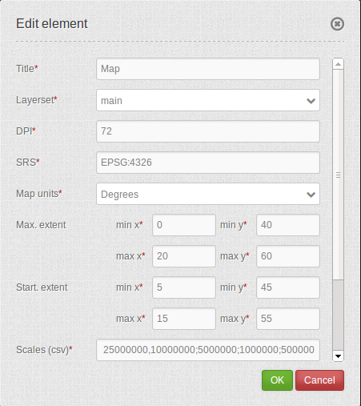

.. _map:

Map
***********************

MapQuery/OpenLayers based map. You have to define the units, the start and max extent, scales and supported projections.

.. image:: ../../../../../figures/map.png
     :scale: 80

Configuration
=============

* **Title:** Title of the element. The title will be listed in "Layouts" and allows to distinguish between different buttons. It will be indicated if "Show label" is activated.
* **Layersets:** refer to a layerset, define the layerset first and refer to it (propably main map).
* **DPI:** resolution, default is 72.
* **SRS:** coordinate reference system. Two ways of srs definitions are supported: EPSG: CODE or EPSG:CODE|MY SRS TITLE.
* **Map units:** units to use degrees/meters, default is deegrees.
* **Max. Extent:** maximal map extents.
* **Start Extent:** map extents for the start of the application.
* **Scales (csv):** a csv scale list.
* **Max. resolution:** at the moment only auto is supported, so please do not change.
* **OL image path:** OpenLayers Bilderpfad, unter dem die Bilder abgespeichert werden (bundles/mapbendercore/mapquery/lib/openlayers/img).
* **Other SRS:** other coordinate reference systems. Two srs definitions are supported: EPSG: CODE or EPSG:CODE|MY SRS TITLE.

YAML-Definition:
----

.. code-block:: yaml

   layerset: null             # refer to a layerset, define the layerset first and refer to it
   dpi: 72                    # resolution, default is 72
   srs: "EPSG:4326"           # coordinate reference system. Two ways of srs definitions are supported:
                                - "EPSG:CODE" or
                                - "EPSG:CODE|MY SRS TITLE"
   units: "degrees"           # units to use degrees/meters, default is deegrees
   extents: array(                 
       max: array(0, 40, 20, 60)    # maximal map extents
       start: array(5, 45, 15, 55)) # map extents for the start of the application
   scales: "25000000,10000000,5000000,1000000,500000" # a csv scale list
   maxResolution: "auto"      # at the moment only auto is supported, so please do not change
   otherSrs: array(
      "EPSG:31466",
      "EPSG:31467",
      "EPSG:25832")           # other coordinate reference systems. Two srs definitions are supported:
                                - ["EPSG:CODE","EPSG:CODE"] or
                                - ["EPSG:CODE|MY SRS TITLE","EPSG:CODE|MY SRS TITLE"]
   imgPath: "bundles/mapbendercore/mapquery/lib/openlayers/img"   # path of images

Class, Widget & Style
============================

* **Class:** Mapbender\\CoreBundle\\Element\\Map
* **Widget:** , mapquery//lib//openlayers//OpenLayers.js, mapquery//lib//jquery//jquery.tmpl.js, mapquery//src//jquery.mapquery.core.js, proj4js//proj4js-compressed.js, mapbender.element.map.js
* **Style:** mapbender.elements.css, mapquery//lib//openlayers//theme//default//style.css

HTTP Callbacks
==============

None.

JavaScript API
==============

center
----------
<>

highlight
----------
<>

layer
----------
<>

appendLayer
--------------------
<>

insert
----------
<>

rebuildStacking
--------------------
<>

move
----------
Moves a layer up (direction == true) or down (direction == false) on the same level in the layer hierarchy.

zoomIn
----------
<>

zoomOut
----------
<>

zoomToFullExtent
--------------------
<>

zoomToScale
--------------------
<>

panMode
----------
<>

addPopup
----------
<>

removePopup
--------------------
<>

removeById
----------
<>

layerById
----------
Searches for a MapQuery layer by its Mapbender id. Returns the layer or null if not found.

scales
----------
<>

setMapProjection
--------------------
<>

getAllSrs
----------
<>

ready
----------
<>

JavaScript Signals
==================

None.

Controlling by URL
==================

Make Layer visible
------------------

If you have a Layer with the id <layerid> in a service with the id <serviceid> you may pass the URL parameter
visiblelayers to turn the layer visible:

.. code-block:: php

  ?visiblelayers=<serviceid>/<layerid>

You may pass multiple such layers, seperated by comma.

The layerid and serviceid values are specific to an application. You can get
the layerid and serviceid in the specific application, namely in the
layerset and there in a layer. Each layer has an icon with three small dots
on the right side. Click on the icon and a popup window will appear.

.. image:: ../../../../../figures/wms_instance_layer_id.png
     :scale: 80

The first value lists the internal SourceID and SourceLayerId (31-591). The
seconds value lists the InstanceID and InstanceLayerId, that we want to use
now (73-836).

Use this values for the "visibleLayers" parameter in your URL, and seperate them by a slash.

For example: http://localhost/mapbender/application/myapp?visiblelayers=73/836

If you have two layers that are not visible by default, put the two values
of layerid and serviceid into the URL and seperate them by a comma.

For example: http://localhost/mapbender/application/myapp?visiblelayers=73/836,73/840

Passing POIs
------------

You can pass one or more POIs in the URL. Each POI has the following parameters:

- point: coordinate pair with values separated by comma (mandatory)
- label: Label to display (optional)
- scale: Scale to show POI in (optional, makes only sense with one POI)

If you pass more than one POI, the map will zoom to 150% of the POIs bounding.

To pass a single POI, use the following URL format:

.. code-block:: php

   ?poi[point]=363374,5621936&poi[label]=Label&poi[scale]=5000

To pass multiple POIs, use the following format:

.. code-block:: php

   ?poi[0][point]=363374,5621936&poi[0][label]=Label%201&poi[1][point]=366761,5623022&poi[1][label]=Label%202

Passing BBOX
------------

You can pass a BBOX to zoom to by using the following URL query parameter:

.. code-block:: php

   ?bbox=364286,5622263,365979,5622806

Passing SRS
------------

You can pass a favorite EPSG code you want to use on start of the application by URL query parameter:

.. code-block:: php

   ?srs=EPSG:4326

Passing CENTER
----------------

You can pass a coordinate. The application will open and display the coordinate in the center.

.. code-block:: php

   ?center=364286,5622263

more start parameter
--------------------------

The elments WMS Loader and WMC Loader provide also parameter you can user on start. Have a look at the element discription for further information.

