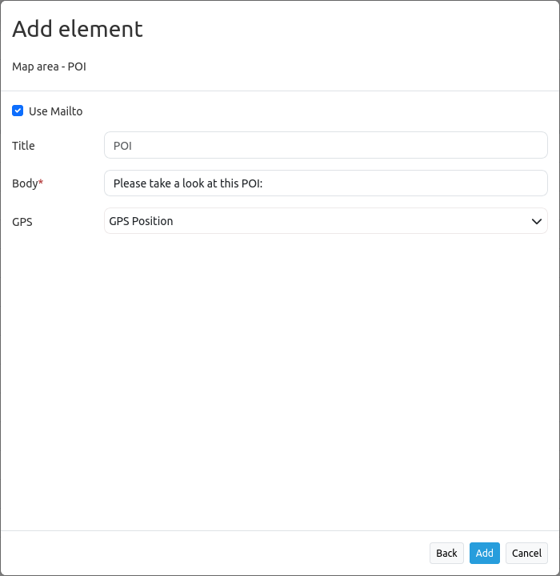

.. _poi:

POI (MeetingPoint)
***********************

Generate POI-URLs (aka meeting point) suitable for sending by e-mail.

.. image:: ../../../../../figures/poi.png
     :scale: 80

Configuration
=============

     

* **Title:** Title of the element. The title will be listed in "Layouts" and allows to distinguish between different buttons. It will be indicated if "Show label" is activated.
* **Tooltip:** text to use as tooltip.
* **Body:** define a text to display. 
* **Target:** only map-element is possible.
* **Use Mailto:** send POI by e-mail.

YAML-Definition:
----

.. code-block:: yaml

    target: map                             # only map-element is possible
    body: 'Please take a look at this POI'  # define a text to display

Class, Widget & Style
=========================

* **Class:** Mapbender\CoreBundle\Element\POI
* **Widget:** mapbender.mbPOI

JavaScript API
==============

defaultAction
-------------

Opens a dialog and listens for next click on map to select POI location.
