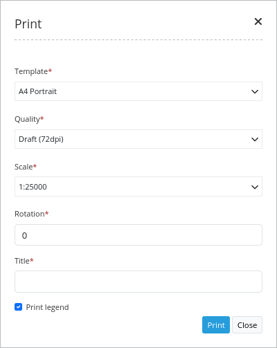

PrintClient
***********************

Print Client allows you to print a defined area of you map. You can choose a template an format and a scale you want to use for printing. You can allow to rotate the area you want to print.

Please not: The PrintClient is still under construction. In version 3.0.0.2 WGS84 is not supported and only printing in A4 and A3 is possible.

Configuration
=============

.. image:: ../../../../../figures/print_client_configuration.png
     :scale: 80

You need a button to show this element. See :doc:`button` for inherited configuration options.

YAML-Definition:

.. code-block:: yaml

    target: map                                 # id of a "map" element (if yml configuration - string 'map', if database configuration - id of a "map" element)
    autoOpen: false				# true/false open when application is started, default is false
    print_directly: true                	# true/false must be true for now
    templates:
        a4portrait:                             # template name, template file name without file extension (Mapbender is looking for file a4portrait.odg an a4portrait.pdf), Template files are located at app/Resources/MapbenderPrintBundle
            label: "A4 Portrait"                # template label in the dialog
            format: a4                          # format (a4,a3,...) has to be defined
        a4landscape:                            # 
            label: "A4 Landscape"               # 
            format: a4                          # 
    scales: [5000, 10000, 25000]        	# define scales to choose from selectbox or if empty free scale can be defined in a textfield
    quality_levels:                             # define quality levels in dpi
        72: draft                               # 72 - dpi value, draft - label
        288: high quality                       # 288 - dpi value, draft - label
    rotatable: true                             # true/false use true for rotation, default is true
    optional_fields:            		# define optional fields (example title-field)
        title:                                  # name of the optional fields, default is null (no optional fields are defined)
            label: Title                        # label of the optional field  
            type: text                          # type of the optional field   
            options:                            # 
                required: true                  # true or false

Class, Widget & Style
==============

* Class: Mapbender\\CoreBundle\\Element\\PrintClient
* Widget: mapbender.element.printClient.js
* Style: mapbender.element.printClient.css

HTTP Callbacks
==============

/direct
--------------------------------

Not Yet Implemented

JavaScript API
==============

open
----------

Opens the print client dialog.

close
-----
Closes the print client dialog.

JavaScript Signals
==================

None.

File location
===============
**northarrow**
The "North arrow" image is located at images/. You can replace the "North arrow" image to use a different image as northarrow.

**print templates**
You find the print templates at app/Resources/MapbenderPrintBundle/templates/. Create your own print template to provide an individual output for your application.

Create your individual templates
==================================
To create an individual print template use an existing print template odg-file or create a new Libre Office Draw file. Your template can have fixed objects like your logo, copyright or print information. In addition you have to create a layer for the dynamic elements like map, northarrow, scale, date and optional fields. The dynamic layer is an additional non printable layer in your Libre Office Draw file. Add this layer with **Menu -> Add -> Layer -> define a name for the layer and choose the option not printable**.

Define areas for the map, northarrow, scale, date and optional fields. The objects have to have names like map, scale, date, title (definition through the context menu).

Export the template to pdf under the same name as the odg file. Use the name without extension in your print yml-definition.

The print script will read the information (position, size, font size, alignment) from the odg file and will also use the pdf with the fixed objects to generate the new pdf. 

