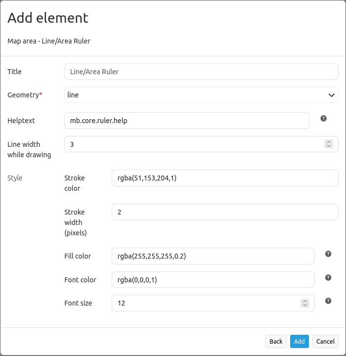

.. _ruler:

Line/Area Ruler
***************

Ruler to draw a line/area and display length/area.

.. image:: ../../../../../figures/ruler.png
     :scale: 80

Configuration
=============

You need a button to show this element. See :doc:`button` for inherited configuration options.

YAML-Definition:

.. code-block:: yaml

   tooltip: "ruler"   # text to use as tooltip
   target: ~          # Id of Map element to query
   type: 'line'       # choose type line or area

Class, Widget & Style
=====================

* Class: Mapbender\\CoreBundle\\Element\\Ruler
* Widget: mapbender.element.ruler.js, subclasses mapbender.element.button.js
* Style: mapbender.elements.css

HTTP Callbacks
==============

None.

JavaScript API
==============

activate
--------

Activates the widget which then waits for mouse click on the map and starts to measure.

deactivate
----------
Deactivates the widget.

JavaScript Signals
==================

None.
