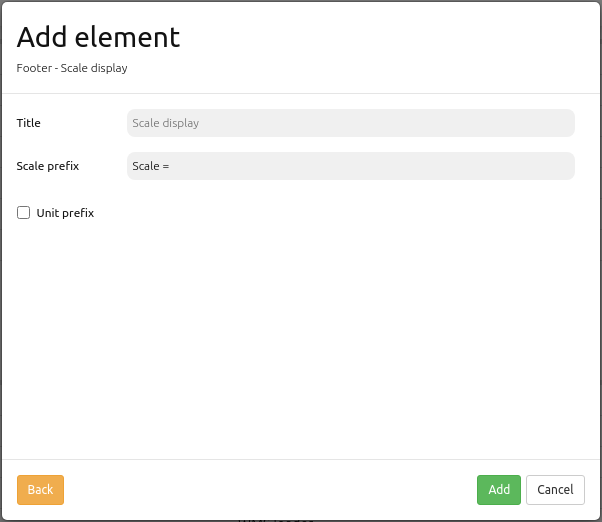

.. _scaledisplay:

ScaleDisplay
***********************

The ScaleDisplay displays the current map scale (1:1K or 1: 1000).

Configuration
=============

YAML-Definition:

.. code-block:: yaml

   tooltip: 'Scale Bar'             # text to use as tooltip
   target: ~                        # Id of Map element to query
   anchor: 'inline'/'left-top'/     # scale bar alignment, default is 'right-bottom'
     'left-bottom'/'right-top'/     # use inline f.e. in sidebar
     'right-bottom'

Class, Widget & Style
==============

* Class: Mapbender\\CoreBundle\\Element\\ScaleDisplay
* Widget: mapbender.element.scaledisplay.js
* Style: mapbender.element.scaledisplay.css

HTTP Callbacks
==============

None.

JavaScript API
==============

None.

JavaScript Signals
==================

None.
