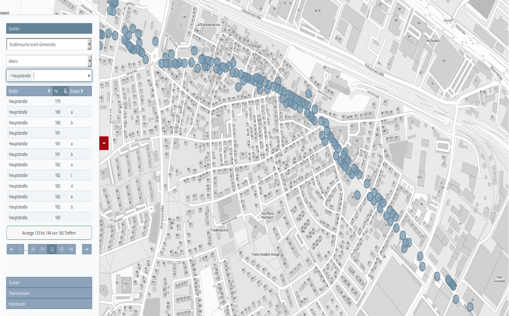
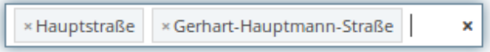
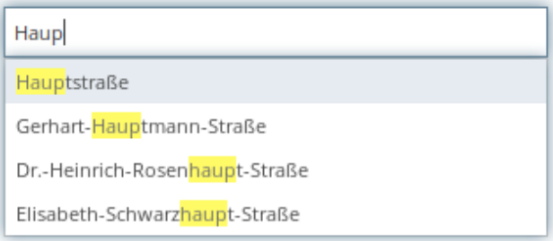

.. _search_digitizer:

Seach via Digitizer
*******************
The Digitizer element allows building editing-interfaces and contains a single-field search on the hit list.
In connection with the digitization, very complex forms and a complex search can be generated on the table for the acquisition of related data. More about the element can be found under `Digitizer <digitizer.html>`_.

Advanced search in tables (search)
==================================

In the following, the individual components for the search are explained using the digitizer, which make up the basic structure and which can be embedded in the form.
 
The advanced search (parameter search) on the database table is possible in addition to the simple search (parameter inlineSearch) in the results list.  
For a more complex search, additional parameters can be specified, which facilitate the finding of specific technical information in the table.  
The advantage of this search is, above all, that the coordinate system can be changed during the search. This is not possible with the `SearchRouter <search_router.html>` _.

YAML-Definition for the element Digitizer in the textarea schemes
-----------------------------------------------------------------

.. code-block:: yaml

  poi_search:
    label: 'Pointsearch (via name and type)'
    featureType:
      connection: search_db
      table: public.poi
      geomType: point
      geomField: geom
      srid: 4326
      uniqueId: gid
    popup:
      title: 'Results point search'
      width: 400px
    zoomScaleDenominator: 500
    maxResults: 1000
    displayOnSelect: true
    searchType: all
    showExtendSearchSwitch: false
    oneInstanceEdit: false
    allowLocate: false
    allowDigitize: true
    allowEditData: false
    allowDelete: false
    allowChangeVisibility: false
    allowCustomerStyle: false
    showVisibilityNavigation: false
    useContextMenu: true
    inlineSearch: false
    toolset: {  }
    search:
      mandatory:
        type: .+
        title: .+
      form:
        - type: select
          name: type
          value: A
          sql: |
            SELECT
              DISTINCT type,
              type
            FROM poi
            ORDER by type ASC  
          connection: search_db
        - type: select
          name: title
          placeholder: Pointname
          allowClear: true
          multiple: true
          language: en
          minimumInputLength: 1
          ajax:
            delay: 100
            connection: search_db
            sql: |
              SELECT  "name"
              FROM    "poi"
              -- Search only in one district, not everywear
              WHERE   "type" LIKE '$type'
              -- Try to find by 'name%' and '%%name%'
              AND (
                LOWER ("name") LIKE LOWER ('$title%')
                OR LOWER ("name") LIKE LOWER ('%%$title%')
              )
              -- Group street names
              GROUP BY "name"
              -- Sort by 'name%' first not '%%name%'
              ORDER BY LOWER ("name") LIKE LOWER ('$title%') DESC
              -- Max results count
              LIMIT 15
      conditions:
        - type: sql
          operator: and
          code: |
            "type" like '$type'
        - type: sql-array
          operator: OR      
          key: title
          code: |
            "name" LIKE '$value%' OR "name" LIKE '%%$value%'
    view:
      type: table
      settings:
        info: true
        processing: false
        ordering: true
        paging: true
        pageLength: 12
        selectable: true
        autoWidth: false
        order: [[1, "asc"]]
    tableFields:
      name:
        label: Pointname
        width: 60%
      type:
        label: Type
        width: 40%
        align: right
    styles:
      default:
        graphic: true
        strokeWidth: 2
        strokeColor: '#648296'
        fillColor: '#7b9fb7'
        fillOpacity: 0.7
        fillWidth: 2
        pointRadius: 10
      select:
        strokeWidth: 3
        strokeColor: '#000000'
        fillOpacity: 1
        fillColor: '#435e70'
        fillWidth: 5
        label: '${name} ${type}'
        pointRadius: 15
      ...

* **mandatory:** Mandatory fields can be defined in the query. In the example, e.g. an indication of the name and type must be fulfilled before a hit is displayed in the list. Regular expressions such as. + (Both queries must have at least one specification that contains at least 1 or more characters). 
* **multiple:** Selection of several search terms, e.g. multiple streets. [true/false]

.. [does not work yet]* **maximumSelectionSize**: Maximum specification of search terms  [numeric] when specified multiple: true.
* **minimumInputLength:** Minimum number of characters to start the search. [numeric]
* **placeholder:** Placeholder for the search field.
* **allowClear:** Allows to delete the input in the search field. [true/false] default is true.
* **multiple:** Allows to insert multiple seach requests in the search field. [true/false] default is true.
* **language:** Define the language, e.g. de
* **value:** Default value from the values ​​in the column that is used when you don't define a search parameter.
* **zoomScale:** Zoomscale for the search (zoomt to the defined scale, e.g. 2000).

Ajax-Definitions: 
* **delay:** Waiting period until the search request is sent (in milliseconds), facilitates search with slow typing. [true/false]
* **sql:** Specify an SQL query for the search fields. A clean and thoughtful SQL query causes the output of the hits in a sinful order, e.g. display first results that have the search term in the first place and not in the middle of the hit. Use of **name** in SQL possible.
* **name:** Variable that can be used in the SQL query, e.g. $title. This makes the SQL query more secure against attacks from outside.

Search Conditions
----------------------------

You can specify conditions for queries.
* **type:** Query type for the condition [sql, php]
* **operator:** SQL connection type of queries [AND, OR]
* **code: ** Specify code that must be fulfilled for a query to the specified key value
* **key:** Key value for the query that is referenced in the code area

.. code-block:: yaml

  poi:
      ...
      inlineSearch: false
      search:
        ...
        conditions:
          - type: sql
            operator: and
            code: |
              "type" like '$type'
          - type: sql-array
            operator: OR      
            key: title
            code: |
              "name" LIKE '$value%' OR "name" LIKE '%%$value%'
      ...

YAML-Definition for the element Digitizer in mapbender.yml
==========================================================

This code-snippet shows how to include the Digitizer into a YAML-file based application.

.. code-block:: yaml

                sidepane:
                    digitizer:
                        class: Mapbender\DigitizerBundle\Element\Digitizer
                        title: Digitalisation
                        target: map
                        schemes:
                            ...

Class, Widget & Style
=====================

* Class: Mapbender\\DigitizerBundle\\Element\\Digitizer
* Widget: mapbender.element.digitizer.js
* Style: sass\\element\\digitizer.scss

