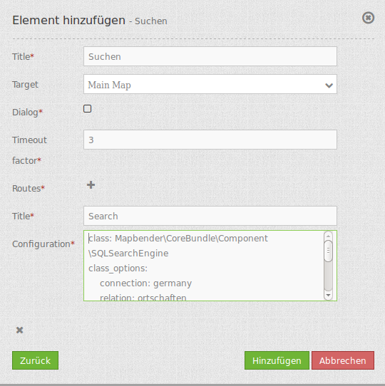

.. _search_router:

Search Router
***********************

Search frontend GUI for plugable search engine modules. Right now a generic SQL search engine
is provided, with more to come (think Lucene enhanced search, etc.)

.. image:: ../../../../../figures/search_router.png
     :scale: 80

Configuration
=============

The SearchRouter needs access to the database where the search tables are. You have to define a new database configuration to be able to connect with the geo database. Read more about this at http://doc.mapbender3.org/en/book/database.html

For the use of the below-described search the digitizer database can be used. The configuration for creating the database connection can be found at :doc:`digitizer`.

* **Title:** Title of the element. The title will be listed in "Layouts" and allows to distinguish between different buttons. It will be indicated if "Show label" is activated.
* **Tooltip:** text to use as tooltip.
* **Target:** Id of Map element to query.
* **Dialog:** render inside a dialog or not.
* **Timeout factor:** timeout factor (multiplied with autcomplete delay) to prevent autocomplete right after a search has been started.
* **Routes:** ollection of search routes.

You can define Searches (Routes) with the ``+`` Button. Each Search has a titel which will show up in the search form in a selectbox where you can choose the search you want to use.

The definition of the search is done in YAML syntax in the textarea configuration. Here you define the database connection, the Search tables/views, the design of the form and of the result table.

Element definition in web interface in the configuration area:

.. code-block:: yaml

    class: Mapbender\CoreBundle\Component\SQLSearchEngine
    class_options:
        connection: search_db
        relation: ortschaften
        attributes:
            - gid
            - ortsname
        geometry_attribute: geom
    form:
        ortsname:
            type: text
            options:
                required: true
            compare: exact
    results:
        view: table
        count: true
        headers:
            gid: ID
            ortsname: Name
        callback:
            event: click
            options:
                buffer: 10
                minScale: null
                maxScale: null

YAML-Definition
----

for mapbender.yml:

.. code-block:: yaml

   target: map  # for result visualization
   asDialog: true  # render inside a dialog or not
   timeoutFactor:  2  # timeout factor (multiplied with autcomplete delay) to prevent autocomplete right after a search has been started
   routes:      # collection of search routes
       demo_polygon:       # machine readable name
			class: Mapbender\CoreBundle\Component\SQLSearchEngine  # Search engine to use
			class_options:  # these are forwarded to the search engine
			    connection: search_db    # search_db  # DBAL connection name to use, use ~ for the default one
			    relation: polygons  # Relation to select from, you can use subqueries
			    attributes: 
			        - gid  # array of columns to select, expressions are possible
			        - name 
			        - type
			    geometry_attribute: geom  # name of the geometry column to query
			form:  # search form configuration
			    name:  # field name, use relation column name to query or anything else for splitted fields (see below)
			        type: text  # field type, usually text or integer
			        options:  # field options
			            required: false  # HTML5 required attribute
			            label: Name  # Enter a custom label, otherwise the label will be derived off the field name
			            attr:  # HTML attributes to inject
			                data-autocomplete: on  # this triggers autocomplete
			                data-autocomplete-distinct: on  # This forces DISTINCT select
			                data-autocomplete-using: type   # komma separierte Liste von anderen Eingabefeldern, in denen WHERE Angaben für die Autovervollständigung gemacht werden                
			        compare: ilike  # See note below for compare modes
			    type:
			        type: choice
			        options:
			            empty_value: Please select a type.
			            required: false
			            choices:
			                A: A
			                B: B
			                C: C
			                D: D
			                E: E
			results:
			    view: table  # only result view type for now
			    count: true # show number of results
			    headers:  # hash of table headers and the corresponding result columns
			        gid: ID  # column name -> header label
			        name: Name
			        type: Type
			    callback:  # What to do on hover/click
			        event: click  # result row event to listen for (click or mouseover)
			        options:
			            buffer: 10
			            minScale: ~  # scale restrictions for zooming, ~ for none
			            maxScale: ~
			    results:
			        styleMap:  # See below
			            default:
			                strokeColor: '#00ff00'
			                strokeOpacity: 1
			                fillOpacity: 0
			            select:
			                strokeColor: '#ff0000'
			                fillColor: '#ff0000'
			                fillOpacity: 0.4

You need a button to show this element. See :doc:`button` for inherited configuration options.

Compare modes
-------------

Each field can be assigned a compare mode which is evaluated by the engine when building the search query. The SQL search
engine has the following modes:

* **exact:** exact comparison (key = val)
* **iexact:** case-insensitive comparison
* **like:** default, uses two-sided like
* **like-left:** uses left-sided like
* **like-right:** uses right-sided like
* **ilike:** uses two-sided case-insensitive like (*searchstring*)
* **ilike-left:** uses left-sided case-insensitive like (f.e *searchstring)
* **ilike-right:** uses right-sided case-insensitive like (f.e searchstring*) 

Result feature styling
----------------------

By default, the result features are styled using the default styles OpenLayers provides. This gives the
well-known orange look and blue look for the selected feature. If you want to override that, you can
provide a styleMap configuration for the results like this:

.. code-block:: yaml

    results:
        styleMap:
            default:
                fillOpacity: 0
            select:
                fillOpacity: 0.4

This will not draw polygon interiors, but only their outlines in default mode. The selected feature will
have it's interior drawn with 60% transparency.

The default style properties will override the properties OpenLayers uses for the default style, therefore
you only need to set properties you wish to change. If you omit the default part, OpenLayers default style
will be used as is.

A similar logic applies to the select style – any property you provide will override the corresponding
property of the *final* default style. Therefore the example above will *not* yield a blue look for the
selected feature!

Keep in mind to quote hex color codes as the pound sign will otherwise be treated as a inline comment!

A more elaborate example with green (hollow) features and the selected one in red:

.. code-block:: yaml

    results:
        styleMap:
            default:
                strokeColor: '#00ff00'
                strokeOpacity: 1
                fillOpacity: 0
            select:
                strokeColor: '#ff0000'
                fillColor: '#ff0000'
                fillOpacity: 0.4

Class, Widget & Style
=====================

* **Class:** Mapbender\\CoreBundle\\Element\\SearchRouter
* **Widget:** mapbender.element.searchRouter.js, mapbender.element.searchRouter.Feature.js, mapbender.element.searchRouter.Search.js
* **Style:** mapbender.element.searchRouter.css

HTTP Callbacks
==============

<route_id>/autocomplete
-----------------------

Autocomplete Ajax endpoint for given search route. Autocomplete is implemented
using Backbone.js with the Mapbender.Autocomplete model implemented in
mapbender.element.searchRouter.Search.js.

<route_id>/search
-----------------

Search Ajax endpoint for given search route. Search is implemented using
Backbone.js with the Mapbender.Search model implemented in
mapbender.element.searchRouter.Search.js.

JavaScript API
==============

open
----
If configured as dialog, open.

close
-----
If configured as dialog, close.

JavaScript Signals
==================

None.

Example
==================

Example with autocomplete and individual result style:

.. code-block:: yaml

   Create or Replace view brd.qry_gn250_p_ortslage as Select gid, name, gemeinde, bundesland, oba, ewz_ger,  hoehe_ger ,geom from brd.gn250_p where oba = 'AX_Ortslage' order by name;

.. code-block:: yaml

	class: Mapbender\CoreBundle\Component\SQLSearchEngine
	class_options:
	    connection: search_db
	    relation: brd.qry_gn250_p_ortslage
	    attributes:
		- gid
		- name
		- gemeinde
		- bundesland
		- ewz_ger
		- hoehe_ger
	    geometry_attribute: geom
	form:
	    name:
		type: text
		options:
		    required: false
		    label: Name
		    attr:
		        data-autocomplete: on
		compare: ilike
	    gemeinde:
		type: text
		options:
		    required: false
		compare: ilike
	results:
	    view: table
	    count: true
	    headers:
		name: Name
		gemeinde: Gemeinde
		bundesland: Bundesland
		ewz_ger: Einwohner
		hoehe_ger: Höhe
	    callback:
		event: click
		options:
		    buffer: 1000
		    minScale: null
		    maxScale: null
	    styleMap:
		default:
		    strokeColor: '#00ff00'
		    strokeOpacity: 1
		    fillOpacity: 0
		select:
		    strokeColor: '#ff0000'
		    fillColor: '#ff0000'
		    fillOpacity: 0.8

Example with selectbox:

.. code-block:: yaml

   Create or Replace view brd.qry_gn250_p as Select gid, name, gemeinde, bundesland, oba, geom from brd.gn250_p where oba = 'AX_Ortslage' OR oba = 'AX_Wasserlauf' order by name;

.. code-block:: yaml

	class: Mapbender\CoreBundle\Component\SQLSearchEngine
	class_options:
	    connection: search_db
	    relation: brd.qry_gn250_p_ortslage
	    attributes:
		- gid
		- name
		- gemeinde
		- bundesland
		- oba
	    geometry_attribute: geom
	form:
	    oba:
		type: choice
		options:
		    empty_value: 'Bitte wählen...'
		    choices:
		        AX_Ortslage: Ort
		        AX_Wasserlauf: 'Gewässer'
	    name:
		type: text
		options:
		    required: false
		    label: Name
		    attr:
		        data-autocomplete: on
		compare: ilike
	    gemeinde:
		type: text
		options:
		    required: false
		compare: ilike
	results:
	    view: table
	    count: true
	    headers:
		name: Name
		gemeinde: Gemeinde
		bundesland: Bundesland
	    callback:
		event: click
		options:
		    buffer: 1000
		    minScale: null
		    maxScale: null

