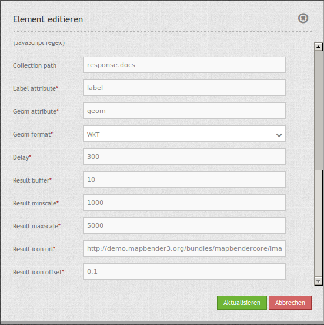

.. _simplesearch:

SimpleSearch
************

SimpleSearch offers a one-step solution for geo-data querying, powered by Solr for example. Giving only one input field
which can be directly embedded into the toolbar, it will send the entered search term to a configurable URL where it
expects to receive a JSON-formatted data back which includes a label and a geometry attribute for each entry.

Geometry data can be encoded as WKT or in GeoJSON format.

.. image:: ../../../../../figures/simplesearch.png
     :scale: 80

Configuration
=============

.. image:: ../../../../../figures/simplesearch_configuration_a.png
     :scale: 80

* **Title:** Title of the element. The title will be listed in "Layouts" and allows to distinguish between different buttons. It will be indicated if "Show label" is activated.
* **Query URL:** Solr URL for the search (e.g. ``http://localhost:8080/solr/core0/select?wt=json&indent=true``).
* **Query URL key:** The query parameter key to append  (e.g. ``q``).
* **Query Whitespace replacement pattern:** Pattern for replacing white spaces.
* **Query key format:** Simple search format  (e.g. ``%s``).
* **Token search/ replace (JavaScript regex):** Tokenizer split/ search/ replace regexp.

  * Token, e.g.: ``[^a-zA-Z0-9äöüÄÖÜß]``
  * Token search, e.g.: ``([a-zA-ZäöüÄÖÜß]{3,})``
  * Token replace, e.g.: ``$1*``
  
* **Collection path:** Can be a dotted attribute path to extract from the query result (e.g. ``response.docs``).
* **Label attribute:** Name of the attribute to use for entry labeling (e.g. ``label``).
* **Geom attribute:** Name of the geometry data attribute (e.g. ``geom``).
* **Geom format:** geometry data format, can be WKT or GeoJSON (e.g. ``WKT``).
* **Delay:** Autocomplete delay. Use 0 to disable autocomplete (e.g. ``300``).
* **Result buffer:** buffer result geometry with this (map units) before zooming (e.g. ``10``).
* **Result minscale/ maxscale:** scale restrictions for zooming, ~ for none  (e.g. ``1000`` und ``5000``).
* **Result icon url:** icon to display as result marker (e.g. ``http://demo.mapbender3.org/bundles/mapbendercore/image/pin_red.png``).
* **Result icon offset:**  Offset x and y for the icon (e.g. ``0,0``).

  
YAML-Definition:
----

.. code-block:: yaml

   query_url: http://example.com/solr/core/0/select?wt=json&indent=true&rows=8   # Example Solr URL
   query_key: q                                                                  # The query parameter key to append
   query_ws_replace:                                                             # Pattern for replacing white spaces.
   query_format: '%s'                                                            # Simple search format.
   token_regex: [^a-zA-Z0-9äöüÄÖÜß]                                              # Tokenizer split regexp.
   token_regex_in: ([a-zA-ZäöüÄÖÜß]{3,})                                         # Tokenizer search regexp.
   token_regex_out: '$1*'                                                        # Tokenizer replace regexp.
   collection_path: response.docs                                                # Can be a dotted attribute path to extract from the query result.                                             
   label_attribute: label                                                        # Name of the attribute to use for entry labeling
   geom_attribute: geom                                                          # Name of the geometry data attribute
   geom_format: WKT                                                              # geometry data format, can be WKT or GeoJSON
   delay: 300                                                                    # Autocomplete delay. Use 0 to disable autocomplete.
   result_buffer: 50                                                             # buffer result geometry with this (map units) before zooming
   result_minscale: 1000                                                         # scale restrictions for zooming, ~ for none
   result_maxscale: 5000
   result_icon_url: http://demo.mapbender3.org/bundles/mapbendercore/image/pin_red.png # icon to display as result marker
   result_icon_offset: -6,-38                                                    # Offset x and y for the icon
   

Class, Widget & Style
=========================

* **Class:** Mapbender\\CoreBundle\\Element\\SimpleSearch
* **Widget:** mapbender.element.simplesearch.js

HTTP Callbacks
==============

- /search: Widget proxy which then queries configured URL. In dev-mode the final query URL will be returned as a
  x-mapbender-simplesearch-url header for easier debugging.

JavaScript API
==============

None.

JavaScript Signals
==================

None.

How to setup Solr:
==================

Installation
------------

Download Apache Solr and extract it to any folder. After successfully extracting the file Solr can be installed as a service in a Linux system by calling solr/bin/install_solr_service.sh.

* **Download**: http://lucene.apache.org/solr/
* **Documentation**: http://lucene.apache.org/solr/resources.html#documentation 
* **Quickstart**: http://lucene.apache.org/solr/quickstart.html

**Installing** Apache Solr via the terminal f.e. in the data directory: 

.. code-block:: yaml

    cd /data
    wget http://apache.lauf-forum.at/lucene/solr/5.4.1/solr-5.4.1.tgz
    tar -zxvf solr-5.4.1.tgz
    cd solr-5.4.1/

Apache Solr runs of Java 7 or greater, Java 8 is verified to be compatible and may bring some performance improvements. When using Oracle Java 7 or OpenJDK 7, be sure to not use the GA build 147 or update versions u40, u45 and u51! We recommend using u55 or later.

Start and stop
---------------

You can start and stop Solr via the terminal by the following commands:

**Start Solr:**

.. code-block:: yaml

    /data/solr-5.4.1/bin/solr start -s /data/solr-5.4.1/server/solr

**Stop Solr:**  

.. code-block:: yaml

    /data/solr-5.4.1/bin/solr stop -all

Solr-Core
---------

The Solr home folder is the area in which the various Solr-Cores for the search are located. 

Der Solr-Home Ordner ist der Bereich, in dem sich die verschiedenen Solr-Kerne für die Suche befinden. The configuration is performed in the following file:

File: solr-5.4.1/server/solr/solr.xml

Enter the following XML-block in the file:

.. code-block:: yaml

    <?xml version="1.0" encoding="UTF-8" ?>
    <solr></solr>

For the cores create a folder under data/solr_data. Each core consists of the three configuration files:

* **core.properties**
* **solrconfig.xml** 
* **schema.xml** 

By core.properties the core of Solr is recognized as a core. The solrconfig.xml describes the features of the core. The schema.xml describes the construction of the index.

Adaptation of configuration files under /data/solr-5.4.1/server/solr/configsets/basic_configs/conf: 

* core.properties
* solrconfig.xml
* schema.xml

Solr example
------------

The directiory /solr-5.4.1/example contains Solr examples. Each example is contained in a 
separate directory. To run a specific example, do:

.. code-block:: yaml

    bin/solr -e <EXAMPLE> where <EXAMPLE> is one of:
    
      cloud        : SolrCloud example
      dih          : Data Import Handler (rdbms, mail, rss, tika)
      schemaless   : Schema-less example (schema is inferred from data during indexing)
      techproducts : Kitchen sink example providing comprehensive examples of Solr features

To test this function run the following command in the terminal: 

.. code-block:: yaml

    /data/solr-5.4.1/bin/solr start -e techproducts

and go to http://localhost:8983/solr. 

/data/solr-5.4.1/server/solr:

* Default solr.solr.home directory where Solr will create core directories; must contain solr.xml

/data/solr-5.4.1/server/solr/configsets: 

* Directories containing different configuration options for running Solr.
* basic_configs: Bare minimum configuration settings needed to run Solr.
* example is under /data/solr-5.4.1/server/solr/configsets/basic_configs

Indexing Solr XML
-----------------

Use the example data in /solr-5.4.1./example/exampledocs/*.xml to index the example Solr XML files.

Indexing Solr PostgreSQL-Data
------------------------------

Import records from a PostgreSQL-database using the Data Import Handler.

Adaptation of the Data Connection in the configutation files under data/solr_data/places/config:

* solrconfig.xml
* data-config.xml

* download matching PostgreSQL-driver: 
* https://jdbc.postgresql.org/download.html

.. code-block:: yaml

    cd /data/solr_data/places/
    wget https://jdbc.postgresql.org/download/postgresql-9.1-903.jdbc4.jar

Solr-scheme
-----------

The Solr-scheme consists of the following parts:

* **Fields** (field)
* **Field types** (fieldType)
* **Specifying an ID-Field** by uniqueKey 

Secure Jetty
-------------

Release of certain IP addresses to access the Jetti. Configuration under solr/etc/jetty.xml:

.. code-block:: yaml

    <Set name="host"><SystemProperty name="jetty.host" /></Set>
    <Set name="port"><SystemProperty name="jetty.port" default="8983"/></Set>

