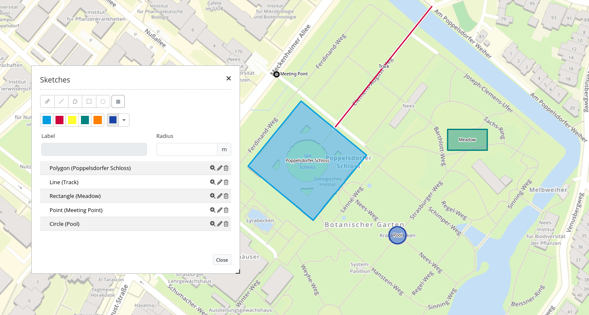

.. _sketch:

Sketch
***********************

The Sketch element adds a vector layer in the map and enables geometry objects to draw

Configuration
================

.. image:: ../../../../../figures/sketch_configuration.png
     :scale: 80

You need a button to show this element. See :ref:`button` for inherited configuration options.

YAML-Definition:

.. code-block:: yaml

   tooltip: 'Sketch'                # text to use as tooltip
   target: ~                        # Id of Map element to query
   types: 'circle'                  # list of supported sketch types     
   defaultType: 'circle'            # sketch type from types (s. parameter 'types')

Class, Widget & Style
============================

* Class: Mapbender\\CoreBundle\\Element\\Sketch
* Widget: mapbender.element.sketch.js

HTTP Callbacks
=====================

None.

JavaScript API
==============

activate
--------

Activates the widget which then waits for mouse click on the map and starts to draw.

deactivate
----------

Deactivates the widget.

JavaScript Signals
==================

None.
